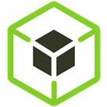
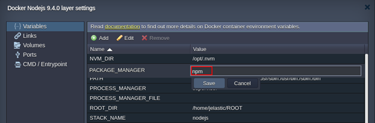

# NodeJS Package Managers

{}{}

Each created Node.js application server within the platform is provisioned with out-of-box support of two main package managers for this language - ***Yarn*** and ***npm***. Both of them operates the same npm registry with a broad collection of the dedicated software packages, providing standardization and automation of the installation, update, configuration and removal processes.

By default, the ***npm*** package manager will be used for [archive](/deployment-guide/#archive-deployment-configurations) or [Git](/deployment-guide/#git--svn-deployment-configurations) deployment operations through the platform dashboard, but it can be easily switched to the ***yarn*** one in case of necessity. For that, access the corresponding *Docker container settings* frame and set the appropriate ***PACKAGE_MANAGER*** Docker container [variable](/container-variables/) to either *npm* or yarn *value*.

Below, we've gathered some basics on operating these managers, intended to help you on determining which one suits you best:

* [Node Package Manager (npm)](#node-package-manager-npm)
* [Yarn Package Manager](#yarn-package-manager)

## Node Package Manager (npm)

**Node Package Manager** ([npm](https://www.npmjs.com/)) can be used for managing additional modules and packages, required for your project, as well as for installation of the ready-to-use applications.

There are two ways to install necessary Node.js packages with *npm*:

1\. Specify required ones within the [dependencies](https://docs.npmjs.com/files/package.json#dependencies) section of the NodeJS ***package.json*** file, located in the root directory of your project. Such packages will be automatically downloaded and installed by *npm* during application server startup. Herewith, the new modules specified in the *package.json* file will be added after NodeJS node restart.

2\. Connect to the container via [SSH Gate](/ssh-gate/) and operate your packages manually with the following commands:

* ***npm search {package_name}*** - to search for modules by name (or its part)
* ***npm install {package_name}*** - to install the necessary module
* ***npm uninstall {package_name}*** - to remove the previously installed module
* ***npm update {package_name}*** - to update the specified module to its latest version
* ***npm ls installed*** - to list already installed packages

## Yarn Package Manager

[Yarn](https://yarnpkg.com/en/) is a recently released package manager, which is already highly popular due to its speed, reliability and convenience. Yarn operates the same NodeJS ***package.json*** file as in *npm*, so no changes are required for the existing applications.

You can use the following list of commands to work with Yarn, while connected over [SSH](/ssh-gate/):

* ***yarn** or **yarn install*** - to get all dependencies package for the project
* ***yarn remove {package}*** - to remove the specified package
* ***yarn add {package}@{version}*** - to add a new package to the dependencies list and install it; optionally, you can specify a particular version as an argument (the latest one will be used by default)
* ***yarn upgrade {package}@{version}*** - to update package to its latest version; optionally, you can specify a particular version as an argument 
* ***yarn list*** - to list all of the installed packages

## What's next?

* [Node.js Dev Center](/nodejs-center/)
* [Node.js Version](/nodejs-versions/)
* [Node.js Process Managers](/nodejs-process-manager/)
* [Deployment Guide](/deployment-guide/)
* [Git/SVN Auto-Deploy](/git-svn-auto-deploy/)