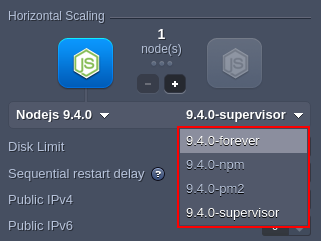
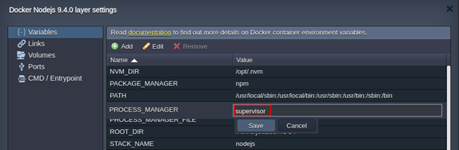
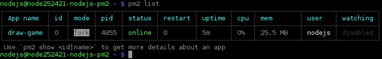
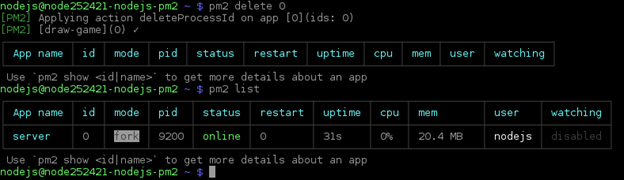
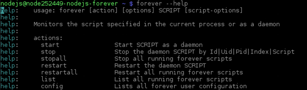

# NodeJS Process Managers

{}{}

Node.js process manager is a tool, which provides an ability to control application lifecycle, monitor the running services and facilitate common system admin tasks to maintain your project operability.

The platform provides three pre-configured process managers by default, which can be selected in the following ways:

* by selecting the appropriate tag during the environment [creation](/setting-up-environment/) or container [redeploy](/container-redeploy/)


* by editing the ***PROCESS_MANAGER*** Docker environment [variable](/container-variables/) in the already created container(s) with the *forever*, *npm*, or *pm2* value (restart is needed to apply the new options)


Below, we'll consider each of the available managers to help you select one:

- [Process Manager (npm)](#process-manager-npm)
- [PM2](#pm2)
- [Forever](#forever)


## Process Manager (npm)

Alongside [package management](/nodejs-package-managers/#node-package-manager-npm), the NPM provides the ability to start the application. The "*npm start*" (which is the "*npm run start*" alias) is performed if **NPM** is chosen as a value for the ***PROCESS_MANAGER*** variable on the NodeJS container. As a result, the script defined in "*start*" of ***package.json*** is launched.

Refer to the [official documentation](https://docs.npmjs.com/cli/v8/commands/npm-run-script) for additional information.


## PM2

[PM2](https://pm2.keymetrics.io/) provides a huge variety of application management features, including the launched NodeJS processes monitoring. You can get acquainted with the [list of commands](https://www.npmjs.com/package/pm2#commands-overview) for *pm2*, which can be executed directly via SSH.

For example, after Node.js server creation, you can list the running processes with the following command:

```
pm2 list
```



As you can see it shows the default *draw-game* application is running.

Next, you can remove this app with the ***pm2 delete*** command and [deploy](/deployment-guide/) your own project (e.g., the default Hello Word application):



Also, PM2 provides users the ability to create the configuration files where all the run options are listed, which is useful for microservice-based applications deployment, as several apps can be described in a single file. The appropriate [config file reference](https://pm2.keymetrics.io/docs/usage/application-declaration/) can be found by following the provided link (e.g. the default ***ecosystem.config.js*** file is used to launch the *server.js* application file as the *"draw game"* application).


## Forever

The [forever](https://www.npmjs.com/package/forever) process manager is the simple CLI tool, which allows to make your NodeJS processes run continuously. It permanently keeps a child process (such as your project on the Node.js web server) and automatically restart it upon failure.

Run the next command to get the main information on the *forever* manager usage, actions, usage, etc.:

```
forever --help
```



Also, using *forever* you can specify the application options in a [JSON file](https://www.npmjs.com/package/forever#json-configuration-files). For example, for the default Draw game (available after Node.js server installation), this ***/home/jelastic/ROOT/forever.json*** file looks like:

```json
{
   "uid": "app1",
   "append": true,
   "watch": true,
   "script": "server.js",
   "sourceDir": "/home/jelastic/ROOT"
}
```

where:

- **uid** - sets unique name for your app
- **append** - selects if logs should be supplemented (*true*) or overwritten (*false*)
- **watch** - allows enabling or disabling automatic restart of a child process upon the appropriate application code changes; set to "*false*", if you want to avoid unexpected restart after deployment from VCS (including [auto-deploy](/git-svn-auto-deploy/))
- **script** - defines a name of the executable ***.js*** file
- **sourceDir** - provides an absolute path to the specified script


## What's next?

- [Node.js Dev Center](/nodejs-center/)
- [Node.js Version](/nodejs-versions/)
- [Node.js Package Managers](/nodejs-package-managers/)
- [Deployment Guide](/deployment-guide/)
- [Git/SVN Auto-Deploy](/git-svn-auto-deploy/)