# How to Install NodeBB

{}{}

**[NodeBB](https://nodebb.org/)** is a forum software, powered by Node.js. It utilizes web sockets for instant interactions and real-time notifications. NodeBB is completely free, easy-to-use and an open source project. Being mobile responsive and providing the inbuilt multi-localization support, it ensures lots of possibilities to build and grow your own extensive community. And with the embedded analytics dashboard, you can be also up-to-date on which content your customers are interested the most.

Generally, this application is featured as:

* *fast*: designed to be as efficient as possible
* *simple*: interaction via user-friendly and localized interface
* *powerful*: functionality can be extended by means of plugins
* *customizable*: tons of ready-to-go themes are available, as well as the ability to adjust the HTML/CSS/JS manually

So, follow the next simple steps in order to get your NodeBB application hosted with the help of the platform.


## Create Environment

1\. Log in to your platform dashboard and create a **New environment** with the appropriate button.


2\. In the appeared **Environment topology wizard**, navigate to the **Node.js** tab and select **Redis** data structure server (**NodeJS** application server will be already chosen automatically as the only available one).

{}**Note:** Redis is an optional node. If you can't find this server in the NoSQL section of your wizard, send a request to your hosting provider for its addition.{}
Then, state the required amount of resources for these nodes using the cloudlet sliders, type your environment name (e.g. *nodebb*), and click the **Create** button.

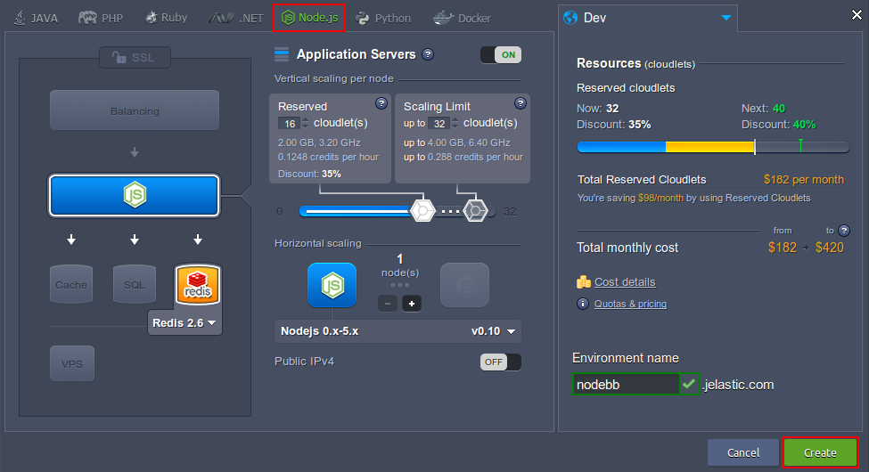

{}**Notes:** 

* Starting with ***0.7.x*** NodeBB version, the currently provided by Redis 2.6 is no longer supported. Thus, in order to work with this or latter forum version, you'll need to use the **MongoDB** database instead (can be found in the same *NoSQL* wizard section). Below, we'll describe all the required configurations for both cases.
* If you'd like to use the Redis 2.6 database, please pay attention that the Node.js engine version should be between ***0.10***-***0.12***, as the latter ones are not supported by NodeBB releases of ***0.6.x*** and lower.{}

3\. In just a minute your environment will appear at the dashboard.

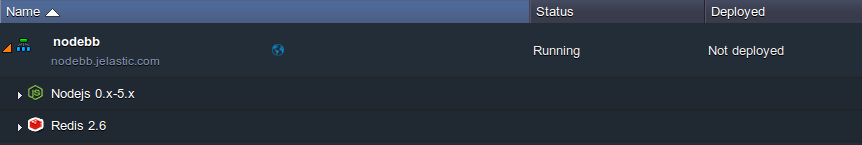


## Add Project

1\. Navigate to the [NodeBB project page](https://github.com/NodeBB/NodeBB) at the GitHub and copy its HTTPS URL with the **Copy to clipboard** button (circled below).

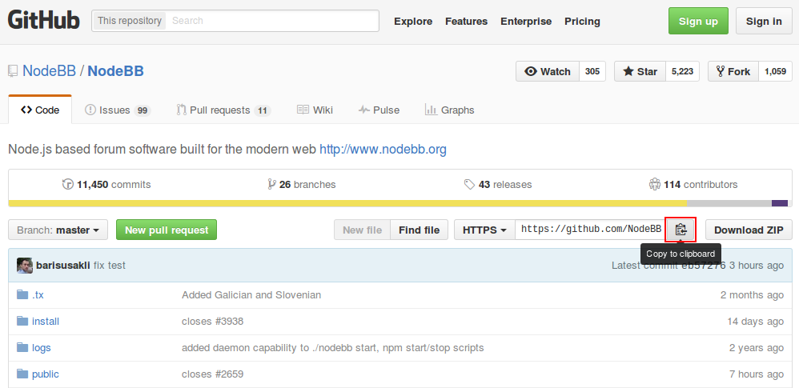

2\. Then, switch back to the platform dashboard and click the **Add project** button next to your NodeJS application server.

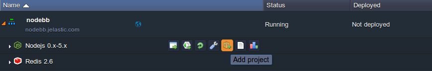

3\. Select the **Git** tab in the opened dialog window and fill in the **URL** field with HTTPS link you've copied before.

{}**Note:** In case you are using the *Redis 2.6* database, the **Branch** field should point to the proper NodeBB version - ***v0.6.x*** or lower. Otherwise (i.e. for *MongoDB*), you can leave the ***master*** branch stated.{}

Click the **Add** button below to proceed.

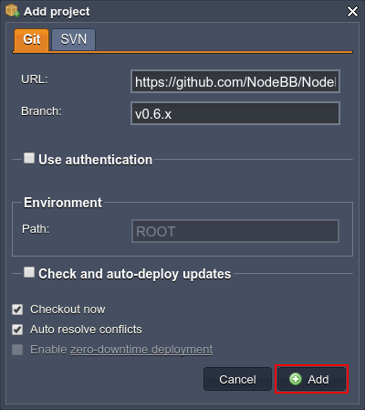

4\. Wait until the project is successfully built and deployed (it can take a few minutes).  

Now, depending on the NodeBB version chosen and the DB server your environment contains, proceed to one of the sections below:

* for the latest app release [with MongoDB](#start-application-mongodb)
* for the preceding versions in a bundle [with Redis 2.6](#start-application-redis)


## Start Application (MongoDB)

In its latest releases, NodeBB provides a comfortable web installer, which is accessible right after the deployment from GIT, to complete all the required configurations.

1\. Click the **Open in Browser** button next to your environment.

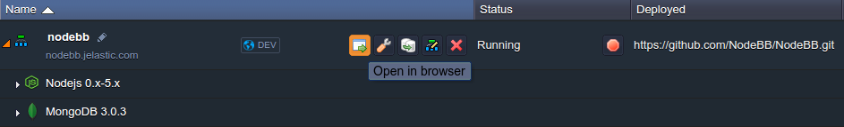

2\. In the opened page, you'll be asked to fill in the required fields with your data in order to *Create an Administrator account* and *Configure your database*.

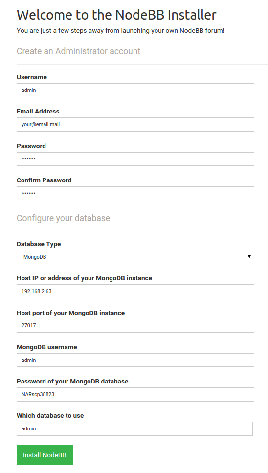

Here, the following data should be specified:

* ***Username*** - administrator account name for NodeBB (login)
* ***Email Address*** - email for the admin account to be bound to
* ***Password / Confirm Password*** - password for the created account (with the confirmation field for the misspelling checking)
* ***Database Type*** - switcher with redis or mongodb options (in our case, you need to choose the latter one)
* ***Host IP or address of your MongoDB instance*** - address your DB server can be accessed by: either URL without the *https://* part (can be found at the corresponding email alongside with other credentials within the *Access URL* string) or node IP from the dashboard:
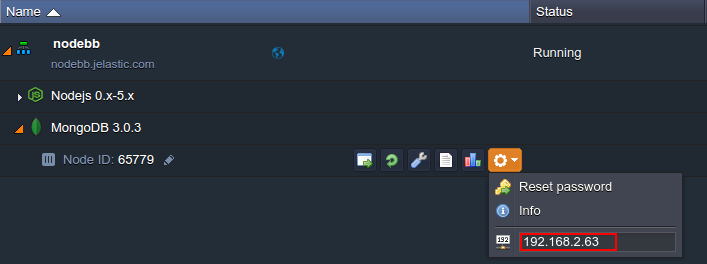

* ***Host port of your MongoDB instance*** - database connection port (*27017* for MongoDB)
* ***MongoDB username*** - login of DB administrator (stands for *admin* for all new MongoDB instances at the platform by default)
* ***Password of your MongoDB database*** - password for the above specified user (can be found in the automatically sent email with your MongoDB credentials)
* ***Which database to use*** - database, you have the read/write permissions for (*admin* for the default user)

Click the **Install NodeBB** button when ready.

3\. If the specified data is correct, you'll see the next success message and can **Launch NodeBB** with the corresponding button.

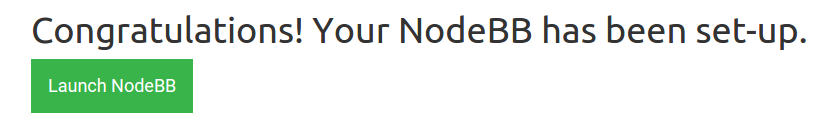

4\. As a result, you'll be redirected to the admin panel login screen, where you can specify the NodeBB administrator credentials (you've stated them while installer configuration within the 2nd instruction step) and access the control dashboard.

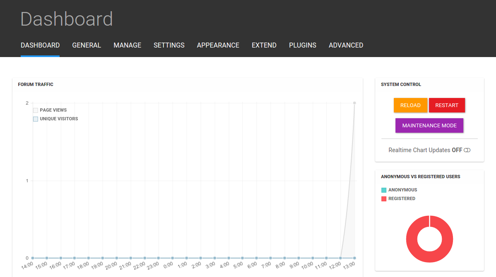

Congratulations! Now you forum is already up and you can start its managing.

{}If you experience any problems with NodeBB deployment or configuration, you can appeal to our technical experts' assistance at [Stackoverflow](https://stackoverflow.com/questions/tagged/jelastic).{}


## Start Application (Redis)

This section assumes that you are configuring NodeBB of 0.6 version or lower (in this example, we'll use the latest product suitable distribution, i.e. *v0.6.x*).

{}**Notes:** 

* preceding NodeBB versions may have some deviations in setup configurations
* in case you need to launch NodeBB of a higher version, please append the *MongoDB* server to your environment (instead of the *Redis* one) and follow [this](#start-application-mongodb) instruction{}

1\. To run the NodeBB application properly, you need to access your environment via [SSH Gateway](/ssh-gate/).

{}In case you haven't done similar operations before, you need to:

* [generate](/ssh-generate-key/) an SSH keypair
* [add your public SSH key](/ssh-add-key/) to the dashboard
* [access your account](/ssh-access/) via SSH protocol{}

2\. Once the connection is established, select the environment with NodeBB project added within the appeared list.

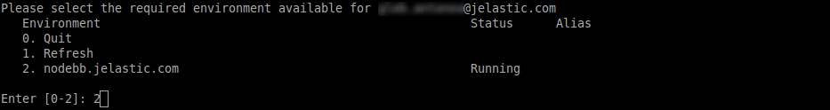

3\. Remember **LAN IP** addresses of your *Redis-2.6* node (you'll need it for further configurations) and continue with choosing the *Nodejs* container.

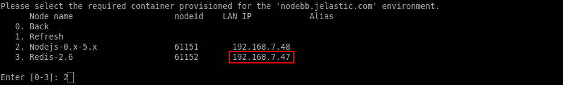

4\. Now you need to load all the necessary package dependencies and execute the setup file, located in the **ROOT** folder, to install NodeBB itself:

```bash
cd ROOT  
sudo npm install  
./nodebb setup  
```

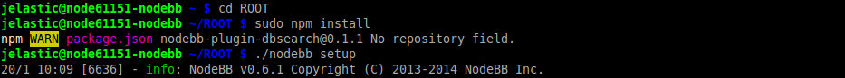

5\. During the NodeBB configuration, you'll be asked to enter the data, required for installation.

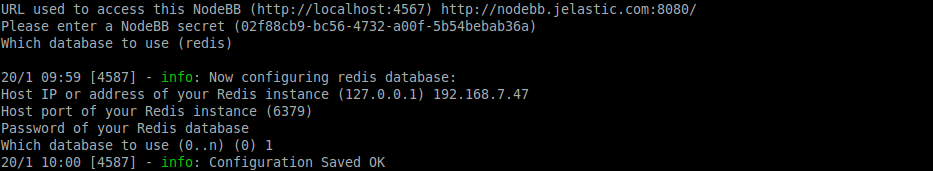

For that, follow the tips in bold within the list below:

* URL used to access this NodeBB (http:/\/localhost:4567) **{insert your environment URL with a port to be listened}** (*http:/\/nodebb.jelastic.com:8080/* in our case)
* Please enter a NodeBB secret (02f88cb9-bc56-4732-a00f-5b54bebab36a) **{just press Enter to confirm the default code, given in brackets}**
* Which database to use (redis) **redis**
* Host IP or address of your Redis instance (127.0.0.1) **{use LAN IP of the Redis server, circled at the 3d step}** (*192.168.7.47*)
* Host port of your Redis instance (6379) **6379**
* Password of your Redis database **{find it in the email with Redis node credentials, sent to you during environment creation}**
* Which database to use (0..n) (0) **1**

6\. Since this is the first time this application is setup, you'll be additionally asked to create an administrator user for your forum:

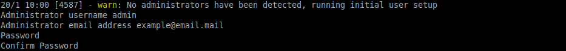

where:

* Administrator username **{enter the desired login, i.e. *admin*}**
* Administrator email address **{enter your email address}**
* Password **{type the password you'd like to use}**
* Confirm Password **{confirm the chosen password}**

Afterwards, just wait until the installation is successfully finished.

7\. Next, in order to allow the new settings to be applied, you need to stop the current NodeBB process. This could be done using the following command:

```bash
./nodebb stop
```

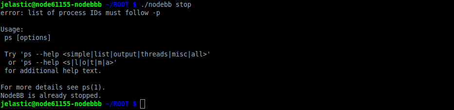

8\. Finally, return to the platform dashboard and click the **Restart nodes** icon for the NodeJS application server in order to apply the changes.

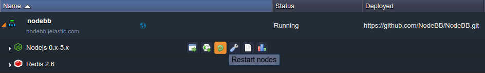

9\. That's it! Now you can access your application using the **Open in browser** button for the appropriate environment.

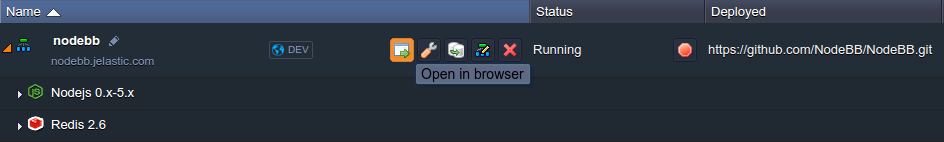

Congrats! Now you have your own NodeBB forum platform, hosted at PaaS.

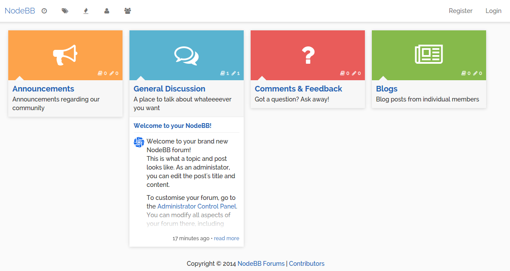

Also, you can access the NodeBB admin panel (through appending the ***/admin*** suffix to the address bar and specifying the administrator credentials you've stated during setup) and proceed to configuring your forum, register new users, create posts and, generally, start socializing with others.

{}If you experience any problems with NodeBB deployment or configuration, you can appeal to our technical experts' assistance at [Stackoverflow](https://stackoverflow.com/questions/tagged/jelastic).{}


## What's next?

* [Tutorials by Category](/tutorials-by-category/)
* [Node.js Tutorials](/nodejs-tutorials/)
* [Setting Up Environment](/setting-up-environment/)