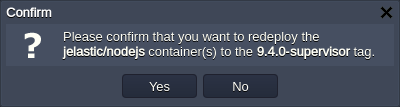

# Node.js Versions

The platform allows to pre-select any of the latest major NodeJS application server releases and the required *process* and *package* managers. Currently, the following versions of this stack are available:

* *14.21.3*
* *16.20.0*
* *18.20.4*
* *20.17.0*
* *21.7.3*
* *22.5.1*
* *22.8.0*

{}The up-to-date list of the releases available on the platform is provided via the dedicated, regularly (weekly) updated [Software Stack Versions](/software-stacks-versions/#engines) document.{}

The required Node.js version can be selected when creating [a new environment](#create-nodejs-environment), as well as switched for [the already existing](#change-nodejs-version) one.

## Create Node.js Environment

1\. Click the **New Environment** button on the top of the dashboard to open the topology wizard:

2\. Switch to the ***Node.js*** programming language tab and choose the required server version using the drop-down list in the central part of the frame:

3\. Next, you can select the preferred [process manager](/nodejs-process-managers/) (*forever*, *npm* or *pm2)* through the *tags* drop-down list (circled in the image below):

A Node.js process manager helps to control your application lifecycle, providing a simple way to start, stop and restart processes on a node. Additionally, it can be configured to automatically re-run scripts in case of an application startup failure or code update:

* ***npm*** - allows to manage additional application modules and packages by means of the *package.json* config file
* ***forever*** - manages node processes (i.e. service start, stop, restart) to save services alive through keeping them run continuously
* ***pm2*** - provides you with multiple special options (like monitoring, load balancing, deployment, etc.), allowing to manage your application more effectively

Specify the remaining server and environment parameters (e.g. cloudlet limits, [region](/environment-regions/), environment name, etc.) and click the **Create** button in the bottom right frame corner.

## Change Node.js Version

You are also able to switch the version of your NodeJS server and process manager afterward, for the already existing environment.

1\. Access the [redeploy container(s)](/container-redeploy/) dialog through either:

* clicking on the **Change Environment Topology** button next to the appropriate environment.

In the opened frame, select to edit your *Nodejs server version* or *tag* (i.e. click on the pencil icon within one of the appropriate fields).

* selecting the **Redeploy Container(s)** button next to the required node (or the appropriate environment layer, for updating all of the comprised containers at once).

2\. Within the opened ***Redeploy container(s)*** dialog, re-configure the following options:

* ***Tag*** - provides a choice of needed Node.js version and preferred process manager
* ***Keep volumes data*** - allows saving data in [volumes](/container-volumes/)
* ***Simultaneous*** or ***Sequential deployment with delay*** (for [scaled servers](/horizontal-scaling/) only) - defines whether all containers within a layer should be redeployed at once or one-by-one, to avoid downtime

3\. To finish Node.js version changing, click on **Redeploy** and confirm your action within the opened pop-up dialog.

{}**Tip:** For the detailed guidance on Node.js projects hosting, please, refer to the [Node.js Developer's Center](/nodejs-center/) guide.{}

## What's next?

* [Create Environment](/setting-up-environment/)
* [Node.js Package Managers](/nodejs-package-managers/)
* [Node.js Process Managers](/nodejs-process-managers/)
* [Deployment Guide](/deployment-guide/)
* [Node.js Tutorials](/nodejs-tutorials/)