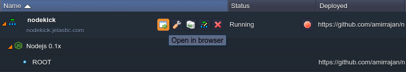

# How to Install NodeKick

**NodeKick** is an open source real time multiplayer fighting game, built at 2d. This application shows a non-trivial usage of *socket.io* and a HTML5 canvas framework called *pixijs*, sharing the common code on the server and client (physics engine in this case). 

Follow the next simple steps in order to get your NodeKick application hosted with the help of the platform.

## Create Environment

1\. Log in to your dashboard and create a new environment.

2\. In the appeared **Environment topology wizard** navigate to the **Node.js** tab and choose **NodeJS** as your application server. Enable **Public IPv4** address for it using the appropriate switcher. Then state the required amount of resources using the cloudlet sliders, type your environment name (e.g. *nodekick*), and click **Create** button.

3\. In a minute your environment will appear at the dashboard.

## Add Project

1\. Navigate to the [NodeKick project page](https://github.com/amirrajan/nodekick) at GitHub and copy its HTTPS URL with the corresponding button (circled below).

2\. Then switch back to your platform dashboard and click **Add project** icon next to your NodeJS application server.

3\. In the opened frame select **Git** tab and fill in the **URL** field with a HTTPS link you've copied in the previous step.

Click **Add** button to proceed.

4\. Once your project is successfully deployed, open it by means of pressing **Open in Browser** icon next to your environment.

Now you can start using your own NodeKick server, ran with the help of the platform.

Play with your friends and have fun!

## What's next?

* [Tutorials by Category](/tutorials-by-category/)
* [Node.js Tutorials](/nodejs-tutorials/)
* [Node.js Dev Center](/nodejs-center/)