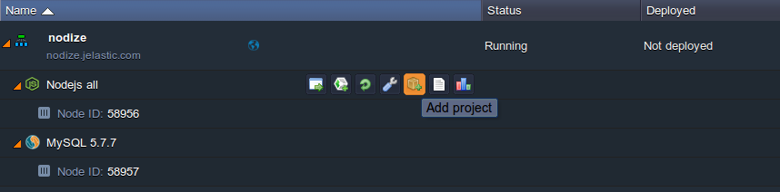

# How to Deploy Nodize CMS

{}{}

**[Nodize](https://github.com/nodize/nodizecms)** is an open source lightweight content management system, written in CoffeeScript. It offers such features as live articles' update (by means of *Socket.io* and *JQuery*), drag&drop uploads and pages sorting, helping to bring your website to a new level. Among other useful capabilities of this CMS you can benefit on, are easy integration of articles into HTML code and auto-generated SEO-friendly URLs. Nodize visual interface is truly simple and comfortable to work with, allowing to put together a website within minutes.

Below, you can find a simple step-by-step instruction on how to install, configure and run Nodize CMS at the platform. So, log in to your PaaS account let's go on!

* [set up environment and DB](#set-up-environment-and-database) 
* [deploy and configure Nodize](#deploy-and-configure-nodize) 
* [start application](#start-application)


## Set Up Environment and Database

1\. Click the **New environment** button on the top dashboard pane.

In the appeared frame, switch to the ***Node.js*** tab (where **NodeJS** application server will be chosen automatically as the only available one), select the desired engine version and enable the **MySQL** node within the *SQL database* section to the left.


Then, state the amount of resources for each layer using cloudlet sliders in the middle section, select the preferred [environment region](/environment-regions/), name your environment (e.g. *nodize*) and click **Create**.

2\. Once the environment is ready and appears at the dashboard, let's proceed with DB configurations - namely, you need to create a dedicated database, where your project data will be stored.


So, access the MySQL web interface by clicking the **Open in Browser** button next to your database node.

3\. Use the credentials you've previously received via email to log in and navigate to the **Users** tab at the top pane.


Click the ***Add user*** link within the *New* section.

4\. Specify the desired ***User name*** and ***Password*** within the appropriate fields. Tick the *Create database with same name and grant all privileges* option below and click on **Go** at the very bottom.


5\. As a result, you'll see a message informing that your new user with a dedicated database was successfully added.


Now, we can proceed to the app server configuration.


## Deploy and Configure Nodize

Once the database is created, you need to deploy Nodize CMS itself and connect it to this DB.

1\. Navigate to Nodize sources at [GitHub](https://github.com/nodize/nodizecms) and click **Copy to clipboard** next to the project link at the top pane.


2\. Then, return to the platform dashboard and select the **Add project** button for the NodeJS app server.



3\. In order to launch the CMS, paste the URL you've just copied to the appropriate field within the **Git** tab and click **Add**.


Wait a bit for all of the required operations to be completed (it will take some time to build and deploy the project).

4\. Now, let's configure the connection between application and database.


Open the configuration tab by clicking the **Config** icon next to your application server.

5\. In the appeared tab, locate the **webroot/ROOT/themes/pageone/settings/database.json** file and adjust the parameters it comprises with your custom values (indicated with the curly brackets below):

```yaml
"host" : "{db_ip}",
"port" : 3306,
"database" : "{db_name}",
"user" : "{db_user}",
"password" : "{user_password}",
"logging" : false,
"dialect" : "mysql"
```

where:

* ***{db_ip}*** - internal IP address of your database
{}**Note:** You can find node IP by expanding the *Additionally* list (gear icon) at the appropriate line.

{}
* ***{db_name}*** - name of the database you've created in the previous section
* ***{db_user}*** - dedicated user for the stated database
* ***{user_password}*** - user's password  

As a result, you should get the similar config:


Don't forget to **Save** the changes with the appropriate button.

6\. Next, navigate to the **webroot/ROOT/settings/nodize.json** file and substitute the default value of the *pixlr_callback_server* line (approximately at the *32nd* line) with a link to your environment.


{}**Tip:** The required URL can be found right under your environment name at the dashboard.

{}

**Save** the changes once again.


## Start Application

Finally, when all the preparations are done, let's start Nodize CMS itself - follow the next steps to perform this:

1\. Locate the ***package.json*** file within the **webroot/ROOT** folder and insert the following line into the *scripts* section (starts approximately at the *41st* line):

```
"start": "cd ~/ROOT/ && coffee app.coffee",
```


**Save** the changes with the appropriate button on the top pane.

{}**Note:** Do not miss the comma at the end of the line (unless it's the last one in the section); otherwise, the script will throw an exception.{}

2\. In order to apply the made changes, **Restart** your NodeJS app server by clicking the appropriate button.


3\. While this operation is performed, open the ***node.log*** file by clicking the **Log** button next to your app server node and selecting it within the list to the left. Here, you can track the current status of the server initialization process.


Wait a while for the *Sequelize session store initialized* string to appear and you are good to proceed.

{}**Note:** Remember the randomly generated admin user's credentials within the list of output data (circled in the image above), as you'll subsequently require them for logging into your CMS admin panel.{}

4\. Finally, hit the **Open in Browser** button next to your environment (an empty page should be opened, as you haven't added anything to your site yet) and append ***/admin*** to the end of the URL within the tab address bar.


You'll see a login frame opened, where you need to specify the admin user credentials you've got during the first initialization (within the preceding instruction step). Click the **Login** button.

Great! Now you can start creating, editing or deleting any content at your site with the help of a simple and powerful Nodize CMS, enjoy!

{}In case you experience any problems with Nodize CMS deployment or configuration, feel free to appeal to our technical experts' assistance at [Stackoverflow](https://stackoverflow.com/questions/tagged/jelastic).{}


## What's next?

* [Tutorials by Category](/tutorials-by-category/)
* [Node.js Tutorials](/nodejs-tutorials/)
* [Setting Up Environment](/setting-up-environment/)