# How to Deploy SocketStream

**[SocketStream](https://socketstream.com/)** is an open-source web framework, powered by Node.js, which is mainly focused on building single-page real time applications and provides a set of tools for that. Its modular structure is designed not to bind you to a particular technology for being used within apps, but its main benefit is native Websockets support. This framework supports all the modern browsers, allowing to establish a true bi-directional communication without any noticeable latency and makes your application actually work in real time!

So, let's examine its functionality in more detail by deploying a simple Socketstream demo app inside the platform.


## Create Environment

1\. First of all, you need to log into your PaaS account and create a **New environment** - the appropriate button can be found in the top left corner of the opened dashboard.

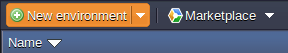

2\. In the appeared environment wizard, switch to the **Node.js** tab at the top, where the required application server will be already chosen:

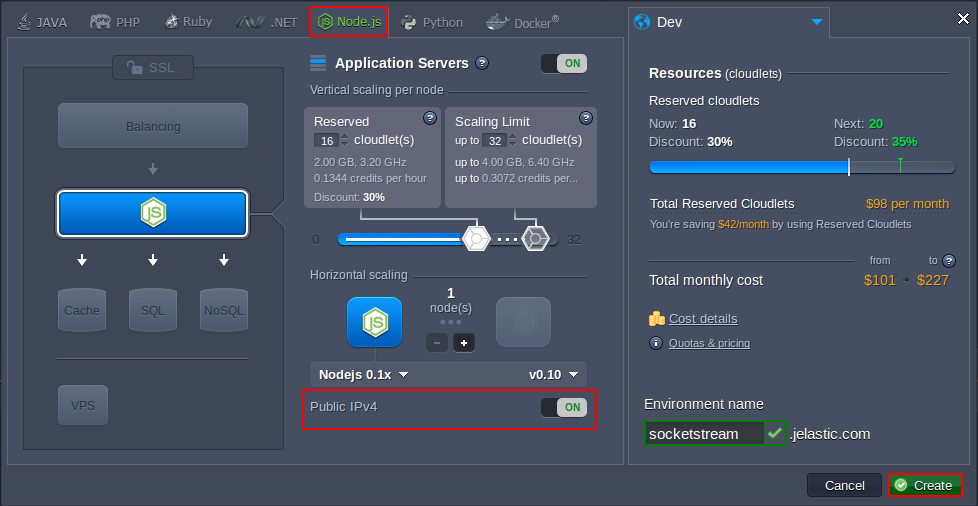

Thus, just define the resource limits using the cloudlet sliders in the central pane, make sure you switch on the **Public IPv4** option (circled above) and enter the desired environment name (*e.g. socketstream*).

Click **Create** to finish.


## Add Project

Now, let's build and deploy the appropriate code to the prepared environment.

1\. Open the **SocketStream** [project page](https://github.com/socketstream/socketstream) at GitHub and click on the **Copy to clipboard** button at the pane to the right.

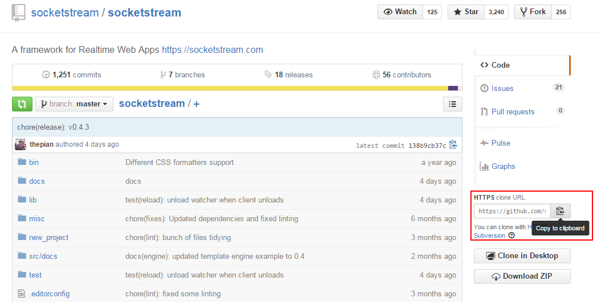

2\. Return to the platform dashboard and click on the **Add project** icon for your *Nodejs* server.

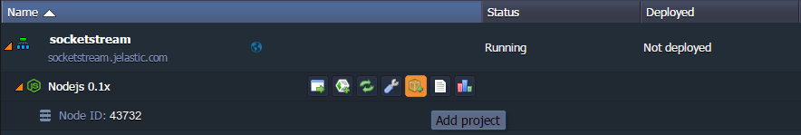

3\. At the appeared ***Add project*** frame, ensure you have the **Git** tab opened and paste the URL you've just copied into the same-named field.

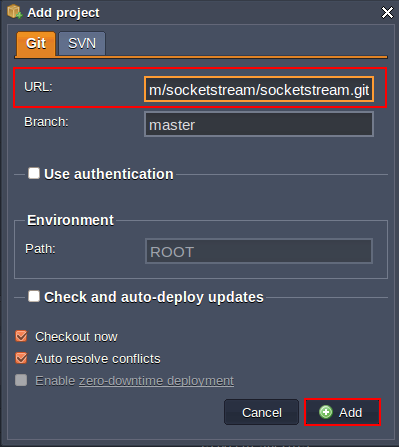

Adjust the rest of the non-obligatory options if needed and click the **Add** button below. Wait until your project is successfully deployed (this may take a couple of minutes).


## Start Application

Now it's time to perform some configurations to make our **Socketstream** application work properly.

1\. Click the **Config** icon next to the *Nodejs* app server at your platform dashboard.

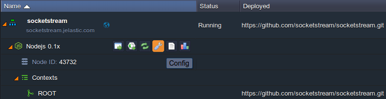

2\. In the opened *Сonfiguration manager* tab, locate the ***package.json*** file within the **webroot/ROOT** directory and insert the following line into its ***scripts*** section (which starts approximately at the *77th* line) as it is shown below:

```
"prestart": "sudo npm install -g socketstream; socketstream new jelastic; cd jelastic; npm install",
```

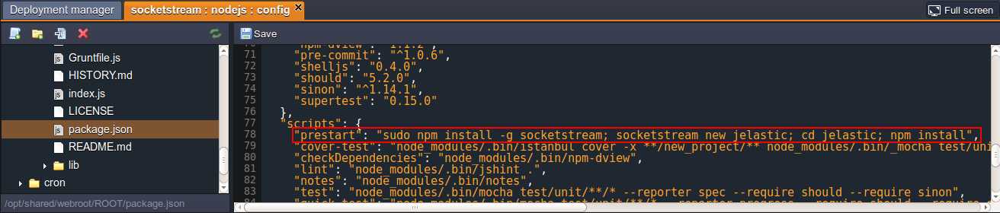

{}**Note:** Do not miss the end comma, that separates our command from the default ones - otherwise, you'll get an error further on.{}

3\. **Save** the changes and **Restart node** with the appropriate button next to your app server.

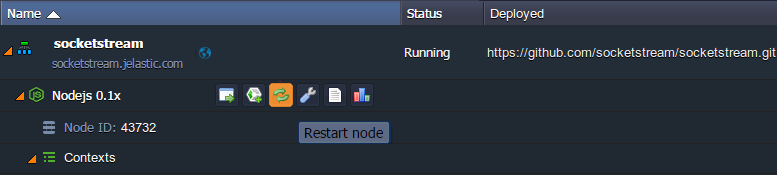

{}**Note:** Our configurations require some time to be applied and you need to wait for this process to complete. Its current state can be tracked through the **Log** files - access the appropriate tab with the same-named button and wait until the *npm info ok* success response appears.

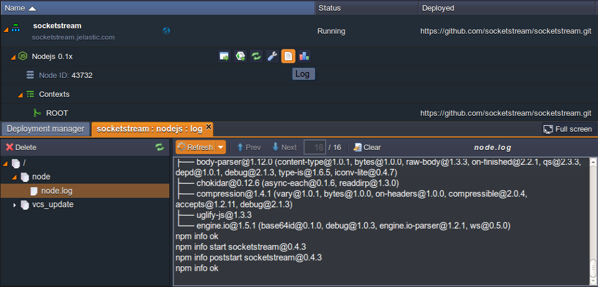{}

4\. Now, you need to change the **package.json** file one more time. Substitute the *prestart* line you've specified before with the next string:

```
"start": "cd ~/ROOT/jelastic/ && node app.js",
```

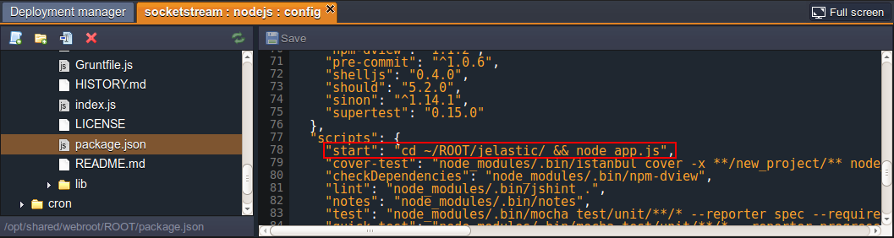

**Save** the made changes and **Restart node** once again.

6\. Finally, select the **Open in Browser** icon for your environment.

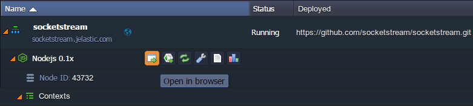

The application will be opened within a new browser tab.

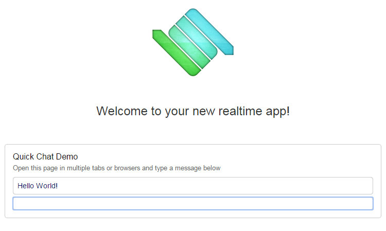

Congratulations! Now, you can use the SocketStream demo chat app to enjoy real time communication with everyone you'll share this page with, or start building your own one.


## What's next?

* [Tutorials by Category](/tutorials-by-category/)
* [Node.js Tutorials](/nodejs-tutorials/)
* [Node.js Dev Center](/nodejs-center/)