# How to Install StrongLoop

With **StrongLoop API Server** you are able to develop, deploy, secure and scale REST APIs at a record speed.

The main StrongLoop components are:

* *LoopBack*, an open-source framework for Node;
* *StrongLoop Controller*, a Node devops system;
* *Application monitoring*, for app's metrics controlling;
* other resources for Node.js developers and devops professionals.

These components, which can be used together or separately, make up a complete Node.js API server. The parts are modular so you can mix and match them as needed.

In this instruction, you'll find out how to deploy the LoopBack framework example application at the platform.


## Create Environment

1\. Log in to the platform and click the **Create environment** button on the upper left corner of the dashboard.


2\. In the opened window, switch to the **Node.js** tab. The only available application server will be chosen by default, therefore just specify the maximum resources usage limit for it (use the cloudlets sliders), type your environment name (e.g. *strongloop*), and click **Create** button.

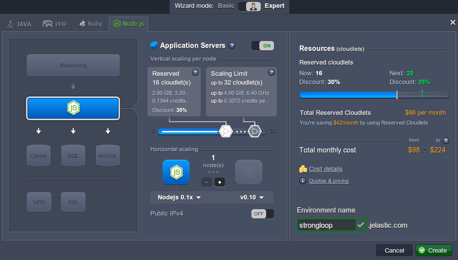

3\. Wait for a minute until your environment is created.

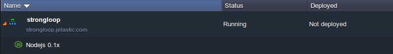


## Application Deployment

1\. To run your LoopBack application, you need to access your environment via SSH protocol.

{}**Tip:** In the case you haven't performed similar operations before, you need to:

* [generate](/ssh-generate-key/) an SSH keypair
* [add your public SSH key](/ssh-add-key/) to the dashboard
* [access your account](/ssh-access/) via SSH protocol
{}

2\. Once you've established the SSH connection to your PaaS account, select *strongloop* environment from the list of available ones.

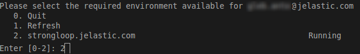

3\. Then enter the *NodeJS* container.

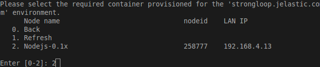

4\. Now let's run the *LoopBack* application sample. Go to the **ROOT** folder with the next command:

```bash
cd ROOT
```

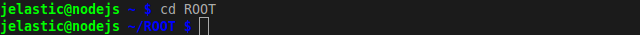

5\. While inside, you need to download the appropriate project from the repository storage. Type the following line for that:

```bash
git clone https://github.com/strongloop/loopback-example-app
```

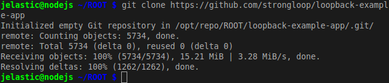

6\. Enter your newly created **loopback-example-app** directory and install the required libraries:

```bash
cd loopback-example-app
npm install
```

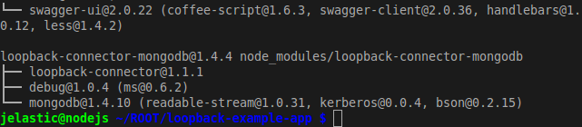

7\. The last thing you need to do before you can start your project is to disable the default Node.js application and allow our project to run instead. Execute the next string:

```bash
sudo service cartridge stop
```

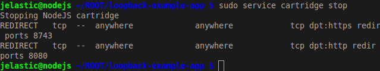

8\. Now you can run your *LoopBack* application using the following command:

```bash
node .
```

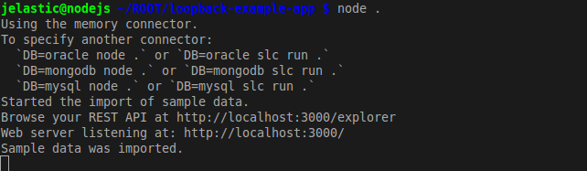

{}**Note:** DO NOT terminate this process because it's required for the proper application work (you still can close your terminal or just its tab).{}

9\. Finally, return to your platform dashboard and run the project by means of pressing **Open in Browser** next to your *strongloop* environment.

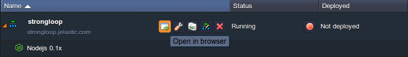

{}**Note:** If you restart your application server, you'll need to run the application through the console again with *sudo service cartridge stop* and *node* commands (ensure you've entered the appropriate project folder).
{}

Congratulations! You have just hosted a *LoopBack* sample application at the platform. 

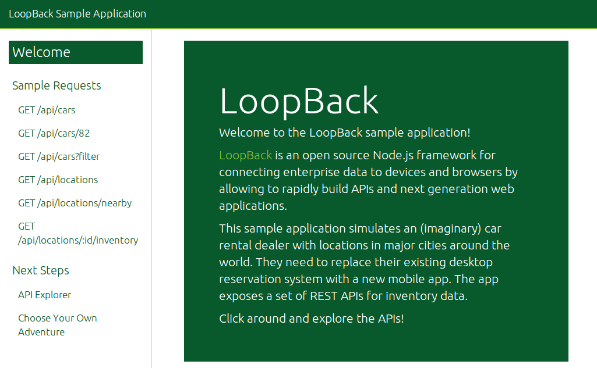

LoopBack's welcome page contains a lot of detailed information that will help you to continue to work with LoopBack in creating APIs. Good luck.


## What's next?

* [Tutorials by Category](/tutorials-by-category/)
* [Node.js Tutorials](/nodejs-tutorials/)
* [Node.js Dev Center](/nodejs-center/)