# How to Install Wintersmith

**Wintersmith** is a simple but flexible multi-platform static site generator, built on top of Node.js. It allows users to freely manage the content, transforming its structure and integrating different plugins and templates. In addition, if you are not satisfied with any plugin among the impressive amount of the preconfigured ones, you can easily create and use your own plugin.

So, follow the tutorial below in order to find out how to host your Wintersmith site generator within the platform.


## Create an Environment

1\. Log in to your PaaS account and click the **Create environment** button.


2\. To begin, create your **Node.js** project by selecting the corresponding tab in the opened dialog window, wherein the **NodeJS** application server will be already automatically chosen.
  
So just specify the required amount of fixed and dynamic cloudlets for it in the *Vertical scaling* section, type your environment name (for example, *wintersmith*) and click the **Create** button.

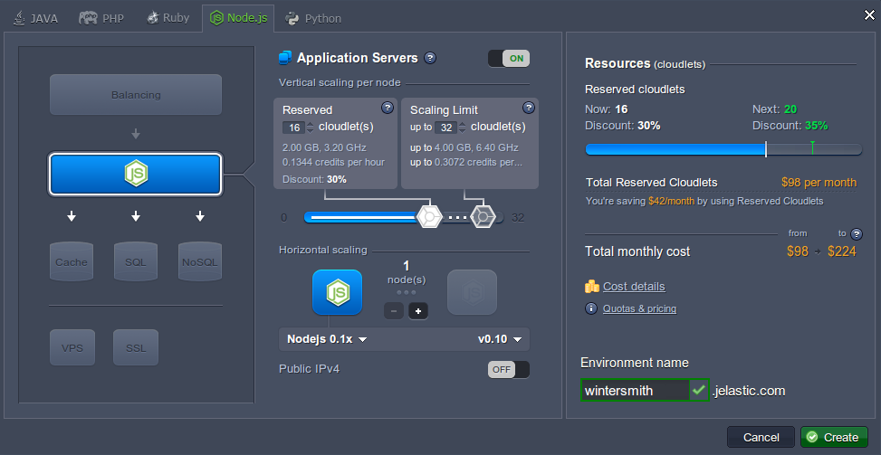

3\. Wait for about a minute until your environment is created and appears at the dashboard.

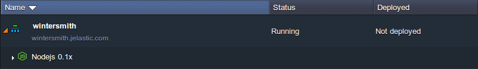


## Add Project 

1\. Navigate to the [Wintersmith project](https://github.com/jnordberg/wintersmith) page at GitHub and select the **Copy to the clipboard** button (circled at the image below) for its HTTPS URL at the right pane.

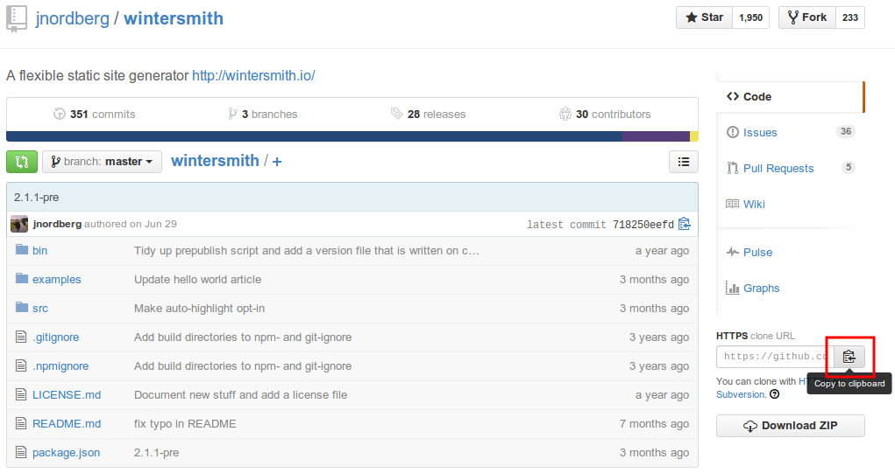

2\. Return to the platform dashboard and **Add** Wintersmith **project** to your NodeJS application server using the appropriate button.

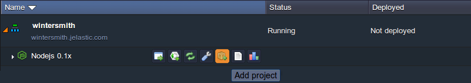

3\. You'll see the **Add project** dialog frame appeared. The **Git** tab will be selected by default, so just insert the previously copied link to its **URL** input field and click the **Add** button.

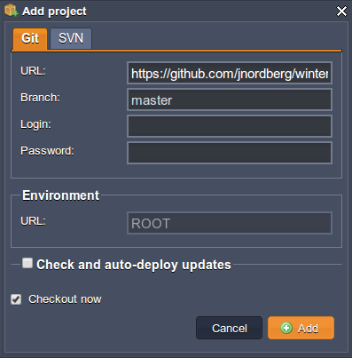

Wait until your project is built and deployed.


## Start the Application

1\. Once the above-mentioned operations are finished, click the **Config** icon next to the NodeJS application server in order to start configuring your app.

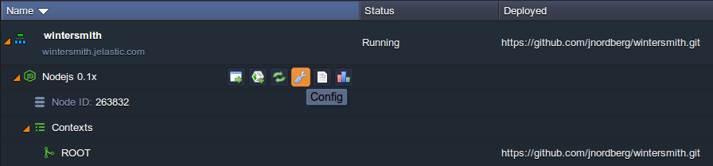

2\. In the opened **Configuration Manager** tab, locate the ***package.json*** file within the **webroot/ROOT** directory and add the next line to its ***scripts*** section in the same way it is shown in the image below:

```
"prestart": "sudo npm install -g wintersmith; wintersmith new jelastic",
```

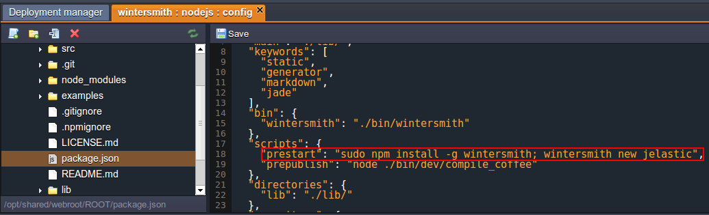

{}**Note:** Do not miss the comma at the end of the added line, otherwise you'll get an error later.{}

3\. **Save** the changes you've made and **Restart** your NodeJS server with the appropriate button.

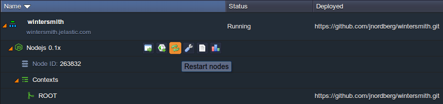

{}**Note:** You should wait until the processes you have initiated with the command above (installation of the required dependencies and creation of a new **jelastic** folder with project inside) are successfully completed.  

The progress can be tracked through the log files of your NodeJS server (use the corresponding **Log** button next to it).

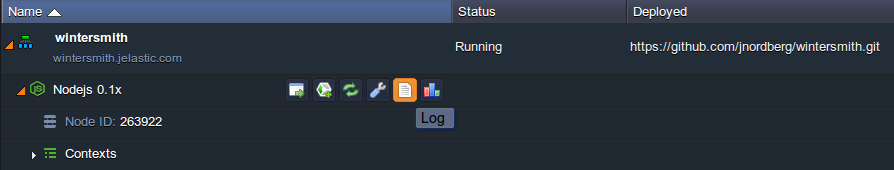

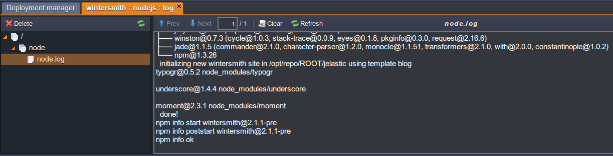{}

4\. Now you need to edit the **scripts** section in the ***package.json*** file one more time. Change the previously added *prestart* line to the following *start* command:

```
"start": "wintersmith preview -C /opt/shared/webroot/ROOT/jelastic",
```

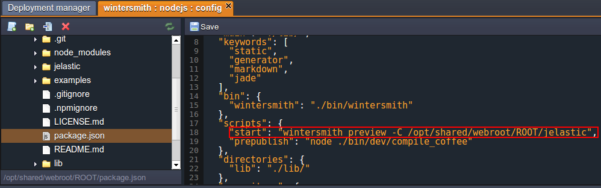

5\. **Save** the performed changes and **Restart** the NodeJS server once again.

Now you are ready to **Open** your application **in Browser** - click the corresponding button next to the *wintersmith* environment.

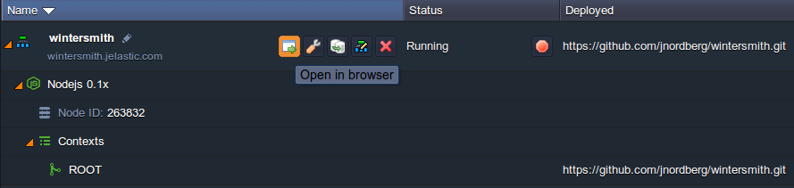

Great! You've just hosted your own Wintersmith project with the help of the platform.

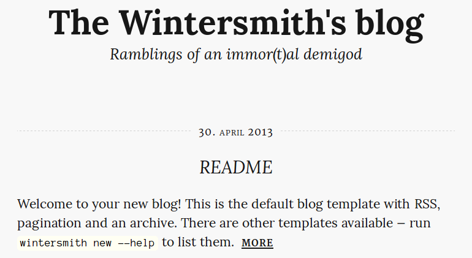

In the opened page you'll find a lot of useful information for further Wintersmith usage. Enjoy!


## What's next?

* [Tutorials by Category](/tutorials-by-category/)
* [Node.js Tutorials](/nodejs-tutorials/)
* [Node.js Dev Center](/nodejs-center/)