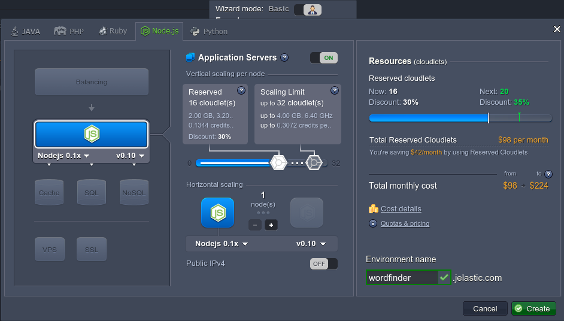
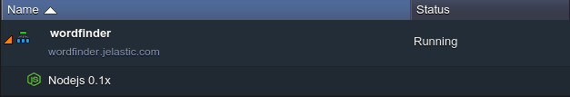
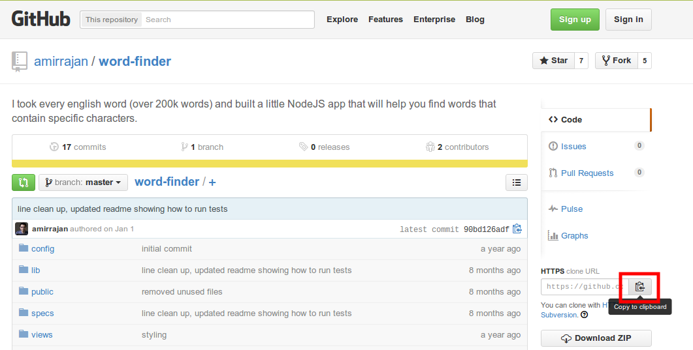
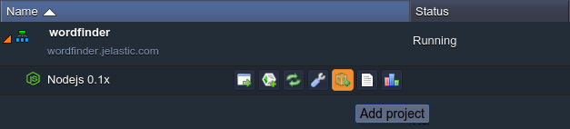
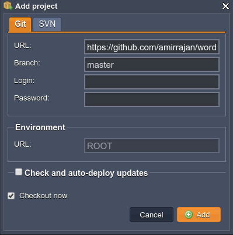
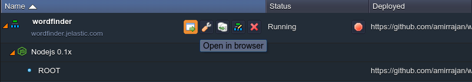
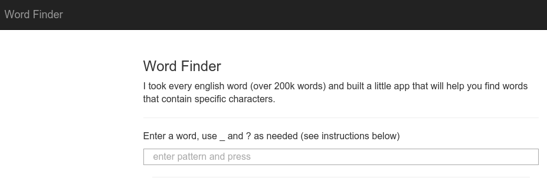

# How to Install Word Finder

**Word Finder** will give you the help you need to beat the competition in such game as Words with Friends. Just enter the tile to find all the matched words, and Word Finder will scan through every english word (within a base with over 200k words) to deliver complete word lists suited for your situation.

So, let's find out how to get the Word Finder application hosted just in a few steps with the help of the platform.

## Create Environment

1\. Log in to the platform and click **Create environment** button in the upper left corner of the dashboard.

2\. In the opened window select the **Node.js** tab and choose **NodeJS** as your application server. Use the cloudlets sliders to determine the amount of required resources, type your environment name (e.g. *wordfinder*), and click **Create** button.

3\. Your environment will be created in a minute.

## Add Project

1\. Navigate to the Word Finder project at GitHub with the following [link](https://github.com/amirrajan/word-finder). Click **Copy to clipboard** button at the right pane.

2\. Now return to the platform dashboard and click **Add project** icon next to your NodeJS app server.

3\. In the opened frame choose the **Git** tab and fill in the **URL** text field with a HTTPS link you've copied at GitHub.

Click **Add** button to proceed.

4\. Wait until the project is successfully added and run the application by means of pressing **Open in Browser** icon next to your environment.

Now you can start use your Word Finder, hosted with the platform.

Good luck and beat them all!

## What's next?

* [Tutorials by Category](/tutorials-by-category/)
* [Node.js Tutorials](/nodejs-tutorials/)
* [Node.js Dev Center](/nodejs-center/)