# How to Deploy Drupal

You can have a **Drupal** instance up and running within minutes using one-click install option.

The process is simple - just click **Get it hosted now**, type your email and install **Drupal** in a minute skipping the steps of manual installation.

## Manual Drupal Installation

**[Drupal](http://drupal.org/)** is an open source content management platform powering millions of websites and applications. It's built, used, and supported by an active and diverse community of people around the world. Let's deploy it to the platform right now!

It's pretty easy, just follow a few simple steps below:

## Create an Environment

1\. Log in to the platform dashboard.

2\. Click the **Create environment** button at the top left:

3\. Pick **Apache PHP** application server and **MySQL** (or **MariaDB**) database.

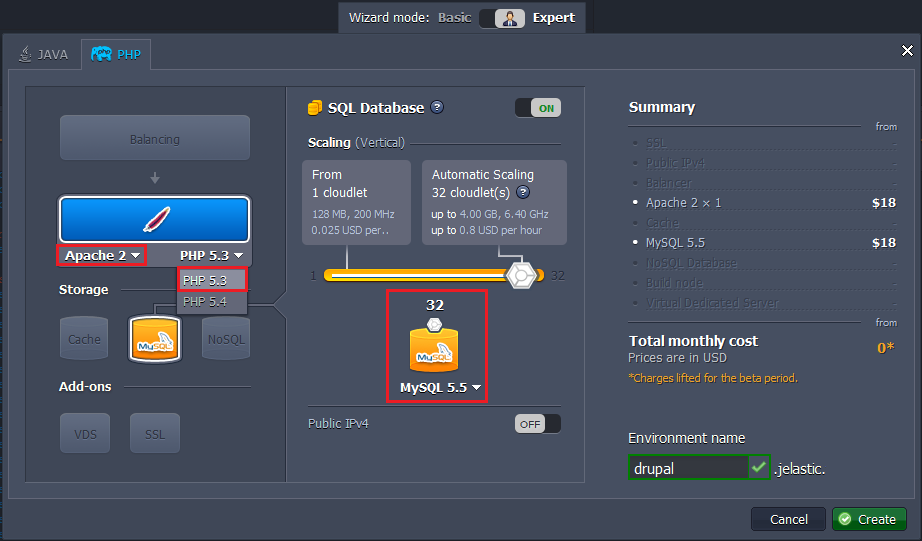

In a minute your environment with both **Apache** and **MySQL** will be created and appear in the environment list.

4\. Click **Config** button for your Apache server.

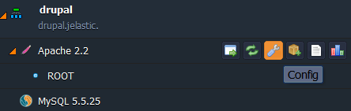

5\. Navigate to **etc** folder and open ***php.ini*** file.

6\. Add ***extension=gd.so*** line after **extension=mysql.so**.

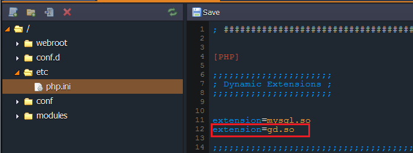

7\. Save the changes and **Restart** the node.

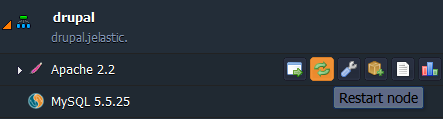

## Upload the Application

1\. Go to the official [Drupal web-site](https://www.drupal.org/download) and download **.zip** archive. For that just click **Download Drupal** button and choose the appropriate version in the opened window.

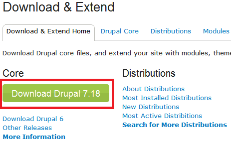

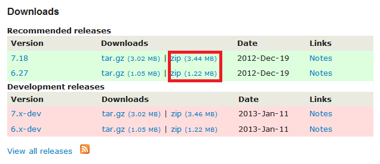

2\. Upload this **.zip** archive to the **Deployment Manager**.

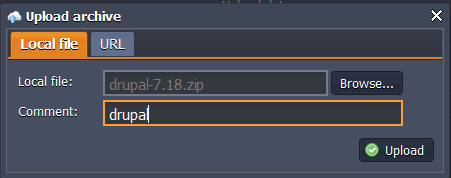

3\. Once the package is in the platform, **Deploy** it to the environment you have just created.

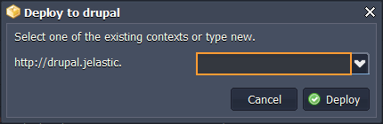

## Configure Database

1\. Once the deployment is finished, click **Open in Browser** button for **MySQL** node.

2\. When you created the environment, the platform sent you an email with credentials to the database. Create an account and the database with the application using these credentials.

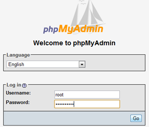

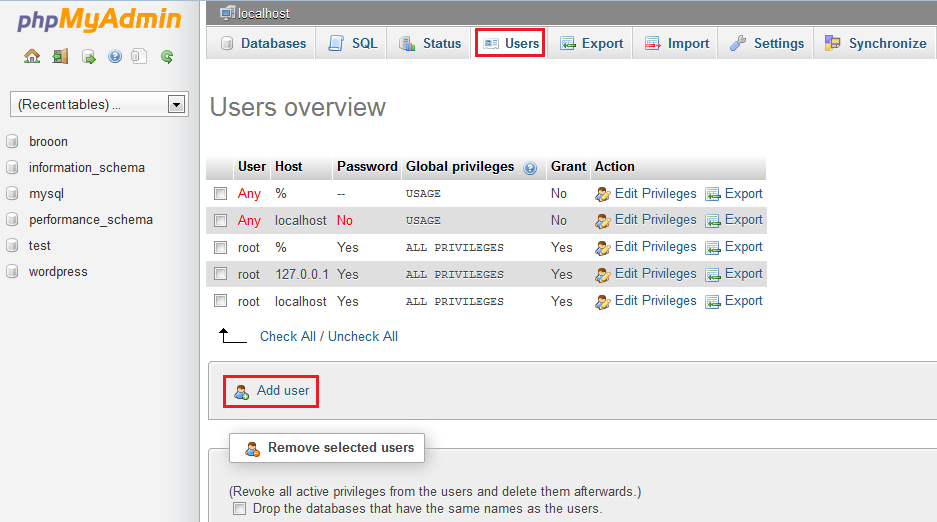

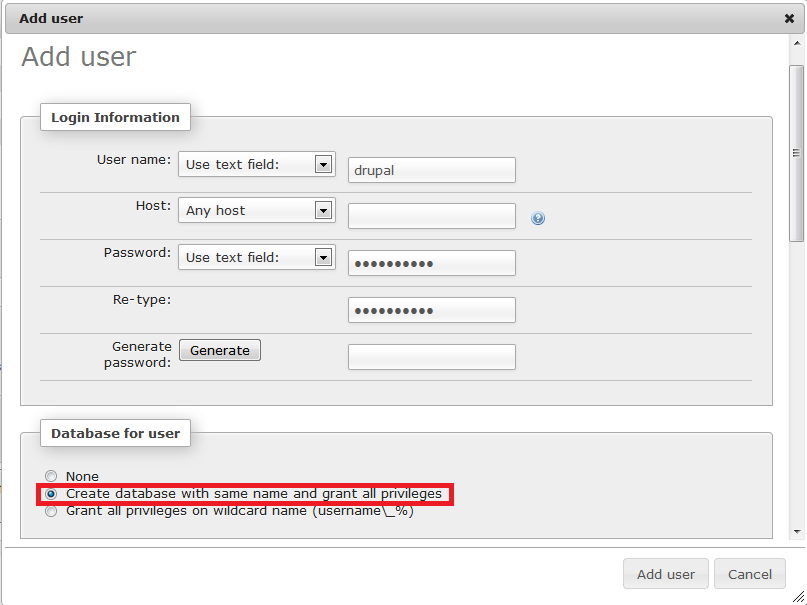

## Install Drupal

1\. Click the **Open in Browser** button for Apache in your environment.

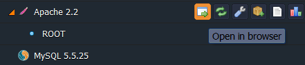

2\. Process of installation is rather simple, but let's pay more attention to the database connection. Fill in the required fields in the following way:
* choose Database Type: **MySQL, MariaDB, or equivalent**
* type **Database name** (which you've entered while creating database)
* type **Database Username** (which you've entered while creating database or just root)
* type **Database Password** (which you've entered while creating database or which you've got by email)
* state **Database Host** (insert the link to your database without "http://" and "/")
* Click **Save and Continue** button

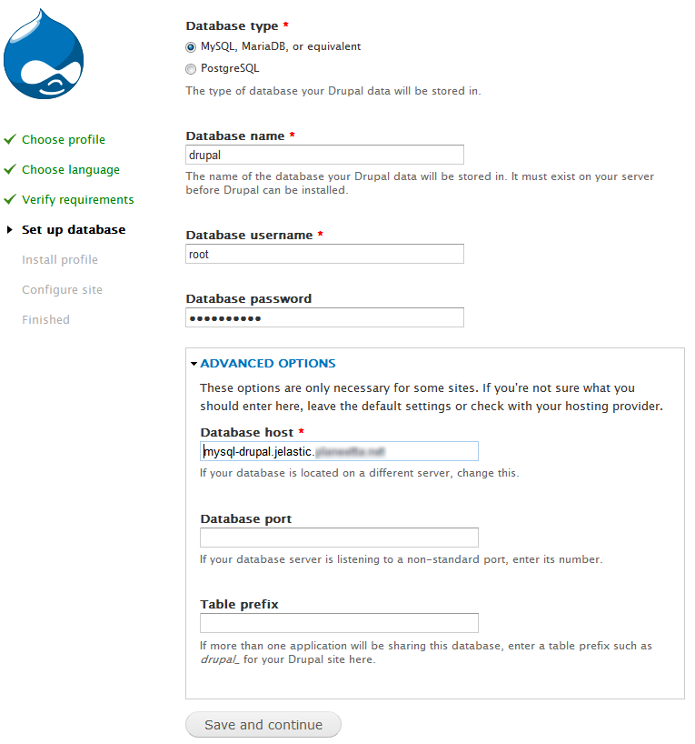

3\. Fill in the last form of installation. That's all!

Now you can easily use **Drupal** in the platform.

## What's next?

* [Tutorials by Category](/tutorials-by-category/)
* [PHP Tutorials](/php-tutorials/)
* [Setting Up Environment](/setting-up-environment/)

