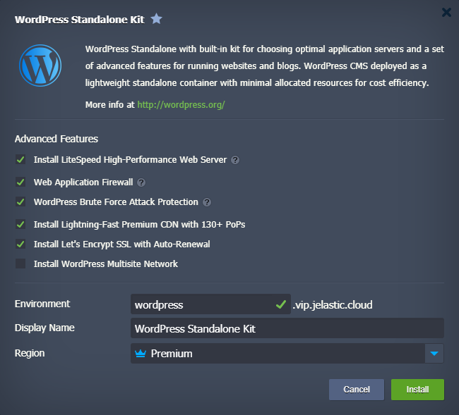
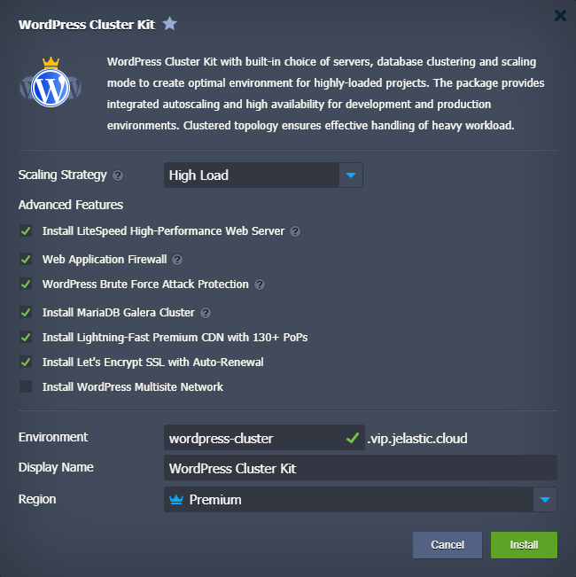
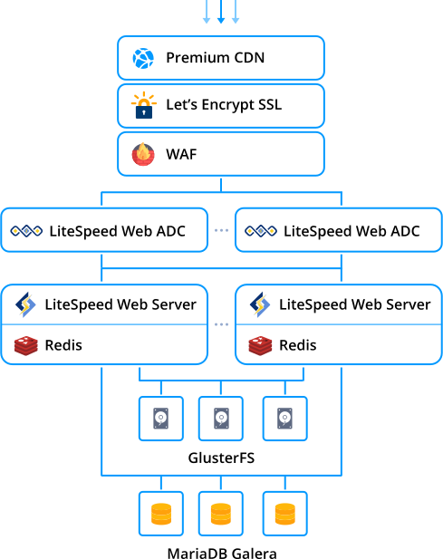
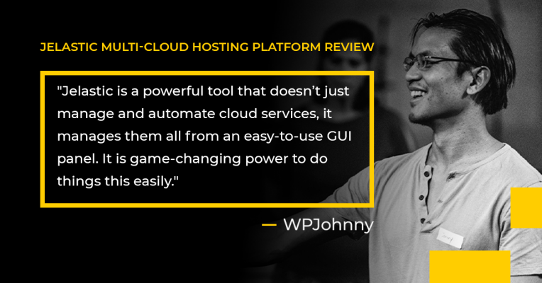

# WordPress Hosting

{}{}

**[WordPress](https://jelastic.com/wordpress-hosting-enterprise/)** is one of the quickest ways to create a website, as it is free and easily accessible to anyone. Considering extensibility via themes and modules, WordPress can be used by both professionals and amateurs, which makes it the world’s most popular website builder.

Herewith, in order to get the most from this great website builder, WordPress needs an equally incredible web host. The platform has vast experience with hosting WordPress-based applications, including pre-packaged solutions, clusterized and standalone options, optimization, automatic scaling, and high availability.

Refer to our dedicated blog posts series to learn how to host WordPress with the platform.

**Getting Started:**

* [WordPress Hosting in Elastic Standalone Container](https://www.virtuozzo.com/company/blog/wordpress-hosting-standalone-container/) - cost-effective WordPress Standalone installation inside a lightweight container for running small and medium-size projects

* [Enterprise WordPress Cluster: Automatic Scaling and High Availability](https://www.virtuozzo.com/company/blog/wordpress-hosting-enterprise-high-availability-auto-scaling/) - production-ready WordPress hosting with embedded options for Multisite Network, advanced performance and high-availability of LiteSpeed servers, HTTP/3 support, MariaDB Galera, CDN, Let’s Encrypt SSL

* [How to Migrate a WordPress Site to PaaS](https://www.virtuozzo.com/company/blog/migrate-wordpress-site/) - steps to migrate WordPress websites to the platform using pre-configured WordPress packages available in the marketplace

**Advanced Configurations and Optimization:**

* [Setup WordPress Multisite Network with Domain Mapping and CDN](https://www.virtuozzo.com/company/blog/wordpress-multisite-network/) - create WordPress multiple networks, bind custom domains, issue SSL certificates and integrate CDN in a few minutes using a single WordPress installation
* [High-Performing WooCommerce Hosting for E-Commerce Projects](https://www.virtuozzo.com/company/blog/woocommerce-hosting/) - set up an online store using WooCommerce plugin and start selling your products on highly-available WordPress site
* [WordPress Speed Optimization Guide: Web Hosting](https://www.virtuozzo.com/company/blog/wordpress-speed-optimization-webhosting/) - web hosting optimization hints for speeding up WordPress websites to increase the Google ranking and the conversion rate
* [WordPress Speed Optimization with Proper Caching](https://www.virtuozzo.com/company/blog/wordpress-speed-optimization-caching/) - choose the right server for caching, configure cache plugins, cache-prebuild, object, browser and private caching, HTML-caching to speed up your WordPress website
* [WordPress Security Optimization for High-Performing Websites](https://www.virtuozzo.com/company/blog/wordpress-security-optimization/) - implement a set of security optimization against hacking and cyber attacks to improve your WordPress website performance
* [LiteSpeed Benefits Over Other Servers for WordPress Hosting](https://www.virtuozzo.com/company/blog/litespeed-wordpress-hosting/) - find out the benefits of hosting WordPress websites on LiteSpeed servers, explore the testing results to make the right software stack choice

**PaaS WordPress Hosting Reviews:**

* [WordPress Hosting Performance Benchmarks 2020 by ReviewSignal](https://reviewsignal.com/blog/wordpress-hosting-performance-benchmarks-2020/) - the most comprehensive testing and comparison of WordPress hosting plans
* [WPJohny Review of PaaS WordPress Hosting](https://wpjohnny.com/jelastic-cloud-platform-review/) - WPJohnny honest thoughts on the multi-cloud hosting platform
* [Webinar: WordPress Cluster for Enterprise High Availability and On-Demand Scaling](https://www.virtuozzo.com/company/blog/wordpress-cluster-high-availability-auto-scaling-webinar/) - review webinar recording to explore what configurations make WordPress sites scalable, highly available, bulletproof against downtimes or malware attacks
* [WordPress Deployment at AWS, Azure or PaaS. What Cloud to Choose?](https://www.virtuozzo.com/company/blog/wordpress-deployment-at-aws-azure-or-jelastic-cloud/) - discover the fastest and easiest way of WordPress installation at three different cloud platforms

## What's next?

* [Automatic Vertical Scaling](/automatic-vertical-scaling/)
* [Automatic Horizontal Scaling](/automatic-horizontal-scaling/)
* [Custom Domain Name](/custom-domains/)
* [Public IP](/public-ip/)
* [HTTP/3 Support](/http3/)
* [Let's Encrypt SSL](https://www.virtuozzo.com/company/blog/free-ssl-certificates-with-lets-encrypt/)
* [Custom SSL](/custom-ssl/)
* [Premium CDN Add-On](https://www.virtuozzo.com/company/blog/enterprise-cdn-verizon-integration/)
* [Configuration File Manager](/configuration-file-manager/)
* [SSH Access](/ssh-access/)
* [Log Files](/view-log-files/)
* [Statistics](/view-app-statistics/)
* [Shared Storage Container](/shared-storage-container/)
* [Auto-Clustering of Instances](/auto-clustering/)
* [Marketplace](/marketplace/)