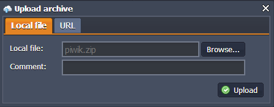

# How to Install Piwik

Meet **Piwik** - web analytics application, freeware and open-source! It can help you gather and analyze important information about your users by tracking Key Performance Indicators such as visits, goal conversion rates, downloads, keywords and many other.

Piwik has been translated to more than 45 languages and new versions appear regularly, every few weeks.

You can easily deploy and run it within the platform with the help of PHP and MySQL web servers. Let's do it now.

## Create Environment

{}If you don't have a PaaS account, please register it as described in the [Getting Started](/getting-started/) document.{}

1\. Log in to the platform and click **Create environment** button in the upper left corner of the dashboard.

2\. Choose the **PHP** tab. Pick Apache as your application server and **MySQL** as a database. Name your environment or use the default name. State the cloudlets limits for each added node. Click the **Create** button.

3\. Just in few seconds your new environment will be created and displayed in the environment list.

You have also received two emails: the first one with the confirmation of successful environment creation, and the second one - with MySQL authorization details. 
 

## Configure MySQL Database

1\. In your platform dashboard window click on **Open in browser** icon for the MySQL node in your environment.

2\. Open the letter with the subject *MySQL node successfully added* in your email box. Find there your **Login** and **Password** (you can enter the **phpMyAdmin** panel by clicking the **Access URL** in the same letter as well). 

3\. Specify your **Username** and **Password** and log in.

4\. Go to the **Users** tab and create a new user (you can name it piwik, for example) with an option ***Create database with same name and grant all privileges*** ticked. Push **Go** button in the bottom right corner.

## Upload and Deploy Application 

1\. Go to the official **[Piwik site](http://piwik.org/)** and click **Download Piwik Now** link. On the next page download the latest application release.

2\. Unzip the package you have just downloaded, and compress the folder Piwik to **Piwik.zip** archive. 

3\. Go to your platform dashboard and click **Upload** at the Deployment Manager. In the opened window **Browse** to your local archive file and upload it.

4\. Click on the **Deploy to** icon next to the name of your archive file and choose your environment from the drop-down list. If you would like to deploy several projects to the single server, specify the application's target context (in our case it is not necessary).

## Install Application

1\. Open your environment in browser by clicking the **Open in Browser** icon.

2\. Follow the installation instructions. 

3\. At the Database Setup step fill the next fields in: 

* **Database Server** (the access URL from the received email <u>without *http://*)</u> 
* **Login and Password** (you've created them while DB setting)
* **Database Name** (the same as login)

Click the **Next** button.

4\. Enter the login and password which you chose for your **Super User**, input valid email address. Click the **Next** button.

5\. Enter your **Website** name and insert your environment **URL**. Click the **Next** button.

6\. At this step you are provided with **Tracking Code**. Later you will be able to find it at your **Admin Dashboard**. Click the **Next** button one more time.

Congratulations! You have got Piwik application up and running inside your platform.

7\. Now, you can enter Super User's login and password and enjoy working with your Web Analytics System!

## What's next?

* [Tutorials by Category](/tutorials-by-category/)
* [PHP Tutorials](/php-tutorials/)
* [Setting Up Environment](/setting-up-environment/)