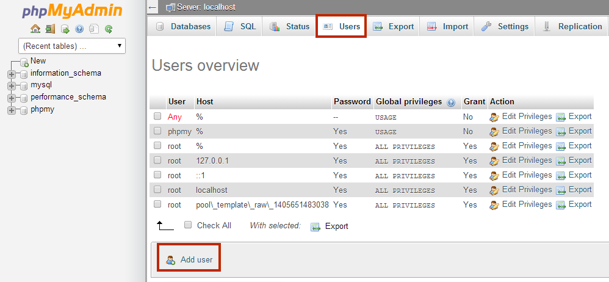

# How to Install Alto CMS

**Alto CMS** is a modern engine for creation of the sites with different purposes. It is open-source, freeware, and can be used with MySQL and PostgreSQL databases.

This CMS is based on a MVC (Model Viewer Controller) paradigm. Its basic functionality is permanently updated with hooks and plug-ins, created by the community of independent developers for this system. In addition, Alto CMS supports Smarty 3+ template engine for PHP, which makes it easy to customize your site appearance. 

Find out how to install **Alto CMS** application into your platform by following the next steps.

## Create an Environment

*NOTE: If you don't have a PaaS account, please register it as described in the [Getting Started](/getting-started) document.*

1\. Log in to the platform and click **Create environment** button in the upper left corner of the dashboard.

2\. Choose the **PHP** tab. Pick **Apache** as your application server and **MySQL** as a database. Define the resources limits for the chosen nodes and name your environment (or use the default name). Click the **Create** button.

3\. In a seconds your environment with both Apache and MySQL will be created and appear in the environments list.

## Upload the Application

1\. Go to [this link](http://sourceforge.net/projects/altocms/files/?source=navbar) and choose the latest version of Alto CMS to download.

2\. Go to your platform dashboard. Click **Upload** in the Deployment Manager. Choose your archive file and click the **Upload** button.

3\. Click the **Deploy to** icon next to the name of your archive file and choose the appropriate environment. If you would like to deploy several projects into one server, specify the application's target context (in our case it is not necessary).

## Configure Database

1\. Once the deployment is finished, click **Open** in browser icon for MySQL node in your AltoCMS environment.

2\. After the environment creation you've received two emails: the first one with the confirmation of successful environment creation and the second one &ndash; with MySQL authorization details. Find there **Login** and **Password** for signing in to the phpMyAdmin. 

3\. In the opened administrator panel navigate to the **Users** tab and create a new user with an option **Create database** **with same name and grant all privileges** ticked. Name it, for example, alto.

## Install Alto CMS

1\. Switch back to the platform dashboard and click the **Open in browser** icon for Apache server in your environment.

2\. In the opened tab you'll see the first step of Alto CMS installation, which starts with checking if your environment configurations meet the requirements. Click the **Next** button.

3\. The next step is DB configuration. Type the **hostname** of your database (it is the access URL from the received email <u>without *http://*</u>), **DB name** and **Username** (you've created them while DB setting). Click the **Next** button. 

4\. In the next stage enter your **Email** and type **Login** and **Password** for administrator user. Click the **Next** button. 

5\.  Installation will be started. Wait till its completion.

6\. Open your platform dashboard and click on the Apache **Config** icon. Now find the **install** folder (**/webroot/ROOT/install**) and delete it.

That's all! Now you have your own Alto CMS in PaaS PHP Cloud. Enjoy it!