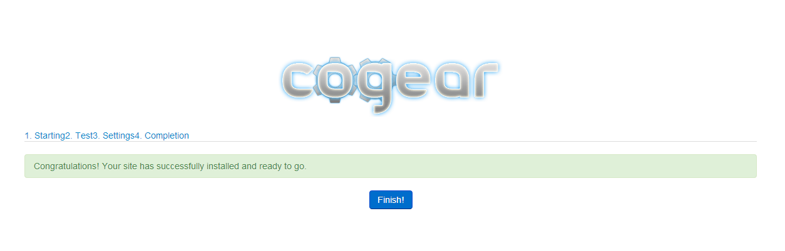

# How to Install Cogear

**Cogear** is a freeware and open-source modular CMS. It provides basic elements ("gears") for web developers, so you can create different sites with really flexible settings and many features available. It is based on a Codeinteger framework and has its own templating system.

You can install it into your platform with ease. Just follow the instruction below.

## Create Environment

{}**Tip:** If you don't have a PaaS account, please sign up as it is described in the [Getting Started](/getting-started/) document.{}

1\. Log in to the platform and click **Create environment** button in the upper left corner of the dashboard.

2\. Choose the **PHP** tab. Pick **Apache** as your application server and **MySQL** as a database. Set the resources limits for these nodes via cloudlets sliders and name your environment (or use the default name). Click the **Create** button.

In a minute your environment with both Apache and MySQL servers will be created and will appear in the environment list.

## Configure Database

1\. Open the letter with a *MySQL node successfully added* subject in your email box. Find there your **Access URL**, **Login** and **Password**.

2\. Open the **phpMyAdmin** panel by clicking the **Access URL**. Type your username and password in the appropriate fields (or just copy them from the email).

3\. Go to the **Users** tab and create a new user with an option *Create database with same name and grant all privileges* ticked.

## Upload and Deploy the Application

1\. Navigate to the official [Cogear](http://cogear.ru/) web site and download **.zip** archive with the latest application version by clicking the **Download** button.

{}**Note:** Currently this site is available in Russian only. If it is a problem for you, please, use an online translator (Google translator, for example).{}

2\. Switch back to your platform dashboard and click **Upload** in the **Deployment Manager**. In the opened frame **Browse** to the archive you've just downloaded and upload it.

3\. Click the **Deploy to** icon next to the name of your archive file in the list of uploaded packages and choose your environment. If you would like to deploy several projects into one server, specify the application's target context (in our case it is not necessary).

## Install Cogear

1\. Click the **Open in Browser** button for Apache node in your environment.

2\. In the opened page just click the **Install** button in order to proceed to the installation steps.

{}**Note:** Currently this application is available in Russian only. If it is a problem for you, please, use an online translator (Google translator, for example).{}

3\. First of all installation wizard checks if your servers meet the needed requirements. If everything is alright here (it should be) just click the **Proceed** button.

4\. The next step is defining a necessary settings. Fill in the following fields:

* **Site name** (any desired one)
* **Host** (insert the link to your database <u>without *http://*)</u>
* **Database name** (similar to the DB user name you've created in the *Configure Database *instruction section)
* **Username** (you've entered it during database creation, similar to the DB name)
* **Password** (you've also specified it during database creation)

Click the **Further** button.

5\. Installation will be started. After its completion click the **Finish** button.

Congratulations! Now you have your own Cogear in your platform. Enjoy!

## What's next?

* [Tutorials by Category](/tutorials-by-category/)
* [PHP Tutorials](/php-tutorials/)
* [PHP Dev Center](/php-center/)