# How to Install Concrete CMS

**[Concrete CMS](https://www.concretecms.com/)** is a free and open-source content management system (CMS).

It was designed for easy usage, so even newbies with minimal technical skills can work with it. You can edit your site's content without leaving the page instead of using an administrative interface or web editors.

The CMS is especially convenient for promo, educational, news and intranet sites. It is pretty easy to deploy Concrete CMS into your platform - just follow the steps below.

## Create Environment

{}**Tip:** If you don't have a PaaS account, please sign up. You can find information about registration in the **[Getting Started](/getting-started/)** document.{}

1\. Log in to the platform dashboard. Click the **New Environment** button at the top left of your platform dashboard.

2\. In the opened topology wizard, go to the ***PHP*** tab. Choose **Apache** application server with PHP version [supported by Concrete CMS](https://documentation.concretecms.org/developers/introduction/system-requirements) (*7.4.20* in our example) and **MySQL** database.

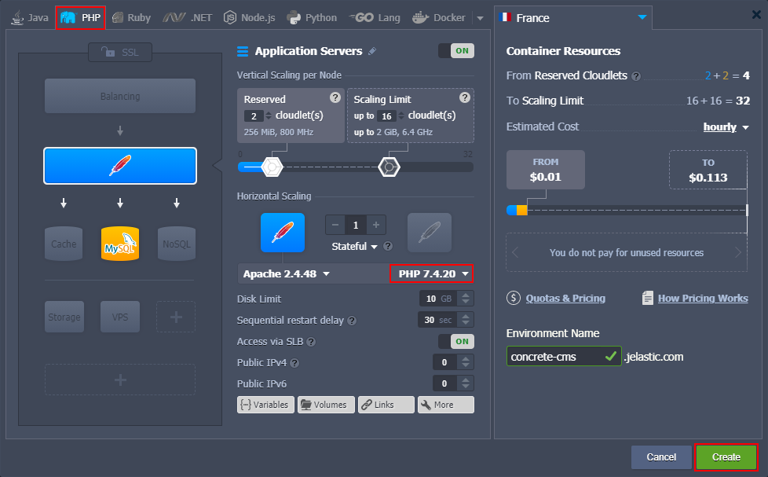

State the cloudlet limits and any other parameters up to your needs. Name your environment (e.g. *concrete-cms*) and click the **Create** button.

Your environment with both Apache and MySQL servers will be created in a few minutes and will appear in the environments list.

## Upload Application

1\. Go to the official [Concrete CMS](https://www.concretecms.org/download) website and download (or copy the link to) the latest version of the CMS.

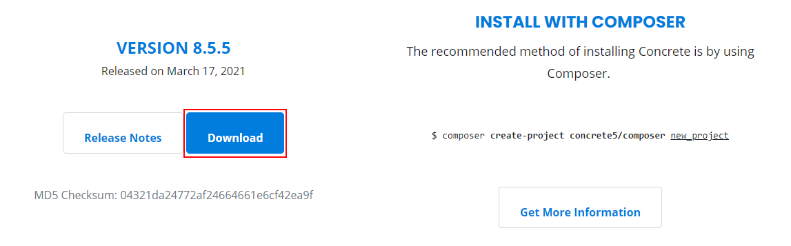

2\. Return to the platform dashboard and upload the archive to the **[Deployment Manager](/deployment-manager/)** (either as a *Local File* or via *URL*).

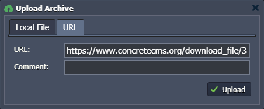

3\. Next, hover over the uploaded archive and click the **Deploy to** button. Choose your environment and type your preferred context name (or just leave it blank) to proceed.

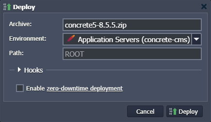

Now, you have got your application deployed.

## Configure Database

1\. Click the **Open in Browser** button for the MySQL node in your environment.

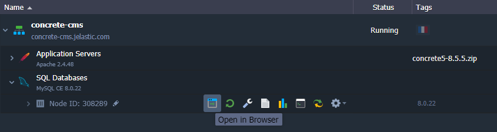

2\. When your environment was created, the platform sent you an email with database credentials. Use the username and password from it to log into the **phpMyAdmin** panel.

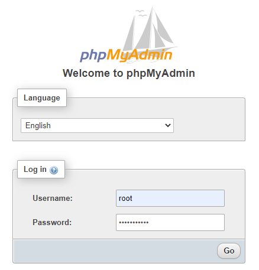

3\. Go to the ***User accounts*** tab and press the *Add user account* link.

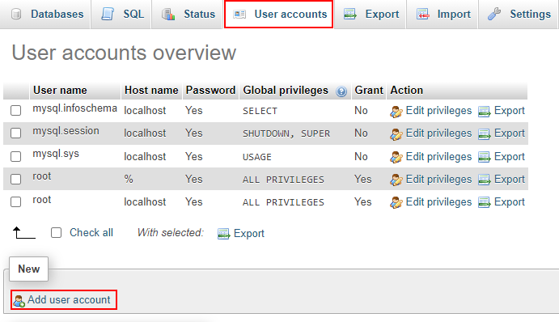

In the opened frame, specify the desired **User name** and **Password**, tick the *Create database with same name and grant all privileges* option.

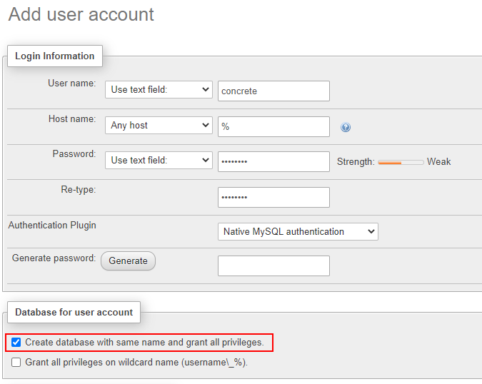

Click the **Go** button at the bottom of the page.

## Install Concrete CMS

1\. Switch back to the platform dashboard and click the **Config** button.

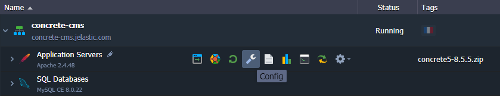

2\. Locate the ***/etc/php.ini*** file and apply the following configurations:

- uncomment the ***extension=gd.so*** line (remove semicolons at the start) to enable the appropriate extension
- add the ***mbstring.http_input = pass*** property to the ***mbstring*** module

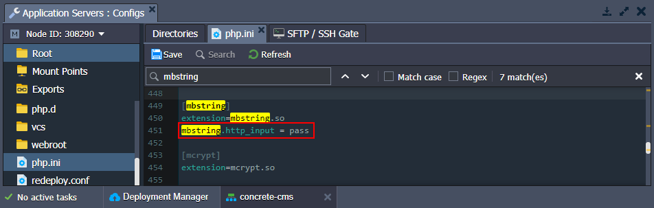

3\. **Save** changes and **Restart** the Apache node to apply changes.

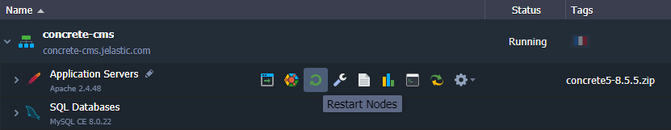

4\. Click the **Open in Browser** icon for the Apache application server in your environment.

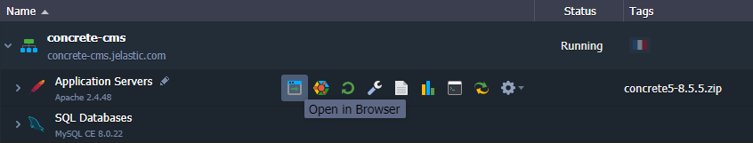

5\. Follow the first steps of the **Concrete CMS** installation: choose the preferable language and verify requirements. Next, fill in all the requested data:

- **Name** - insert the desired name of your site
- **Administrator Email Address** - type the email of the administrator user
- **Administrator Password** - specify password for the administrator user (and confirm it)
- **Server** - paste a link to your database <u>*without https://*</u> (copy from the *phpMyAdmin* address bar or from the MySQL node *email*)
- **MySQL Username** - enter the name of the database user you've created during the DB configuration
- **MySQL Password** - type the password you've specified for a new database user
- **Database Name** - provide the required database name (should be the same as the DB user name)

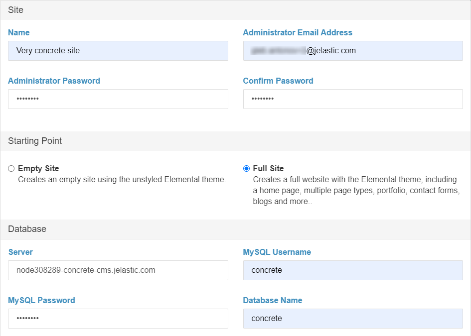

Tick a checkbox below to agree to the privacy policy and proceed with the installation.

6\. Wait a bit till the process is successfully completed.

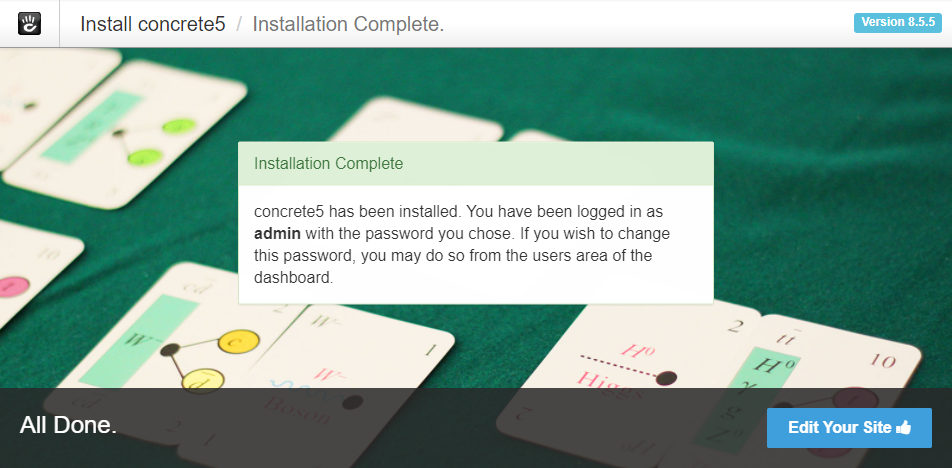

Click the **Edit Your Site** button.

7\. Congratulations! You can start working on your website with the **Concrete CMS** inside your platform.

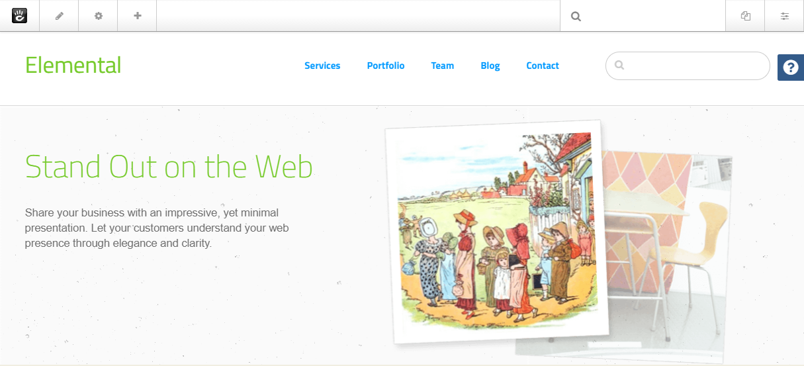

## What's next?

* [Tutorials by Category](/tutorials-by-category/)
* [PHP Tutorials](/php-tutorials/)
* [PHP Dev Center](/php-center/)