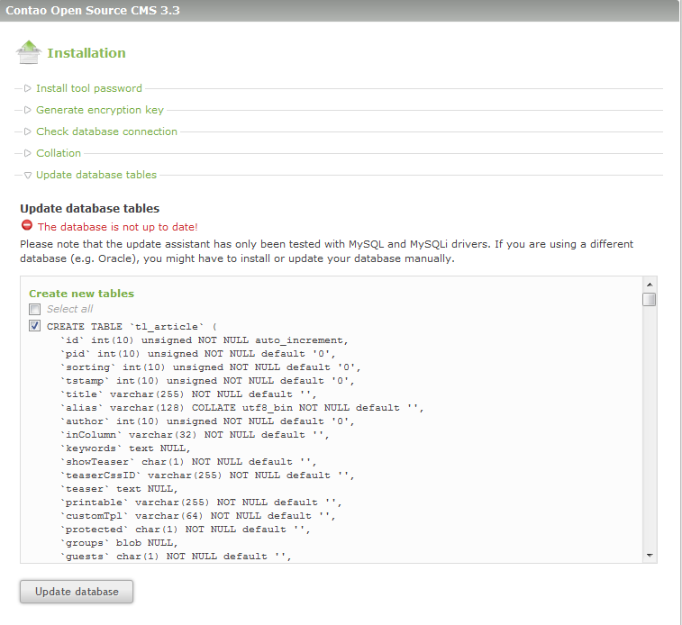
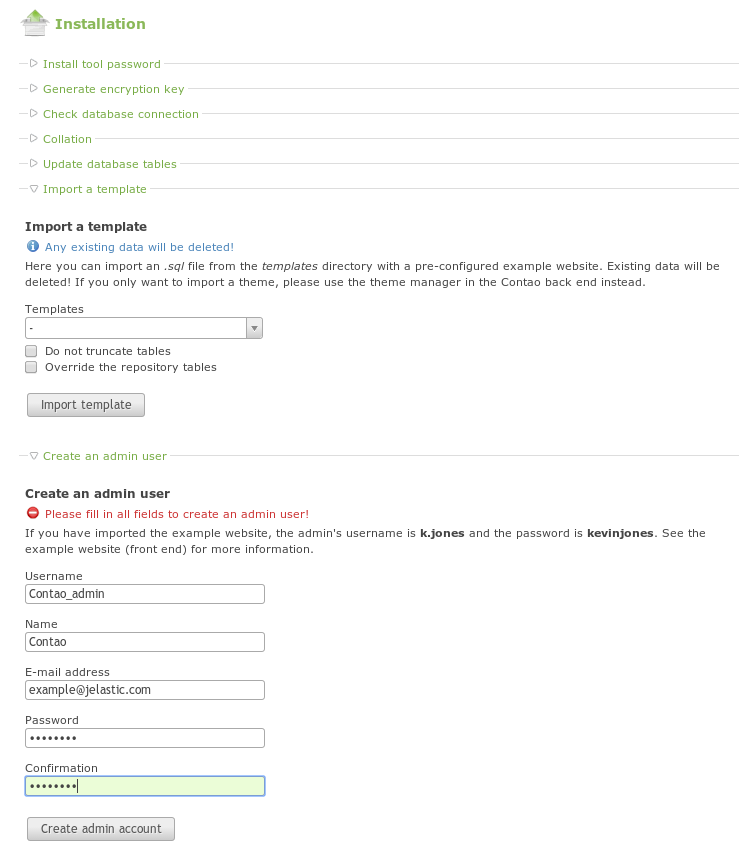

# Install Contao

**Contao** is a content management system (CMS), freeware and open-source. It is good for the users who want to have professional but easy to maintain sites. Contao's interface is built on Ajax and Web 2.0 technologies, supports many languages and themes. This CMS has a powerful permissions system, versioning and undo management, advanced search and sorting options. It contains modern CSS framework and a lot of integrated modules (news, calendar, forms, etc.).

To host **Contao** into your platform, please, follow this instruction's steps.

## Create Environment

1\. Log in to the platform and click the **Create Environment** button at the top left of your dasboard.

2\. Find a **PHP** tab in the opened topology wizard. Pick the **Apache** application server and **MySQL** database there. State the cloudlet limits. Name your environment and click the **Create** button.

3\. You have got your environment appeared in the platform dashboard list.

## Upload the Application

1\. Go to the official **[Contao](https://contao.org/en/download.html)** web-site. Find the latest stable application version there and download it as a **.zip** archive.

2\. Go back to your platform dashboard and click the **Upload** button at the **Deployment manager** tab. Choose the downloaded **.zip** archive for uploading.

3\. Once the package is in the platform, deploy it to the environment you have just created by clicking on the **Deploy to** icon. If you want to deploy several projects into one server specify the application's target context (it is not necessary in our case, so you can just leave it empty).

## Database Configuration

1\. While the environment creation at the very beginning of this tutorial, the platform sent you an email with database credentials. Find there your **Access URL**, **Login** and **Password**.

2\. Enter the **phpMyAdmin** panel by clicking the *Access URL* (you can do it from your platform dashboard or from email). Type your username and password (copy them from the email).

3\. Go to the **Users** tab and press **Add user**.

Create a new user with an option *Create database with same name and grant all privileges* ticked.

## Install Contao CMS

1\. Go back to the platform dashboard and click the **Open in Browser** icon for Apache in your environment.

2\. The window about **Incomplete installation** will be opened.

3\. Don't worry, everything is going well. Just go to the following address: ***http://{your_app_address}/contao/install.php***

This will open the Contao install tool, which will guide you through the installation process.

4\. In the opened window click on the **Accept license** button.

5\. Then specify and confirm your security password (it has to be at least 8 characters long).

6\. At the next wizard step choose the *MySQL* **Driver Type** in the appropriate drop-down list and fill in the following fields:

* **Host:** link to your database <u>without *http://*</u>
* **User**: name of the user you've specified while database configuration
* **Password**: password for the DB user you've created while database configuration
* **Database**: same as the DB user name

Click the **Save database settings** button.

7\. You will get a warning that the database is not up to date. That's ok, just click the **Update Database** button.

8\. In the opened window navigate to the **Create an admin user** section and fill in the following fields:

* **User**: insert the administrator login
* **Name**: type the name of the administrator account
* **E-mail address**: paste the administrator e-mail
* **Password**: enter the password for admin account

Click the **Create admin account** button.

9\. Congratulations! Contao installed and now you just need to configure some system settings.

10\. Go back to the platform dashboard and click on the **Config** icon for your **Apache**.

11\. Go to the **/webroot/ROOT/contao** folder and find there **install.php** file. Delete or rename it.

That's all. Now you have your own Contao up and running in the platform. Visit your Contao website to make sure it works correctly. After filling Username and Password fields, you will see your administration panel.

Enjoy your work with Contao CMS!

## What's next?

* [Tutorials by Category](/tutorials-by-category/)
* [PHP Tutorials](/php-tutorials/)
* [PHP Dev Center](/php-center/)