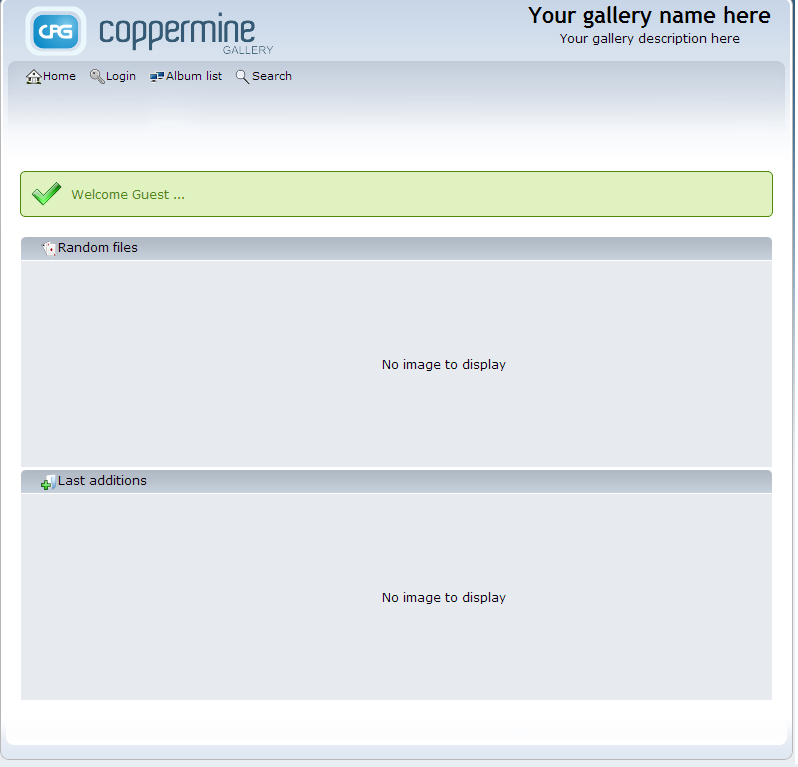

# How to Install Coppermine

**Coppermine Photo Gallery** is a specialized CMS for creating and managing photo galleries in the Internet. It has been translated into dozens of languages. Powered by PHP/MySQL, Coppermine is open-source and freeware.

It is not a rocket science to get Coppermine inside your platform. Just follow the instruction.

## Create Environment

1\. Log in to the platform. If you don't have an account and don't know how to get it, please, use our [Getting Started](/getting-started/) document.

2\. Click the **Create environment** button which can be seen in the upper left corner of your platform dashboard.

3\. Choose the **PHP** tab and pick up the **Apache** and **MySQL** nodes there. State the cloudlets limits for the chosen servers and name your environment (for example, *coppermine*). Now click the **Create** button.

4\. Your environment has appeared in your platform dashboard with both Apache and MySQL.

## Upload the Application

1\. Go to the official [Coppermine web-site](https://coppermine-gallery.net/) and download its **.zip** archive by clicking the **Download** button.

2\. Go back to the platform dashboard. Open the **Upload archive** frame via the Deployment Manager and choose **.zip** archive you have just downloaded. Now click the **Upload** button.

3\. Once the package is in the platform, deploy it to the environment you have just created by clicking the **Deploy to** icon and then **Deploy** button.

## Database Configuration

1\. Open the **phpMyAdmin** panel for your database. You can reach it via the **Access URL** you've got in the email about MySQL node adding right after your environment has been created.

Or click **Open in Browser** button for MySQL server in the platform dashboard.

2\. In the mentioned above email you can also find the **Login** and the **Password**. Use them for logging into the **phpMyAdmin** panel.

3\. Go to the **Users** tab and press **Add user** link. Create a new user (e.g. *coppermine*) with an option *Create database with same name and grant all privileges* ticked. Click the **Go** button.

## Install Coppermine

1\. Switch back to your platform dashboard and click the **Open in Browser** button for **Apache** in your environment.

2\. Click the **here** link to get the classical installation view.

3\. In the opened window specify a **Username**, **Password** and **Email** for your administrator user.

Then fill in the following fields:

* **MySQL Host** (insert the link to your database <u>without *http://*)</u>
* **MySQL Username** and **Database name** (the one you've created during database configuring)
* **MySQL Password** (the one you've entered for the created DB user)

Click **Let's Go!**

4\. Read the provided information and click **Let's continue!** button.

That's all! For now your Coppermine is ready to work right in your platform. Congratulations!

## What's next?

* [Tutorials by Category](/tutorials-by-category/)
* [PHP Tutorials](/php-tutorials/)
* [PHP Dev Center](/php-center/)