# How to Deploy Joomla

You can have a **Joomla** instance up and running within minutes using one-click install option.

The process is simple - just click **Get it hosted now**, type your email and install **Joomla** in a minute skipping the steps of manual installation.

The full list of similar prepackaged solutions for quick deploy can be found at [platform Marketplace](https://www.virtuozzo.com/application-platform/marketplace/).

## Manual Joomla Installation

This is a step-by-step instruction on deploying [Joomla](https://www.joomla.org/) into the platform so you can use it as a content management system (CMS), which enables you to build Web sites and powerful online applications.

To host a PHP Joomla application follow the next instruction:

### Create Environment

1\. Log in to the platform dashboard.

2\. Click the **Create environment** button at the top left:

3\. Pick **Apache** application server, **PHP v5.3** and **MySQL** database.

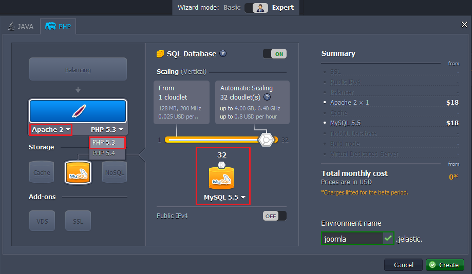

In a minute your environment with both **Apache** and **MySQL** will be created and appear in the environment list.

### Upload Application

1\. Go to the official [Joomla web-site](https://downloads.joomla.org/) and download **.zip** archive by clicking **Download Joomla! 3.0** button.

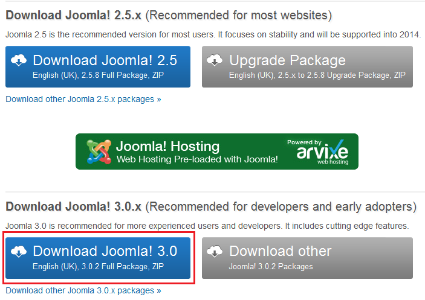

2\. Upload this **.zip** archive to the **Deployment manager**.

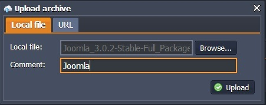

3\. Once the package is in the platform, deploy it to the environment you have just created.

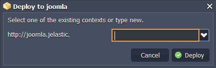

### Configure Database

1\. Once the deployment is finished, click **Open in Browser** button for **MySQL** node.

2\. When you created the environment, the platform sent you an email with credentials to the database. Create an account and the database with the application using these credentials.

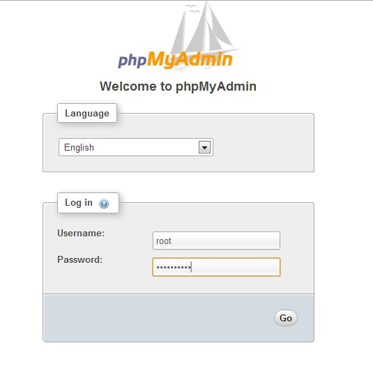

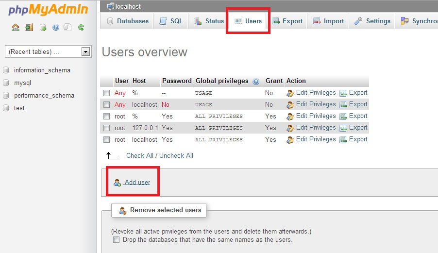

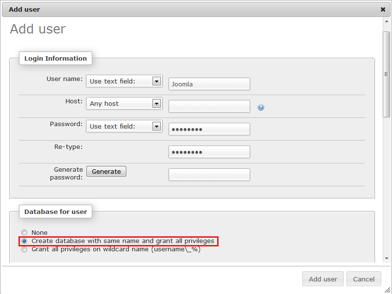

### Install Joomla

1\. Click the **Open in Browser** button for Apache in your environment.

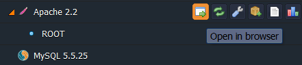

2\. Follow the steps of **Joomla** installation starting with **Main Configuration** settings.

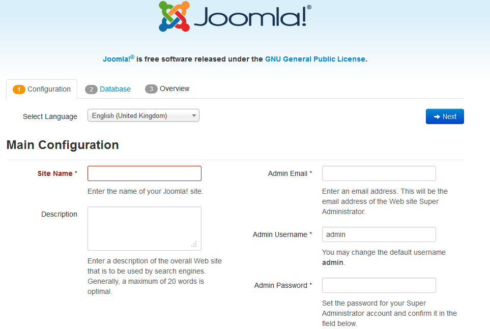

3\. At the **Database Configuration** stage fill in the required fields in the following way:

* choose Database Type: **MySQL** or **MariaDB**
* state **Host Name** (insert the link to your database without "http://" and "/")
* type **Username** (which you've entered while creating database or just root)
* type **Password** (which you've entered while creating database or which you've got by email)
* type **Database name** (which you've entered while creating database)
* Click **Next** button

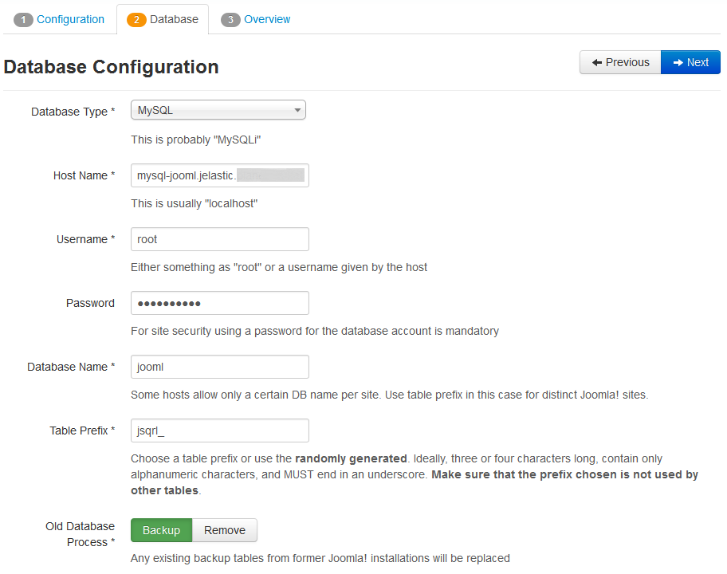

4\. The final step is **Overview**:

* Choose **Sample Data** from the list if you want to install any.
* Activate **Email Configuration** if you want to get the settings info to your email after installation.
* Look through configurations and click **Install** button.

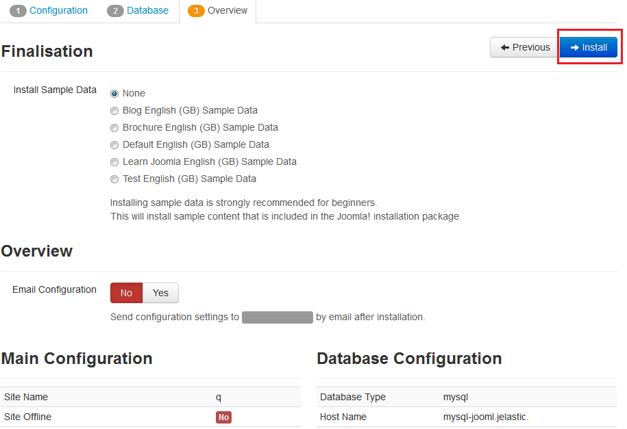

Now you have your own Joomla in the platform. Enjoy!

## What's next?

* [Tutorials by Category](/tutorials-by-category/)
* [PHP Tutorials](/php-tutorials/)
* [Setting Up Environment](/setting-up-environment/)

