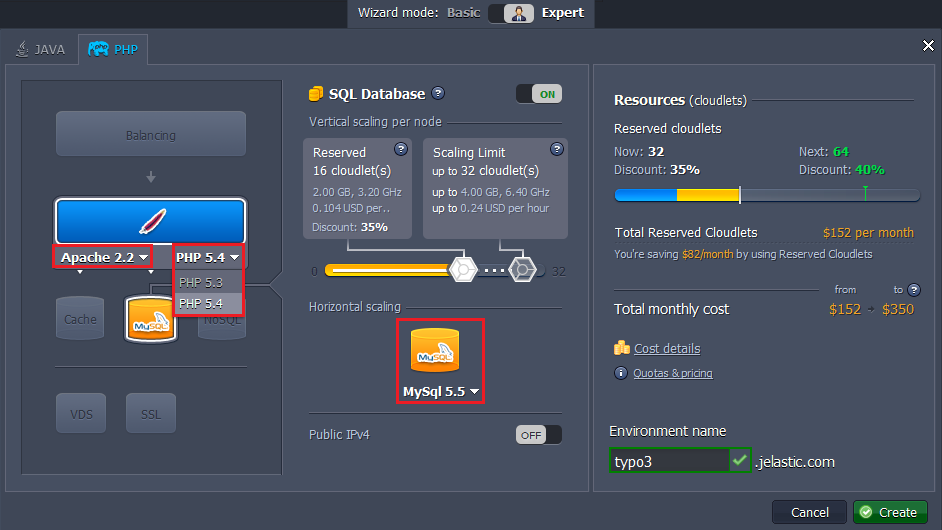

# How to Deploy TYPO3

Here's a step-by-step tutorial on how to deploy **[TYPO3](https://typo3.org/)**, an enterprise-class, open-source CMS (Content Management System), into the platform.

So, let's get started!


## Create Environment

1\. Log in to the platform dashboard.

2\. Click the **Create environment** button at the top left:


3\. Pick **Apache** application server, **PHP v5.4** and **MySQL** (or **MariaDB**) database. Specify your cloudlet limits and name of your environment (for example, *typo3*). Click **Create**.



Wait just a minute for your environment to be created.


## Upload Application Package

1\. Visit the official [TYPO3 web-site](https://sourceforge.net/projects/typo3/files/TYPO3%20Source%20and%20Dummy/TYPO3%206.0.4/introductionpackage-6.0.4.zip/download?use_mirror=garr&download=) to download the latest TYPO3 version as a **zip** package (the downloading will start automatically).

2\. Using the **Deployment manager** upload the package you've just downloaded.


3\. Once the package is in the platform, deploy it to the environment you have just created.


## Environment Configuration

You need to disable ***zend_extension*** in order to get your TYPO3 application up and running. For that follow the next steps:

1\. Click **Config** button for **Apache** server.


2\. Navigate to **etc &gt; php.ini** file and comment the following line: 

```
#zend_extension=/usr/lib64/php/modules/opcache.so
```


3\. Don't forget to **Save** the changes and **Restart** your application server.


## Install TYPO3

1\. Click **Open in Browser** button next to the Apache node.


2\. The Typo3 installation will be started. Click **Continue**.


3\. In the *Connect to your database host* window choose the **MySQL/MySQLi** driver and fill in the **Username** and **Password** fields with credentials to your database (you've got them via email while creating the environment). Put database server address in the **Host** field and click **Continue** button.


4\. Then specify the name of a new database (for example, *typo3*) and click **Continue** button.


5\. In the next window choose the *Introduction package*. Click **Continue**.


6\. The installation will be started. Wait a few minutes for its completion.


7\. Finally, enter the password for access to TYPO3 Admin Panel and choose the color of TYPO3 main page.


8\. Congratulations! The TYPO3 was installed. Click **Go to your Website** button.


9\. Now you can see a default main page. Click **Log into TYPO3**.


10\. Here just enter your login and password (which you've stated in the 7th step) and click **Login**.


11\. Your admin page will be opened.


That's it! Now you have your own TYPO3 in the platform.


## What's next?

* [Tutorials by Category](/tutorials-by-category/)
* [PHP Tutorials](/php-tutorials/)
* [Setting Up Environment](/setting-up-environment/)