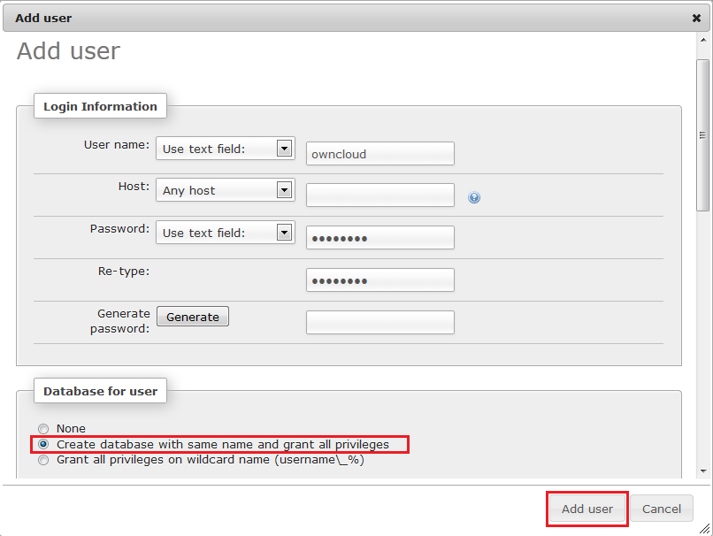

# How to Deploy ownCloud

You can have a **ownCloud** instance up and running within minutes using one-click install option.

The process is simple - just click **Get it hosted now**, type your email and install ownCloud in a minute skipping the steps of manual installation.

Find the full list of applications available for one-click installation at our [Marketplace page](https://www.virtuozzo.com/application-platform/marketplace/).

## Manual ownCloud Installation

**ownCloud** represents an open source and free file cloud storage. It can be easily used for data sharing and synchronization, as well as just for storing documents.

So, follow the next instruction to get your **ownCloud storage** hosted with PaaS PHP cloud. 

### Create Environment

1\. Log in to the platform using PaaS account.

2\. Press **Create environment** button in order to open the environment topology wizard.

3\. Navigate to the **PHP** tab, pick up the application server (e.g. **Apache**) and database node (e.g. **MySQL**) you would like to use.

### Upload and Deploy Application

1\. Open the official ownCloud [web-site](https://owncloud.com/download-server/) and press the **Tar or Zip File** button in order to get the latest ownCloud version. 

2\. In the appeared window choose **.tar.bz2** or **.zip** archive in the first line. Press the appropriate link to start downloading.

3\. Navigate back to the platform dashboard and upload the ownCloud archive within **Deployment Manager**.

4\. Find the uploaded archive in the list of the application packages and deploy it to the necessary environment.

### Database Configurations

1\. Check your email inbox and find the letter with MySQL credentials. Open the phpMyAdmin panel for MySQL (**Open in Browser** button next to the db node) and log in using them.

2\. Create a new user and database with the same names. Specify the password for a new user.

### ownCloud Installation

1\. Press **Open in Browser** button for your environment.

2\. In the opened window create the administrator account by specifying the desired **username** and **password**. Then expand the **Advanced** settings.

3\. Using the appeared fields you can edit the path to your data directory and specify your database server information (**MySQL** in our case):

* **Database user**: the one you've created while db configuration
* **Database password**: the one you've specified while db configuration
* **Database name**: the same as the db user
* **Host**: the host of your db 

In order to get your MySQL server string URL or host number, navigate back to the platform dashboard and press the rightmost button for MySQL node. Choose the **Info** option and in the appeared window copy the circled below string or host number and enter it to the localhost field.

4\. Eventually, press the **Finish Setup** button.

Congrats! Now you can use your personal ownCloud storage hosted at PaaS.

## What's next?

* [Tutorials by Category](/tutorials-by-category/)
* [PHP Tutorials](/php-tutorials/)
* [Setting Up Environment](/setting-up-environment/)

