# How to Install Pydio

**Pydio** (ex-ajaXplorer) is a free and open-source launcher that can turn your server (on premise, NAS, cloud IaaS or PaaS) into a powerful and convenient information exchanging system for you company. It is really safe, private and controllable alternative to SaaS Boxes and Drives. There are freeware clients for iOS and Android, so you can get an access to your files from any smartphone or tablet. 

You can install it with ease into your platform.

## Create Environment

{}If you don't have a PaaS account, please register it as described in the [Getting Started](/getting-started/) document.{}

1\. Log in to the platform dashboard and click **Create environment** button in the upper left corner of the dashboard.

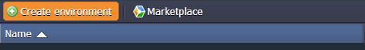

2\. Choose the ***PHP*** tab. Pick **Apache** as your application server and **MySQL** as a database. State the cloudlet limits for the chosen nodes and name your environment or use the default name. Click the **Create** button.

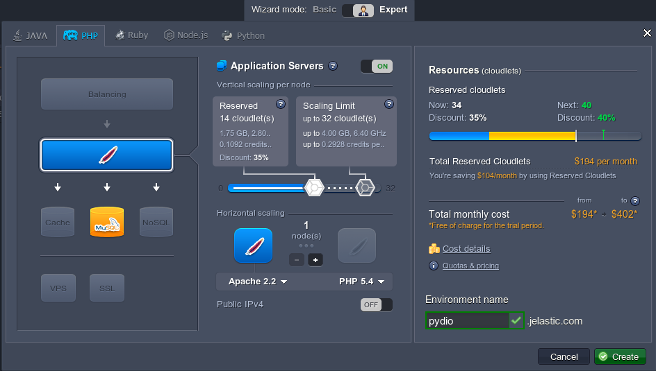

3\. Just in seconds your new environment will be created and displayed in the environment list.  

You have received two emails as well: the first one with the confirmation of the successful creation of the environment and the second one - with MySQL authorization details. 

## Configure MySQL Database

1\. In the platform dashboard panel click the **Open in Browser** button for the MySQL node in your environment.

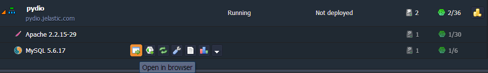

2\. Open the letter with *MySQL node successfully added* subject in your email box. Find there your **Login** and **Password** (you can also enter the **phpMyAdmin** panel by clicking on the **Access URL** from the same letter omitting the first step).

3\. Enter your **Username** and **Password** (or copy them from the email).

4\. Navigate to the **Users** tab and create a new user (name it, for example, *pydio*) with an option ***Create database with same name and grant all privileged*** ticked. Click the **Go** button in the bottom right corner.

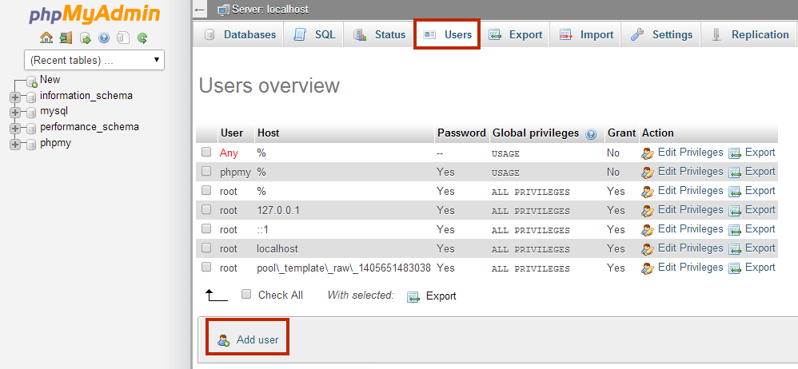

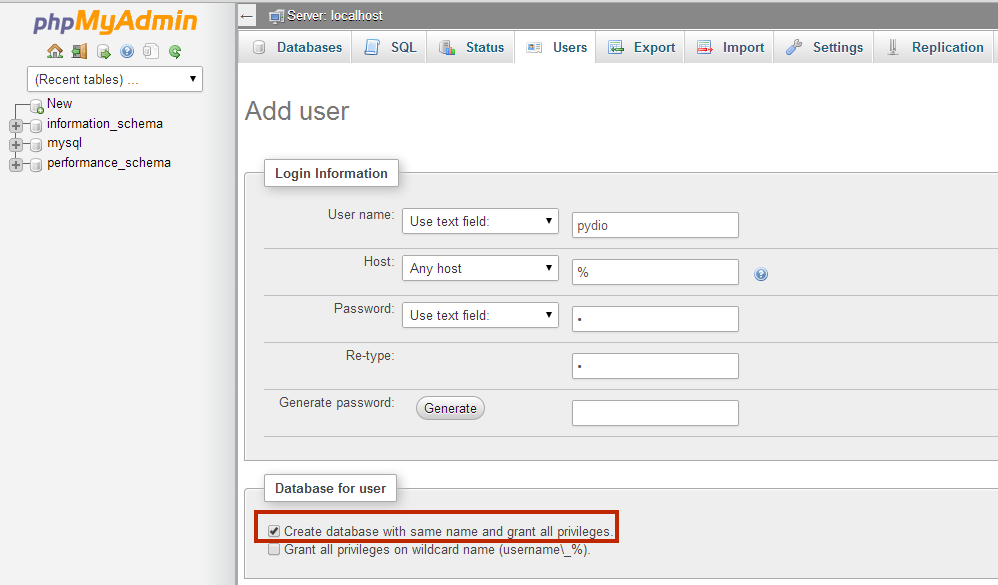

## Download and Deploy Application 

1\. Go to the official [Pydio site](https://pydio.com/), find **Download** tab and choose the **Latest Stable** item.

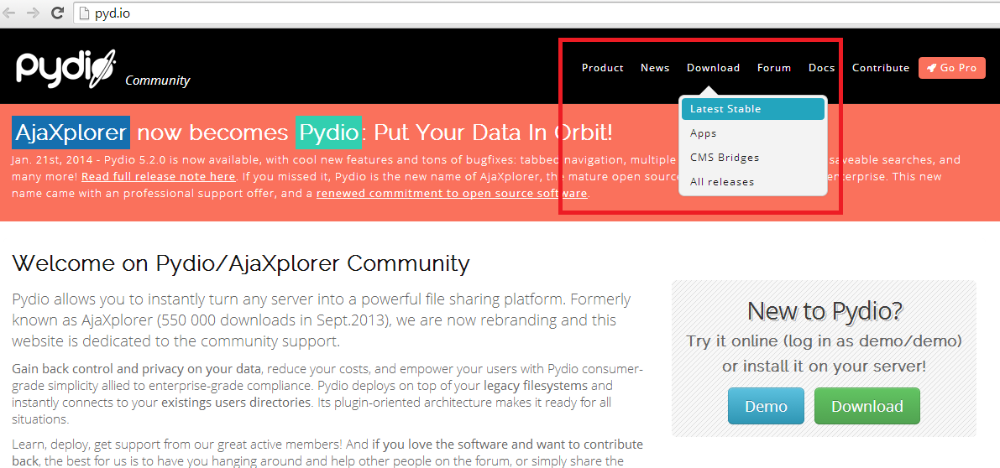

2\. Choose **Click Here!** in the Manual Installation box.

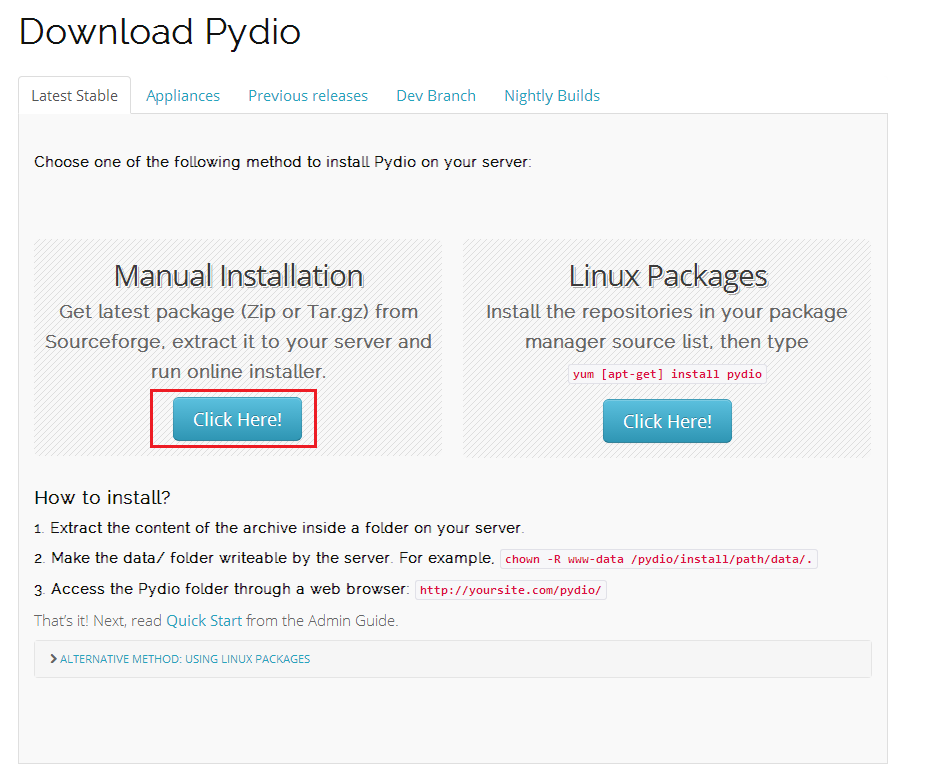

3\. Add your email and name to subscribe to Pydio mailing or just click ***No thanks, to the download now!*** link at the right-bottom corner of the pop-up window.

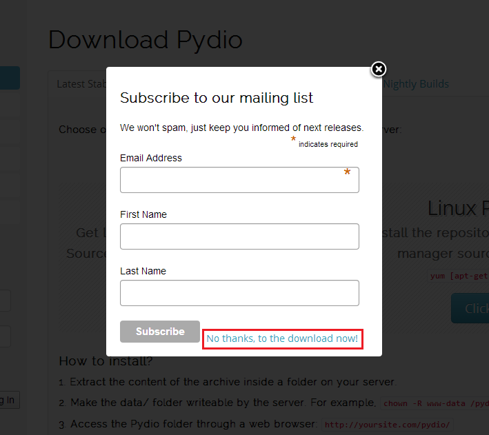

4\. In the opened browser tab select the latest branch (*5.2.3* in our case).

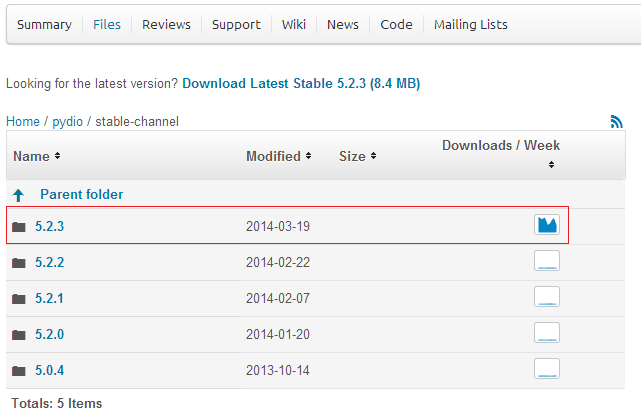

5\. Download a ***pydio-core*** *.zip* file (in our example it is named *pydio-core-5.2.3.zip*).

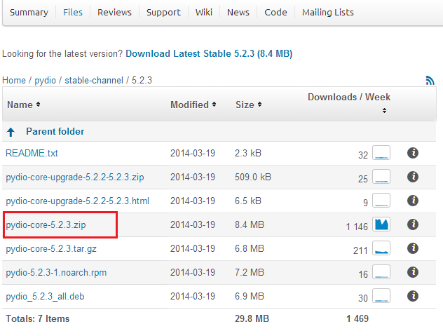

6\. Switch back to your platform dashboard. Click **Upload** in the **Deployment Manager**. Choose your archive file and click the **Upload** button.

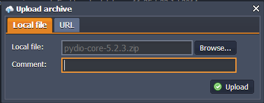

7\. Then click the **Deploy to** icon next to the name of your archive file in the **Deployment Manager** and choose your environment within drop-down list. In the opened frame specify the application's target context if you want to deploy several projects into one server (in our case it is not necessary) or just leave it blank. 

## Run Application 

1\. Open your environment in browser by clicking the **Open in Browser** icon next to it.

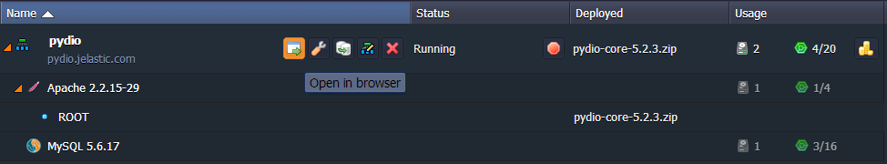

2\. Click on the ***click here to continue to Pydio*** link.

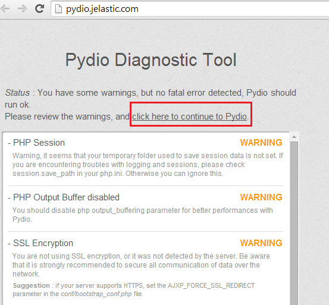

3\. Choose the language you prefer and click **Start Wizard**. Follow the instructions.

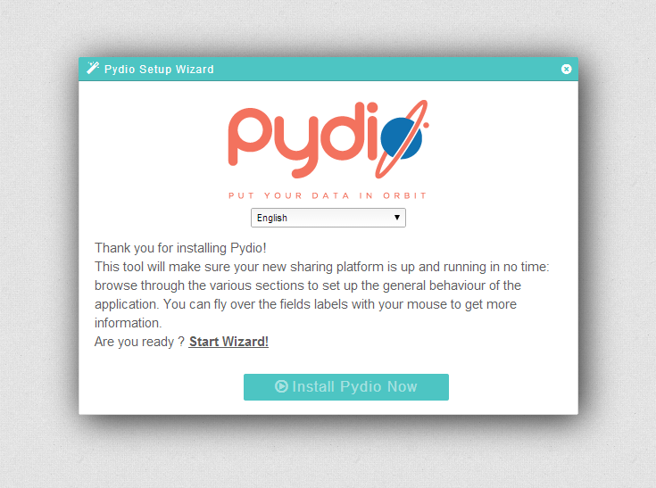

4\. Expand parameters sections one by one and fill in the required data.

In the **Configurations storage** section choose *Database (Requires MySQL, PostgreSQL or SQLite)* **Storage Type**. Enter your database **Host** (access URL from the received email <u>without *http://*</u>), type **Database** name and **User** name (you've specified them while DB setting up).

Once you've customized all the necessary settings, press **Install Pydio Now** button.

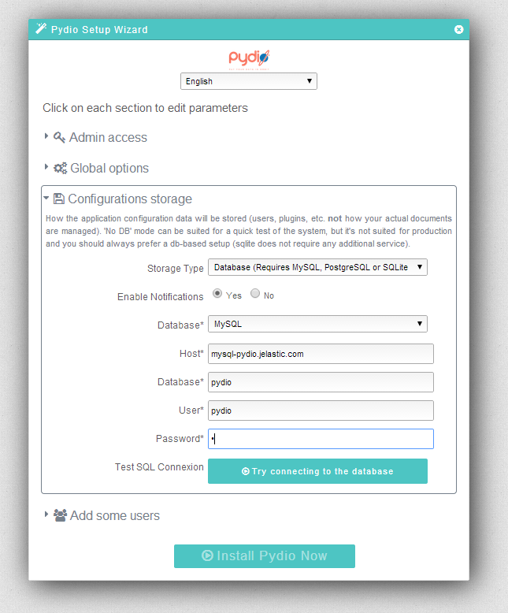

5\. After installation has been successfully completed you'll be automatically redirected to the Pydio login page. Type the credentials of administrator account you've created in the previous step and click button with green tick.

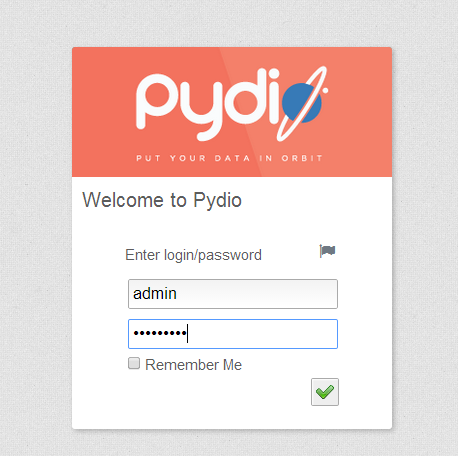

6\. Congrats! Now you can work with Pydio application installed to your platform. Enjoy and share!

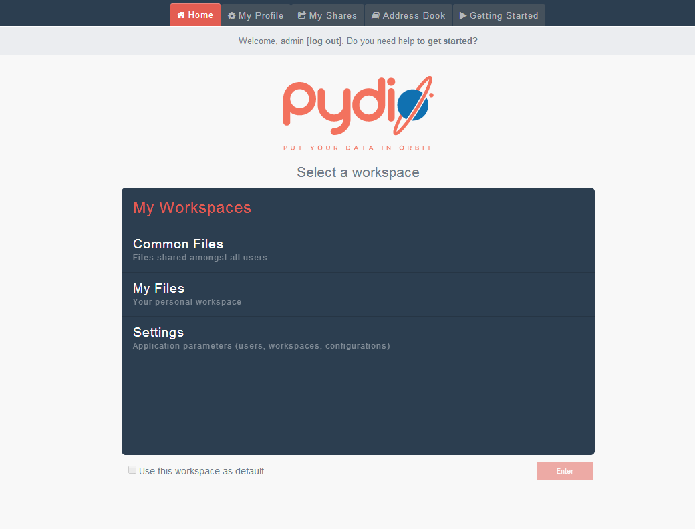

## What's next?

* [Tutorials by Category](/tutorials-by-category/)
* [PHP Tutorials](/php-tutorials/)
* [PHP Dev Center](/php-center/)