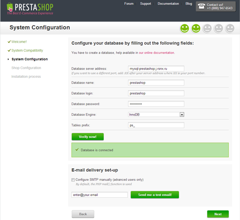
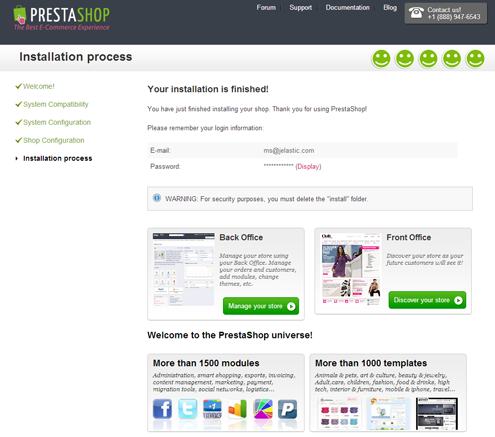

# How to Deploy PrestaShop

You can have a **PrestaShop** instance up and running within minutes using one-click install option.

The process is simple - just click **Get it hosted now**, type your email and install **PrestaShop** in a minute, skipping the steps of manual installation.

Find the full list of applications available for one-click installation at our [Marketplace page](https://www.virtuozzo.com/application-platform/marketplace/).

## Manual PrestaShop Installation

Here's a step-by-step tutorial on how to deploy [PrestaShop](https://www.prestashop.com/en), popular all over the world online stores platform.

So, let's get started!

### Create Environment

1\. Log in to the platform dashboard.

2\. While in the dashboard, click the **Create environment** button at the top left:

3\. Pick **Apache PHP** application server and **MySQL** database.

Wait just a minute for your environment to be created.

### Upload Application Package

1\. Go to [PrestaShop site](https://www.prestashop.com/en), download the latest PrestaShop version as a **zip** package and upload it using Deployment manager.

2\. Once the package is in the platform, deploy it to the environment you have just created.

3\. For using PrestaShop you need to include *gd.so, xcache.so, apc.so, memcache.so* modules. For this click **Config** button for your Apache server, navigate to **etc/php.ini** and add *extension=gd.so, extension=xcache.so, extension=apc.so, extension=memcache.so* lines as it is shown in the picture below:

Click **Open in Browser** button next to the MySQL node. Log in to *phpMyAdmin* using credentials, which you've got via email while creating your environment. Create an account and the same-named database.

4\. Go back to the dashboard and restart Apache node.

5\. That's all. Now you can open your application in browser and install it. Process of installation is rather simple, but let's pay a little attention to the database connection. Just fill in form with database server address, database name, login and password which you've used while creating your MySQL user.

Now you can easily configure your online-store and install it.

Hope this instruction will be helpful for you.

## What's next?

* [Tutorials by Category](/tutorials-by-category/)
* [PHP Tutorials](/php-tutorials/)
* [PHP Dev Center](/php-center/)

