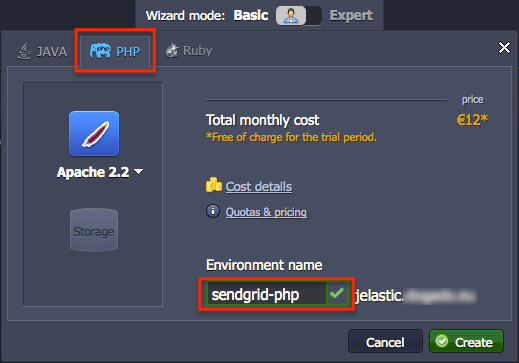
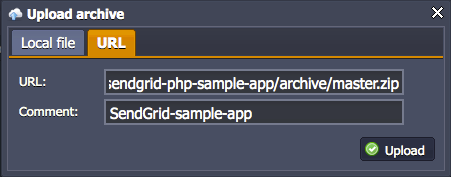
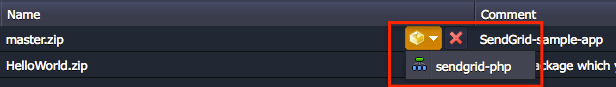
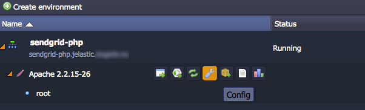
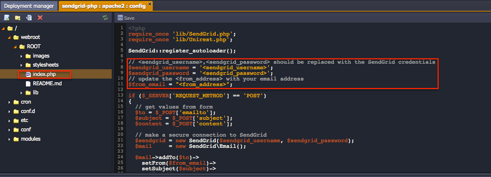
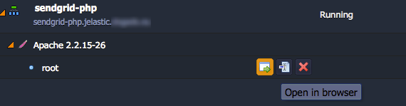
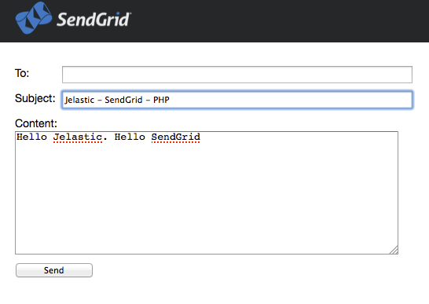
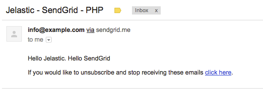

# Using SendGrid

**SendGrid** is a reliable and scalable cloud-based email infrastructure with flexible APIs that allows you to easily integrate it to your app. The platform and SendGrid interconnection gives you an opportunity to send the emails directly from your PHP application without the necessity to support the custom email system.

In the following instruction we will examine a simple example of SendGrid integration with PHP application hosted with PaaS.

## Sign Up for SendGrid

The first thing you should do is to [create a new account](http://sendgrid.com/partner/jelastic) at SendGrid. For the first try of the platform and SendGrid integration you can choose a free pricing plan, that allows you to send mailings with a limitation in 200 emails per day.

Note that some time is needed for the account to be verified.

Remember your username and password after registration, you'll need them for configuring application example below.

## Create Environment

1\. Login to PaaS account and press **Create Environment** button. Then select PHP language wizard tab and specify environment name, *sendgrid-php* in our case.

2\. Click **Upload** button in Deployment Manager. [Sample SendGrid application](https://github.com/sendgrid/sendgrid-php-sample-app), bundled with SendGrid [PHP library](https://github.com/sendgrid/sendgrid-php), is hosted at GitHub, therefore you can use the direct link for archive uploading:

[https://github.com/sendgrid/sendgrid-php-sample-app/archive/master.zip](https://github.com/sendgrid/sendgrid-php-sample-app/archive/master.zip)

3\. After the archive is uploaded, it will be listed in the packages panel. Press **Deploy to..** button next to **master.zip** archive and select environment you've created in the previous steps.

4\. Type context in the opened window (in case you need it) and press **Deploy**.

## Sample Application Configuring

After sample application is deployed, you can configure it and specify your SendGrid login and password.

1\. Press **Config** button alongside the Apache server.

2\. You'll see the list of folders and configuration files. Navigate to the **webroot &gt; {context_name}** folder and open **index.php** file.

Edit the circled below strings to specify your SendGrid account username, password, and email you want to send mailings from.

Don't forget to press **Save** button.

## Checking Results

\. Find your SendGrid environment at the dashboard and open it (**Open in browser** button near the application context).

2\. You'll see the simple basic form for emails sending. State the recipient in the **To:** field, subject and mailing text in the **Subject:** and **Content:** fields respectively. Click **Send**.

3\. Just in a few minutes the sent email will appear in the inbox of recipient.

That's all! For now you are able to send up to 200 emails per day via your PHP application hosted with the platform. More info about plenty of additional features you can find in the [complete SendGrid documentation](http://sendgrid.com/). Enjoy!

## What's next?

* [Tutorials by Category](/tutorials-by-category/)
* [PHP Tutorials](/php-tutorials/)
* [Setting Up Environment](/setting-up-environment/)