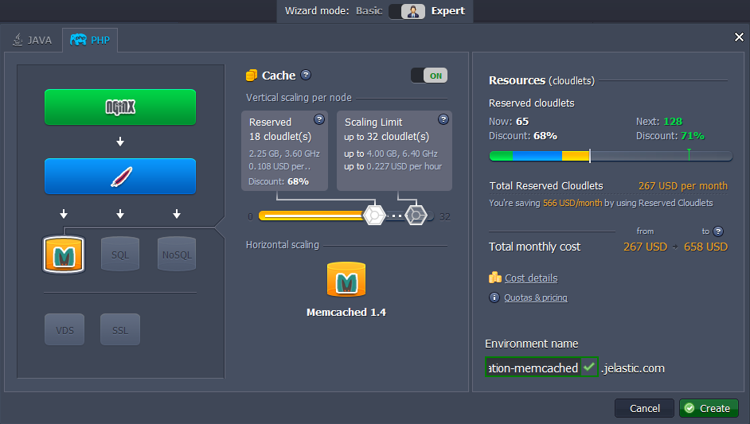
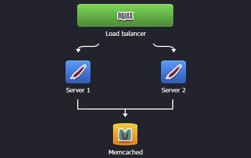
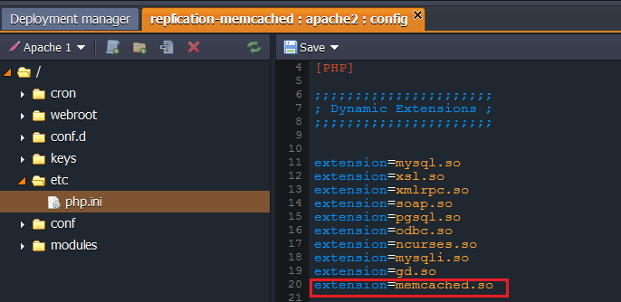
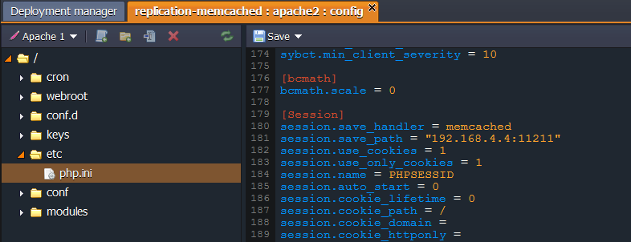

# PHP Sessions Clustering

The high availability of your PHP application can be achieved by implementing PHP sessions clustering in the cloud. To successfully handle application server failover we create environment with Memcached, several Apache servers, and an NGINX load balancer:

1\. Log into the PaaS account.

2\. Click the **Create environment** button.

3\. In the **Environment topology** window choose two or more servers you want to use (for example, two instances of **Apache**) and **Memcached** node. Type the name of the environment and click **Create**.



The Memcached node is used as a distributed caching engine in the environment with multiple nodes. In our case, it provides a Web session with the sticky sessions running on several application servers. If one server fails, the sessions are stored for backup on the Memcached node. Other servers can fetch the sessions from Memcached and start serving the session.




## How It Works

When each session request is completed, the session is sent to the Memcached node for the backup. This session remains available on the original application server and can be used for serving the next request. After the second request completion, the session is updated in the Memcached.

If the original server fails, the next request is routed to another application server. The newly requested server is asked for the session it doesn't know. So this new server will find the needed session in the Memcached node. It is identified according to the ID that was appended to the sessionID while session creation. As a result the server can fetch the session from the Memcached node.

When the server answers the request, it also updates the session in the Memcached node. Thus there is no interruption of the app caused by  the original server failure - the failover is successfully handled.

At the same time, the NGINX load balancer is distributing traffic across the cluster containing HTTP resources. You can [check the load balancing](/testing-load-balancing/) in the platform using different load balancing tools.


## How to Configure

1\. Navigate to your environment in the dashboard and click **Config** button for Apache.

2\. In the opened tab go to ***etc > php.ini***.

3\. Add the next line to **Dynamic Extensions**:

```
extension=memcached.so
```



4\. Make the changes in the **[Session]** block:

```
session.save_handler = memcached
session.save_path = "< server >:11211"
```



{}**Note:** *\<server>* states for memcached IP or URL which you can find by clicking **Info** button for the memcached node in your environment.{}

5\. Save the changes and restart the **Apache** node.

That's all! Now if one of the instances fails, the users get automatically switched to the other instance in this cluster and never notice any change.


## What's next?

* [Memcached Configuration](/memcached-configuration/)
* [WordPress Cluster](https://www.virtuozzo.com/company/blog/wordpress-hosting-enterprise-high-availability-auto-scaling/)
* [Setting Up a Cronjob](/cron-job/)