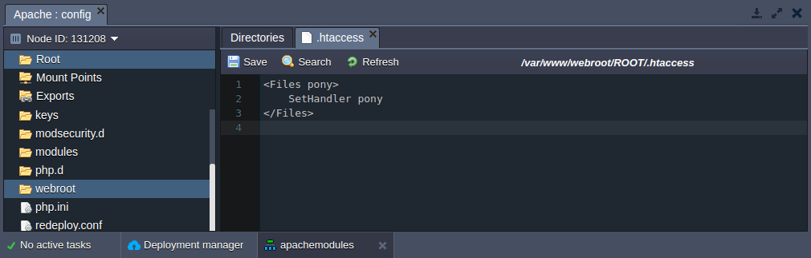
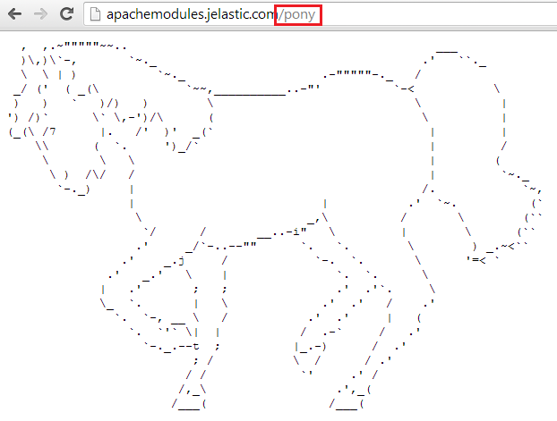

# Adding Custom Apache Modules

To meet all of the requirements of your application, you might need to add some **custom Apache modules**. Some of these are not listed among the [Apache modules](/apache-nginx-modules/) installed in the platform by default. You can enable your own Apache modules in the environment by following the instructions below: 


## Create the environment

1\. Log into the PaaS account.

2\. Click on **Create environment** at the top left corner of the dashboard.

3\. In the opened wizard, navigate to the **PHP** tab, select the **Apache** application server and specify the number of resources your application needs. After that, enter the name for your environment (e.g. *apachemodules*) and click the **Create** button.


4\. In several seconds your environment will appear on the platform dashboard.


## Build your Apache module

1\. [Download](http://archive.apache.org/dist/httpd/) Apache **httpd** from **apxs** with the same version as your Apache server. In our case we have Apache 2.2.15, so we will download and install [httpd 2.2.15.](http://archive.apache.org/dist/httpd/httpd-2.2.15.tar.gz)

2\. [Download](http://archive.apache.org/dist/httpd/httpd-2.2.15.tar.gz) the source of the needed **module** in the Apache modules list. As an example we will use a funny *mod_pony* Apache module.

3\. Compile your Apache module.

Here is how we've compiled our **mod_pony** module:  
```bash
apxs -i -a -c mod_pony.c 
/usr/lib64/apr-1/build/libtool --silent --mode=compile gcc -prefer-pic -O2 -g -pipe -Wall -Wp,-D_FORTIFY_SOURCE=2 -fexceptions -fstack-protector --param=ssp-buffer-size=4 -m64 -mtune=generic -Wformat-security -fno-strict-aliasing  -DLINUX=2 -D_REENTRANT -D_GNU_SOURCE -pthread -I/usr/include/httpd  -I/usr/include/apr-1   -I/usr/include/apr-1   -c -o mod_pony.lo mod_pony.c && touch mod_pony.slo
/usr/lib64/apr-1/build/libtool --silent --mode=link gcc -o mod_pony.la  -rpath /usr/lib64/httpd/modules -module -avoid-version    mod_pony.lo
/usr/lib64/httpd/build/instdso.sh SH_LIBTOOL='/usr/lib64/apr-1/build/libtool' mod_pony.la /usr/lib64/httpd/modules
/usr/lib64/apr-1/build/libtool --mode=install cp mod_pony.la /usr/lib64/httpd/modules/
libtool: install: cp .libs/mod_pony.so /usr/lib64/httpd/modules/mod_pony.so
libtool: install: cp .libs/mod_pony.lai /usr/lib64/httpd/modules/mod_pony.la
libtool: install: cp .libs/mod_pony.a /usr/lib64/httpd/modules/mod_pony.a
libtool: install: chmod 644 /usr/lib64/httpd/modules/mod_pony.a
libtool: install: ranlib /usr/lib64/httpd/modules/mod_pony.a
libtool: finish: PATH="/usr/local/sbin:/bin:/sbin:/usr/bin:/usr/sbin:/sbin" ldconfig -n /usr/lib64/httpd/modules
----------------------------------------------------------------------
Libraries have been installed in:
   /usr/lib64/httpd/modules

If you ever happen to want to link against installed libraries
in a given directory, LIBDIR, you must either use libtool, and
specify the full pathname of the library, or use the `-LLIBDIR'
flag during linking and do at least one of the following:
   - add LIBDIR to the `LD_LIBRARY_PATH' environment variable
     during execution
   - add LIBDIR to the `LD_RUN_PATH' environment variable
     during linking
   - use the `-Wl,-rpath -Wl,LIBDIR' linker flag
   - have your system administrator add LIBDIR to `/etc/ld.so.conf'

See any operating system documentation about shared libraries for
more information, such as the ld(1) and ld.so(8) manual pages.
----------------------------------------------------------------------
chmod 755 /usr/lib64/httpd/modules/mod_pony.so
[activating module `pony' in /etc/httpd/conf/httpd.conf]
```

4\. As a result you will get an **.so** file of your Apache module. We have a [mod_pony.so](mod_pony.so) file (*/usr/lib64/httpd/modules/mod_pony.so*).

  
## Upload and configure your module

1\. Navigate to your environment and click **Config** for your Apache server.


2\. Upload ***mod_pony.so*** file to the **/usr/lib64/php/modules** folder.


3\. Go to the **/etc/httpd/conf** folder and edit the ***httpd.conf*** file by adding the LoadModule string in the following format: 

*LoadModule {module-name}_module /usr/lib64/php/modules/{file-name}.so*   

Example: *LoadModule pony_module /usr/lib64/php/modules/mod_pony.so*  

**Save** the changes. 


 
4\. Change the settings required for your Apache module.  

For example, for further configuration of the **mod_pony** module we need:  

* to navigate to the **webroot &gt; ROOT** folder and create a **.htaccess** file;  
* to add the following strings to the **.htaccess** file:  
*\<Files pony>  
 SetHandler pony  
\</Files>*  
     
**Save** the changes. 


 
5\. After all of the configuration changes **Restart node** of your Apache server to enable Apache module.


## Check the result

1\. To check that the **mod_pony** Apache module is working, click **Open in browser** for your environment.


2\. Add **/pony** to the link and refresh. As a result you have your own pony.




That's all it takes! Just a few simple steps and you can enjoy using your own custom modules for an Apache server.


## What's next?

* [Apache WebDav Module](/apache-webdav-module/)
* [Apache Statistics Module](/apache-statistics-module/)