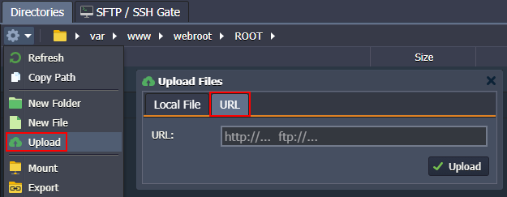

# Apache PHP

The platform adapts a robust, commercial-grade, and open-source [Apache HTTP Server](https://httpd.apache.org/) ("*httpd*") to create a secure, efficient, and scalable application server for PHP hosting. **Apache PHP** stack by the platform provides out-of-box support of the PHP programming language and HTTP/2  protocol ([SSL](/secure-sockets-layer/) is required) through utilizing the ***php7_module*** and ***http2_module*** modules respectively.

{}**Notes:**

- This template utilizes a modern ***systemd*** initialization daemon.
- The list of all modules loaded on the server can be viewed with the ***apachectl -M*** command or at the default ***phpinfo*** page.

{}

To get your *Apache PHP* server, follow the steps below:

1\. Log into your PaaS account and click **New Environment** at the top.

2\. Within the opened *topology wizard*, switch to the **PHP** tab and select ***Apache*** as your application server. Set other configurations up to your needs (e.g. [cloudlets limit](/automatic-vertical-scaling/), [public IPs](/public-ip/), [region](/environment-regions/), etc.).

Type your environment name and click **Create**.

3\. Once the environment is created, you can click the **Open in Browser** button next to the *Apache* application server:

4\. Within the opened default page, you'll see your server's ***phpinfo*** data.

Now, you can [deploy](/deployment-guide/) your PHP application into the environment.

## Apache Configuration

Apache PHP has some main configuration files that you may want to adjust to customize your application server up to your specific needs:

- ***/etc/php.ini*** - lists [directives](https://www.php.net/manual/en/ini.list.php) that configure your **PHP** setup
- ***/etc/httpd/conf.d/php.conf*** - configures PHP scripts execution
- ***/etc/httpd/conf/httpd.conf*** - lists [directives](https://httpd.apache.org/docs/2.4/mod/directives.html) that configure your **Apache** server

As an example, we'll show how you can change the size of the files, which can be uploaded to your application.

1\. Click the **Config** button for your Apache server to access the [configuration file manager](/configuration-file-manager/):

2\. Open the ***/etc/php.ini*** file (available through the *Favorites* shortcut) and locate the next parameters:

* ***upload_max_filesize*** - maximum size of files that can be uploaded to the server (*100MB* by default)
* ***post_max_size*** - maximum size of the POST data that PHP will accept (*100MB* by default)

{}**Note:** Regardless of these settings, the maximum file size that can be uploaded via the platform file manager from the local machine is *150MB* (may vary based on the hosting provider settings). To operate larger files, use the **URL** option or attach [public IP](/public-ip/) and use your own manager (for example, [FTP add-on](/ftp-ftps-support/)).

{}

3\. Don't forget to **Save** the changes and **Restart Nodes** of your application server to apply new settings.

For the detailed info on the PHP servers configuration refer to the appropriate guides:

* [PHP Dev Center](/php-center/)
* [PHP.INI Security Settings](/php-security-settings/)
* [PHP Extensions](/php-extensions/)
* [PHP Accelerators](/php-accelerators/)
* [PHP Auto Configurations](/php-auto-configuration/)

## What's next?

* [Apache Security Configurations](/apache-security-configurations/)
* [Apache Modules](/apache-nginx-modules/)
* [Add Apache Modules](/add-apache-modules/)
* [Apache WebDav Module](/apache-webdav-module/)
* [Apache Statistics Module](/apache-statistics-module/)
* [Name-Based Virtual Host in Apache](/name-based-apache-virtual-host/)