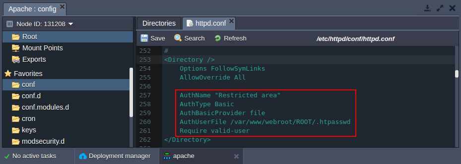
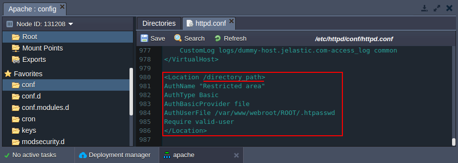
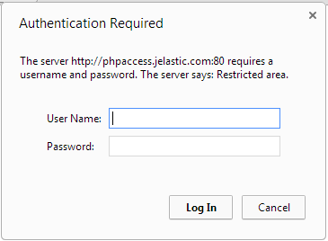
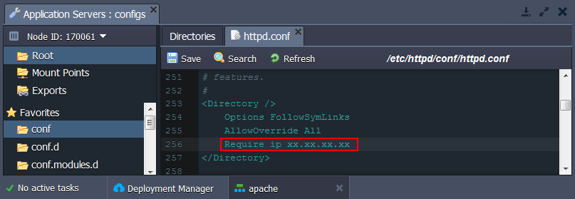
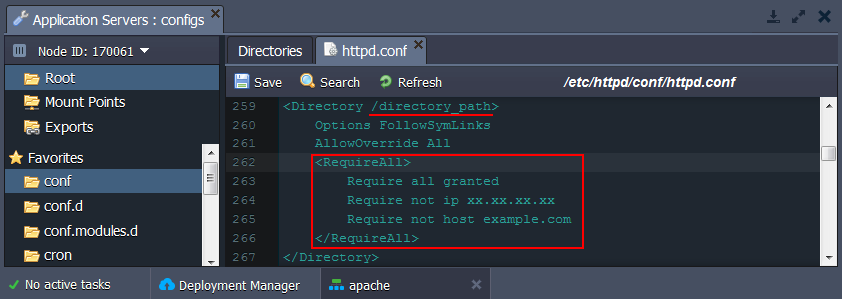
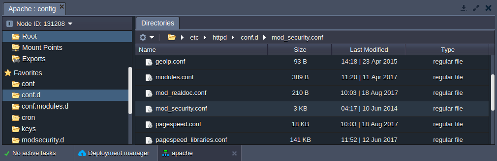
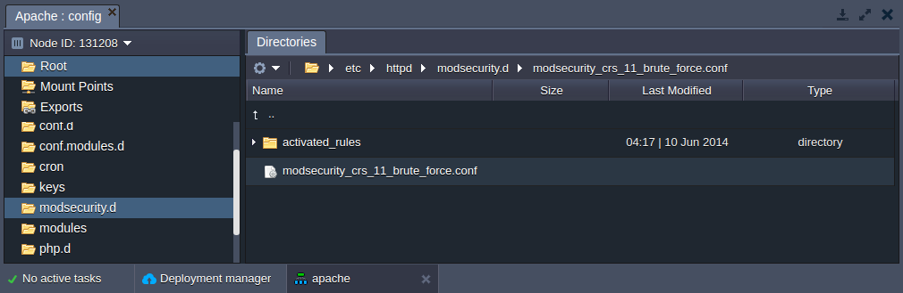

# Apache Security Configurations

In this tutorial we will show how to set up the additional security configurations for your PHP application hosted with Apache application server.

There are two ways of setting up your main security configurations:

* make changes in main configuration file of the Apache (***httpd.conf***)
* create special ***.htaccess*** file, which contains one or more configuration directives and is placed inside your application directory

The directives are able to override a subset of the server's global configuration for that directory and all subdirectories thereof. What you can put in this file is determined by the AllowOverride directive.

**AllowOverride** is valid only in < directory > sections specified without regular expressions. When this directive is set to None - *.htaccess* files are completely ignored. When this directive is set to All, then any directive which has the *.htaccess* Context is allowed in *.htaccess* files. 

Let's examine the every kind of security configs you can apply in order to protect your application:

* [Authentication](#setting-up-the-authentication-request)
* [Setting up the access criteria](#security-through-setting-up-criteria)
* [Configuring mod_security module](#configuring-mod_security-module)
* [Server version hiding](#hide-apache-server-version)


## Setting Up the Authentication Request

To set the authentication to your Apache **application** or to just separate a **directory** in your application, follow these next steps.

1\. Generate hash from your password. For that you can use any **htpasswd tool** or online service (for example, [https://www.web2generators.com/apache-tools/htpasswd-generator](https://www.web2generators.com/apache-tools/htpasswd-generator)).

2\. Create simple text file with previously generated hash.

3\. Click **Config** button for your server.

4\. Upload the created file to the **/var/www/webroot/ROOT** folder.

5\. In the **/etc/httpd/conf** folder open ***httpd.conf*** file (or ***.htaccess*** file, if you use it) perform the following configurations:

* **authentication for the whole application** - add the following strings to the **Directory** as it is shown in the image below:
```  
AuthName "Restricted area"
AuthType Basic
AuthBasicProvider file
AuthUserFile /var/www/webroot/ROOT/.htpasswd
Require valid-user
```



* **authentication for the separate directory** - add the following **Location** strings stating the path to the required directory:
```  
<Location /directory_path>  
AuthName "Restricted area"  
AuthType Basic  
AuthBasicProvider file  
AuthUserFile /var/www/webroot/ROOT/.htpasswd  
Require valid-user  
</Location>
```



6\. Save the changes and **Restart** the Apache server.

{}**Note:** If you use *httpd.conf* file for setting up your security configuration, you need to restart Apache after making every change in configuration. In the case of *.htaccess* files usage, changes made in these files take immediate effect, because these files are read on every request.{}

As a result, while accessing the application or the protected directory a user will be requested to authenticate.




## Security Through Setting Up Criteria

You can provide security for your application through setting access control to the particular parts of your server based on specific criteria (e.g. client hostname or IP address).

The necessary configurations can be applied with the help of the ***[Require](https://httpd.apache.org/docs/2.4/mod/mod_authz_core.html#require)*** directive. And in order to set up more complex access policy, it can be used in conjunction with:

* ***[RequireAll](https://httpd.apache.org/docs/2.4/mod/mod_authz_core.html#requireall)*** - a set of authorization directives, where none must fail and at least one to succeed
* ***[RequireAny](https://httpd.apache.org/docs/2.4/mod/mod_authz_core.html#requireany)*** -  a set of authorization directives, where at least one must succeed
* ***[RequireNone](https://httpd.apache.org/docs/2.4/mod/mod_authz_core.html#requirenone)*** - a set of authorization directives, where none must succeed

Navigate to the **/etc/httpd/conf** folder and open the ***httpd.conf*** file (or the ***.htaccess*** one directly in a target directory).

1\. In order to set up access criteria by IP, just add a necessary directive to the *[Directory](https://httpd.apache.org/docs/2.4/mod/core.html#directory)* section.



2\. As a more complex example, you can configure access policy of several conditions (e.g. via *RequireAll* directive) and for a particular server folder (just change the part underlined in the image below).



3\. Don't forget to **Save** the changes and **Restart** your Apache server to apply changes.

{}**Note:** Denying access through IP makes sense only if you use [Public IP](/public-ip/) feature.{}


## Configuring mod_security Module

**[mod_security](http://www.modsecurity.org/)** is a super handy Apache module which provides such abilities as simple filtering, URL and Unicode encoding validation, auditing, null byte attack prevention, upload memory limits, server identity masking, built in chroot support and many more.

This module is available in the platform by default and can be configured via ***/etc/httpd/conf.d/mod_security.conf*** file.



Here you can edit the default configurations or add your own custom.

For example, you can add some extra **ModSecurity Rules** by uploading them to the **/etc/httpd/modsecurity.d** folder (e.g. ***modsecurity_crs_11_brute_force.conf***).



The rules uploaded to **modsecurity.d** or to **activated_rules** folders will be automatically activated without any extra settings. This is configured by the following default parameters in the ***/etc/httpd/conf.d/mod_security.conf*** file:
```
Include modsecurity.d/*.conf
Include modsecurity.d/activated_rules/*.conf
```


## Hide Apache Server Version

Usually with default configurations, the Apache server version is publicly shown. As a result, the information about the version of your Apache and operating system/version, or even the details about installed Apache Modules can be used to perform an attack.

To avoid this, the platform automatically adds the following configurations to your ***httpd.conf*** file:

* ***ServerSignature Off*** - shows 404 page instead of directory listings and other such pages generated by Apache
* ***ServerTokens Prod*** - determines Apache Server HTTP response header; with the *Prod* value the HTTP response header will be as follows - *Server: Apache*


## What's next?

* [Apache PHP](/apache-php/)
* [PHP Application Server Configuration](/php-application-server-config/)
* [Apache Modules](/apache-nginx-modules/)
* [NGINX-Balancer Security](/nginx-balancer-security/)