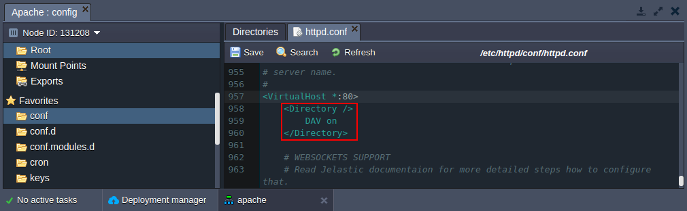
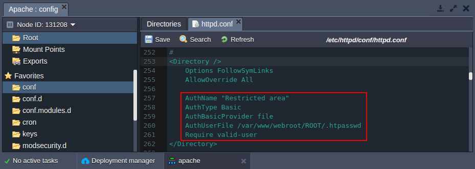

# Apache WebDav Module

While setting up a website you can face the need to build some complicated method of viewing and updating the information on the site. There are lots of solutions - using a local copy, using a combination of HTTP and FTP tools to download the original and upload the changes etc. But also as an easy solution you can use **Web-based Distributed Authoring and Versioning (WebDAV)** which is available in the platform.

WebDAV is turning into an important tool on Apache-based servers. It was invented in order to simplify the way you update websites. 


## Enabling WebDAV Module for Apache Server

1\. Click **Config** button for the server in your environment.

2\. The required ***mod_dav*** and ***mod_dav_fs*** modules are loaded by default, so you just need to add the following code to the *VirtualHost* configuration in the **/etc/httpd/conf/*httpd.conf*** file:

```
<Directory />
 DAV on  
</Directory>
```

 

3\. Save the changes and restart **Apache**.


## Setting Up Security Configuration

1\. Generate hash from your password. For that you can use any **htpasswd tool** or online service (for example, [http://www.htpasswdgenerator.net/](http://www.htpasswdgenerator.net)).

2\. Create simple text file with previously generated hash.

3\. Click **Config** button for your **Apache** server.

4\. Upload the created file to the **/var/www/webroot/ROOT** folder.

5\. In the **/etc/httpd/conf** folder open the ***httpd.conf*** file. Modify directory configurations by adding the following strings as it is shown in the picture below:

```
AuthName "Restricted area"   
AuthType Basic   
AuthBasicProvider file   
AuthUserFile /var/www/webroot/ROOT/.htpasswd   
Require valid-user
```

 

6\. Save the changes and restart **Apache**.

Finally you can go to any **WebDAV client**. State there the host (also your credentials if you set up security configuration) and connect to the server. As a result you'll see your files and will be able to edit them, update, add some new files, etc.


## What's next?

* [Add Apache Modules](/add-apache-modules/)
* [Apache Security Configurations](/apache-security-configurations/)
* [Apache Statistics Module](/apache-statistics-module/)