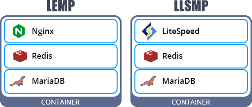
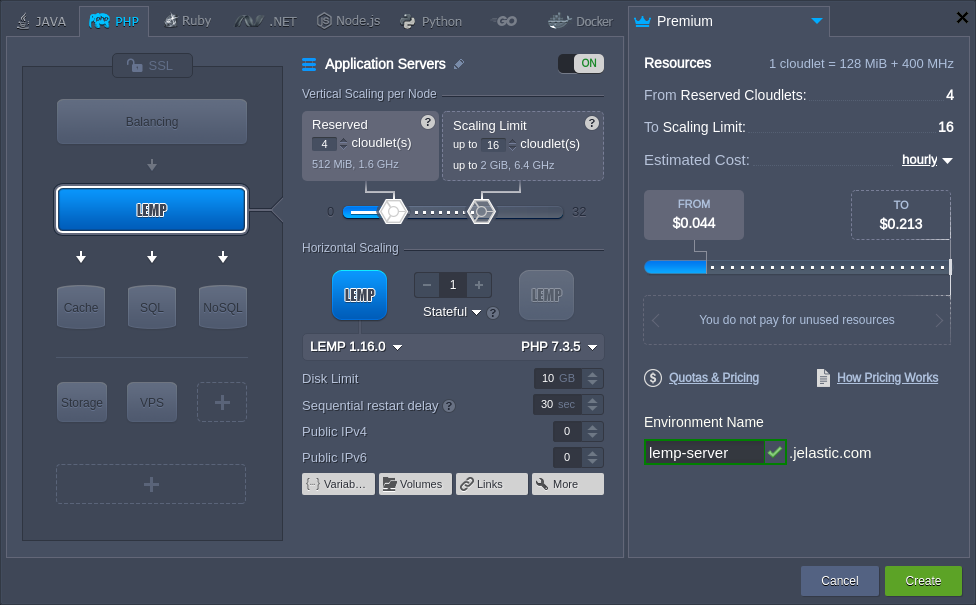
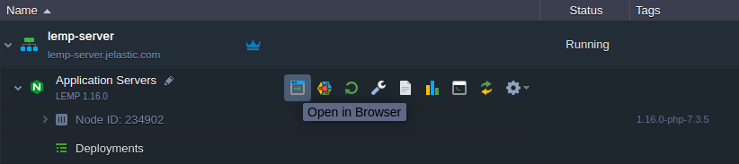
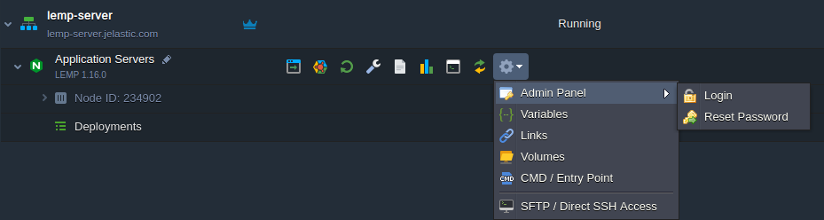
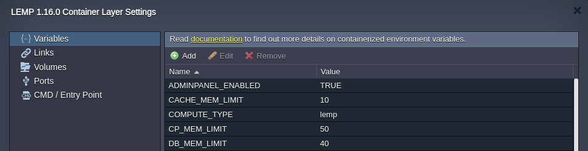

# LEMP (LLSMP) Application Server

{}The **LEMP** (since the **1.16.1** release) & **LLSMP** stacks are [HTTP/3](/http3/) ready with the feature support enabled by default. However, a [public IP address](/public-ip/) is required to bypass the Shared Load Balancer and work directly with the server over HTTP/3.{}

**LEMP** is a software bundle solution based on the *Linux* operating system, *NGINX* HTTP web server, *MariaDB* database, and *PHP* programming language. Such a model is a popular choice among developers as it is sufficient to host a wide variety of projects with a single container.

If the platform provides [LiteSpeed](/litespeed-web-server/) support, a similar **LLSMP** (*Linux*, *LiteSpeed*, *MariaDB*, *PHP*) stack can be available. Follow the link above to learn about the LiteSpeed Web Server benefits.

The topology structure inside of the LEMP and LLSMP containers is the following:

* a PHP-powered event-driven *NGINX* or *LiteSpeed* application server
* built-in *MariaDB 10* database server is used to store your project data
* an additional *Redis 6* database is launched by default as an object caching solution

Other [peculiarities of the stacks](#lemp--llsmp-peculiarities) can be viewed in the appropriate section below. For now, let's walk through the required installation steps.

1\. Log in to your platform dashboard ([sign up](/getting-started/#sign-up-how-to-create-an-account) if you don't have one yet) and click the **New Environment** button at the top of the page.

2\. Switch to the ***PHP*** tab of the automatically opened topology wizard. Select **LEMP** (**LLSMP**) as your application server.

Configure other parameters up to your needs (e.g. [scaling limit](/automatic-vertical-scaling/), [public IPs](/public-ip/), [regions](/environment-regions/)) and click **Create** to proceed.

3\. Wait a few minutes for the platform to set up your environment. Once created, you can click **Open in Browser** to view the default *phpinfo()* data on your server.

Now, you can proceed to the [deployment](/deployment-guide/) of your application.

## LEMP & LLSMP Peculiarities

When working with the LLSMP software stack, all the specifics of the [LiteSpeed Web Server](/litespeed-web-server/) are applied to this node (including [license fee](/litespeed-web-server/#license-pricing)). All the other peculiarities are the same for both servers.

1\. Built-in database servers can be accessed in the following way:

* The *phpMyAdmin* administration tool for ***MariaDB*** can be connected via the *8443* port. The exact link and access credentials can be found in the after-creation email. If needed, a password can be reset via the dashboard by hovering over the application server and selecting the **Additionally > Admin Panel > Reset Password** option.
* The ***Redis*** database is accessible without a password but only from within the container (i.e. *localhost*).

{}**Tip:** Within the LEMP/LLSMP container, you can establish the client connection to the database via both *SOCKET* (*localhost*) and *TCP* (*127.0.0.1*) [protocols](https://dev.mysql.com/doc/refman/5.7/en/connection-options.html#option_general_protocol).{}

Read the linked guide to learn more about [PHP connection to MariaDB](/connection-to-mysql-php/).

2\. Several [environment variables](/environment-variables/) can be used to manage your LEMP/LLSMP container:

* ***ADMINPANEL_ENABLED*** - allows (*true*, by default) or forbids (*false*) access to phpMyAdmin console for the integrated MariaDB database server
* ***REDIS_ENABLED*** - enables (*true*, by default) or disables (*false*) object caching with Redis
* ***CP_MEM_LIMIT*** - defines the portion of RAM, which should be reserved for the application server (*NGINX/LiteSpeed*), ***50%*** of container total RAM by default
* ***CACHE_MEM_LIMIT*** - defines the portion of RAM, which should be reserved for the *Redis* cache server, ***10%*** of container total RAM by default
* ***DB_MEM_LIMIT*** - defines the portion of RAM, which should be reserved for the *MariaDB* database server, ***40%*** of container total RAM by default
{}**Tip:** These RAM limits can be specified in megabytes (*m|mb|M|MB*), gigabytes (*g|gb|G|GB*), or percentages (*%*). If units are omitted, the values are considered as percentages.{}

The container(s) restart is required to apply changes to these parameters.

{}**Note:** LLSMP has additional variables (e.g. *WAF*, *WP_PROTECT*, *WP_PROTECT_LIMIT*) specific for the [LiteSpeed](/litespeed-web-server/) stack, which are described in the dedicated document.{}

3\. Obviously, all the benefits of the regular platform containers are available for the LEMP and LLSMP stacks as well. For example:

* [automatic vertical scaling](/automatic-vertical-scaling/)
* [usage-based pricing](/pricing-model/)
* [SSH access](/ssh-access/)
* [container firewall](/custom-firewall/)
* [container redeploy](/container-redeploy/)
* [statistics monitoring](/view-app-statistics/)
* [deployment automation](/deployment-guide/)
* and even more at [Platform Documentation](/)

## What's next?

* [PHP Dev Center](/php-center/)
* [LiteSpeed Web Server](/litespeed-web-server/)
* [PHP Extensions](/php-extensions/)
* [PHP Accelerators](/php-accelerators/)
* [PHP Auto Configurations](/php-auto-configuration/)