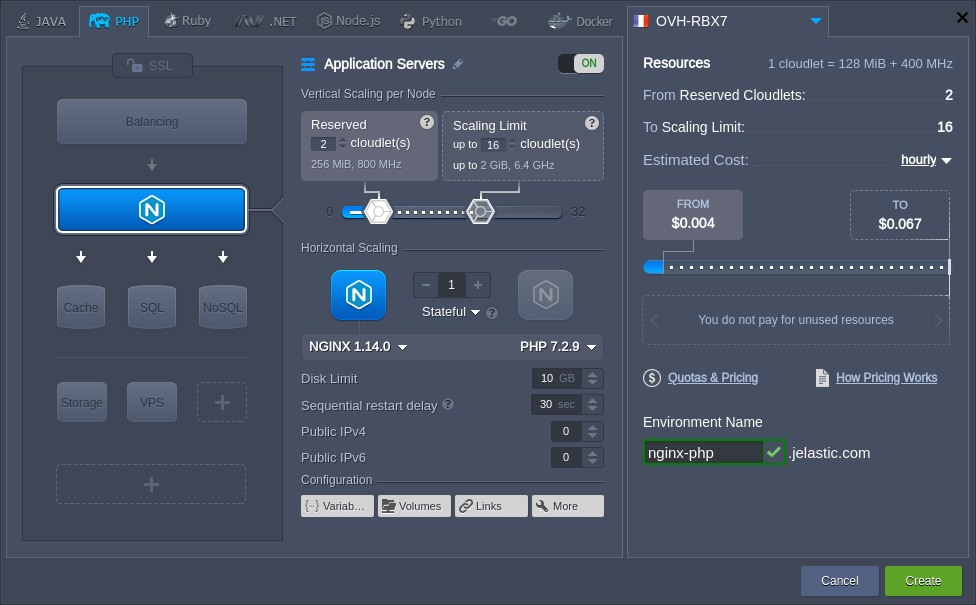
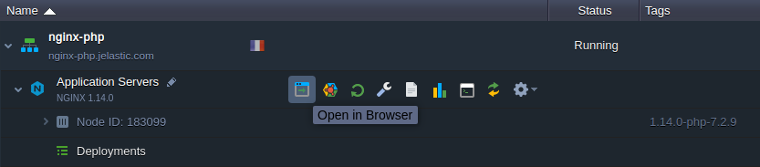
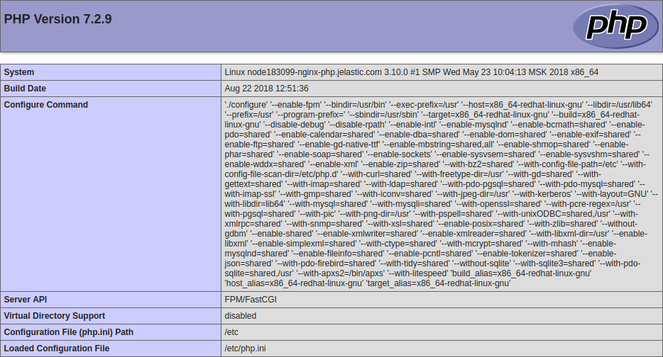
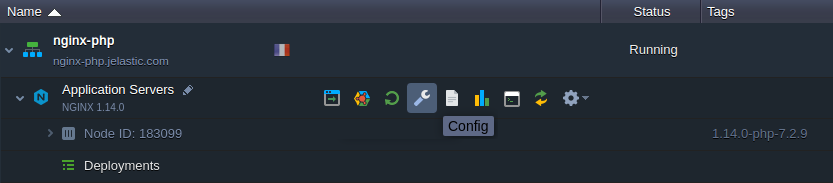
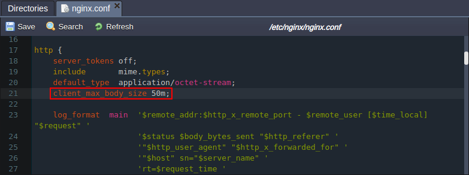
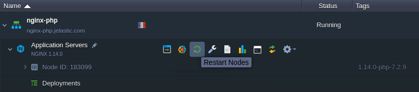

# NGINX PHP

{}The *NGINX PHP* stack is [HTTP/3](/http3/) ready with the feature support enabled by default since the *1.16.1* release for PHP *7.2.26*, *7.3.13*, *7.4.1* versions and above. However, a [public IP address](/public-ip/) is required to bypass the Shared Load Balancer and work directly with the server over HTTP/3.{}

**[NGINX](https://nginx.org/en/)** is a fast and lightweight HTTP server, which is widely used by developers across the world. It is highly customizable due to the modular structure, which simultaneously allows utilizing just the required functionality, ensuring efficient resource usage.

The platform customizes and optimizes NGINX to provide it as a PHP application server fully compatible with the platform functionality. Compared to the [Apache PHP](/apache-php/), it is more suitable for handling websites with static content, but due to the FastCGI support can process complex scripts as well.

{}**Note:** This template utilizes a modern ***systemd*** initialization daemon.{}

To create NGINX server for PHP application hosting, follow the steps in the detailed instruction below.

1\. Log into the platform dashboard and click the **New Environment** button to access the topology wizard.


2\. On the **PHP** engine tab, choose ***NGINX*** as your application server and configure other parameters (like [cloudlets](/automatic-vertical-scaling/) or [environment region](/environment-regions/)) up to your needs.



Click **Create** to proceed.

3\. After creation, click **Open in Browser** next to the NGINX server:



4\. You will see the server's ***phpinfo*** data by default.



The next step will be to [deploy](/deployment-guide/) your PHP application.


## NGINX Configuration

While using NGINX as an application server, there are some restrictions on the size of uploaded files to the application. You can make the next configurations to adjust it:

1\. Hover over the NGINX application server and click the appeared **Config** button.



2\. Within the opened [configuration file manager](/configuration-file-manager/), locate and adjust the ***/etc/nginx/nginx.conf*** file by adding the following string to the *http* section:

```
client_max_body_size 50m;
```



You can set any required value instead of the *50MB* used in the example above.

{}**Note:** Regardless of the setting above, if working via the platform inbuilt file manager, you are limited to the upload size of 150MB (may vary based on the hosting provider settings). To operate larger files, you need to attach [public IP](/public-ip/) and use own manager (for example, you can utilize the [FTP add-on](/ftp-ftps-support/)).{}

3\. **Save** the made changes and apply them by clicking the **Restart Nodes** button.



Learn more about the PHP servers configuration via the appropriate guides:

* [PHP Dev Center](/php-center/)
* [PHP Extensions](/php-extensions/)
* [PHP Accelerators](/php-accelerators/)
* [PHP Auto Configurations](/php-auto-configuration/)


## What's next?

* [NGINX Security Configurations](/nginx-security-configurations/)
* [NGINX Modules](/nginx-modules/)
* [NGINX WebDav Module](/nginx-webdav-module/)
* [Caching in NGINX App Server](/caching-nginx-server/)