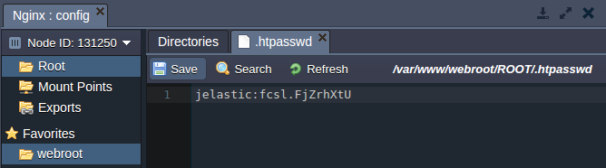
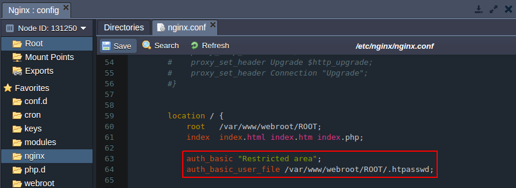
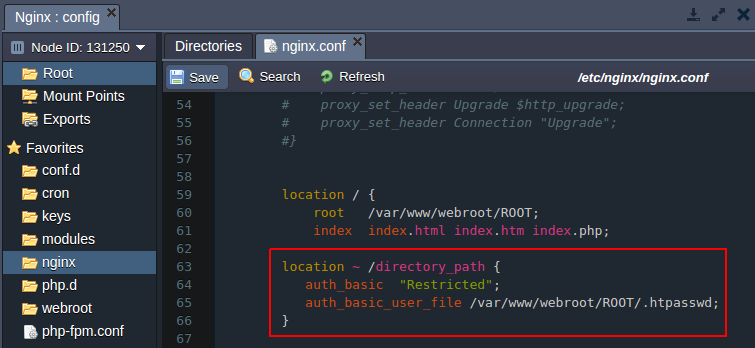
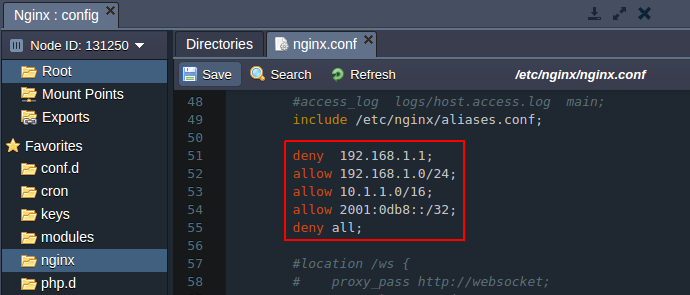
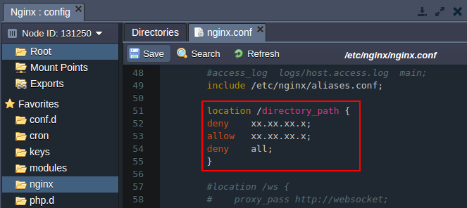
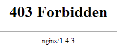

# Security Configurations for NGINX

In this tutorial we will show how to set up the additional security configurations for your **PHP application** hosted with NGINX application server.

You can use the following types of security configurations:

* [Authentication](#a)
* [Setting up the access criteria](#b)

**
A. Security through authentication
**
To provide this, come through the next steps:

* Generate hash from your password. For that you can use any **htpasswd tool** or online service (for example, [http://www.htpasswdgenerator.net/](http://www.htpasswdgenerator.net/)).
* Create simple text file with previously generated hash.
* Click **Config** button for your server.
* Upload the created file to the **/var/www/webroot/ROOT** directory.

* In the  **/etc/nginx** directory, open *nginx.conf* file and modify directory configurations:
    * **authentication for the whole application**
Modify the location configurations by adding the following strings:  
*auth_basic "Restricted area";   
auth_basic_user_file /var/www/webroot/ROOT/.htpasswd;*  
 
    * **authentication for the separate directory**  
        Add the following **location** strings stating the path to the required directory:  
*location ~ /directory_path {   auth_basic "Restricted";   auth_basic_user_file /var/www/webroot/ROOT/.htpasswd;  }*

* Save the changes and restart **NGINX**  
As a result, while accessing the application or the protected directory a user will be requested to authenticate.

**
B. Security through setting up criteria
**
You can provide security for your application through setting up different criteria, for example, allow or deny access by IP address.

* The **Allow** and **Deny** directives are used to specify which clients are or are not allowed access to the server. The rules are checked in sequence until the first match is found.
* Open *nginx.conf* file in the **/etc/nginx** directory and add necessary directives:
    * **deny access to the whole application**
Modify the **location** configurations using the strings of the following type:  
<i>deny xx.xx.xx.x;  
allow xx.xx.xx.x;  
deny all;  </i>

    * **deny access to the separate directory**  
        Add the following **location** strings stating the path to the needed **directory**:  
        *location /directory_path {  
        deny   xx.xx.xx.x;  
        allow  xx.xx.xx.x;  
        deny   all;*  
        }

As a result, a user with any IP except of the allowed ones will see the 403 error while trying to open your application.

***<u>Note:</u>***

* Denying access through IP makes sense only if you use Public IP feature.
* Both criteria access restrictions and password-based authentication may be implemented simultaneously. In that case, the Satisfy directive is used to determine how the two sets of restrictions interact. More information you can get [here](https://docs.nginx.com/nginx/admin-guide/security-controls/configuring-http-basic-authentication/#combining-basic-authentication-with-access-restriction-by-ip-address).

## What's next?

* [PHP Application Server Configuration](/php-application-server-config/)
* [NGINX Modules](/nginx-modules/)
* [NGINX-Balancer Security](/nginx-balancer-security/)