

# PHP Application Server Configuration

To perform the necessary configurations, press the **Config** button next to your application server. In the case you have **several application servers** you can configure them together or separately. To do this follow the steps:

1\. Open the drop-down menu at the top of the configuration tab. It includes the list of all of the app servers in your environment.

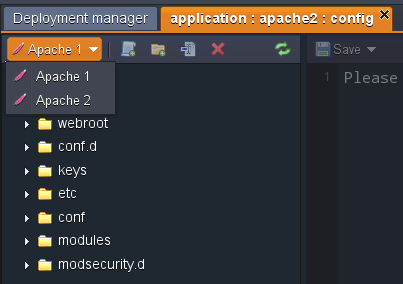

2\. Choose the one you need and make the configurations.

3\. To apply the changes:

* only for the chosen server click **Save only for the current instance** button from drop-down menu;
* for all the servers click **Save for all instances**.

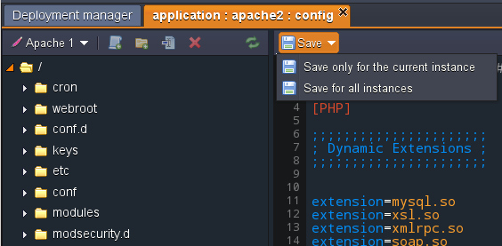

{}**Note**: if you create/rename a file or folder in the Configuration manager, this will be applied only in the list of the chosen node. You can't save this change for all of the app servers available in the environment. If you want to also create/rename the file or folder in the other servers you need to do this manually.{}

Below you can see the list of the configuration files available for editing in the PHP application servers:

### Apache

Folder|File|Path
---|---|---
[etc](#etc)|php.ini|/etc
[conf.d](#confd)|modules.conf aliases.conf geoip.conf mod_security.conf php.conf ssl.conf welcome.conf|/etc/httpd/conf.d/
[conf](#conf)|httpd.conf|/etc/httpd/conf/
[webroot](#webroot)||/var/www/webroot
[cron](#cron)|apache|/var/spool/cron
[keys](#keys)||/var/lib/jelastic/keys
[modules](#modules)||/usr/lib64/php/modules

### NGINX-PHP

Folder|File|Path
---|---|---
[etc](#etc)|php-fpm.conf php.ini|/etc
[conf.d](#confd)|virtual.conf ssl.conf|/etc/nginx/conf.d 
[conf](#conf)|nginx.conf|/etc/nginx
[webroot](#webroot)||/var/www/webroot
[cron](#cron)|nginx|/var/spool/cron
[keys](#keys)||/var/lib/jelastic/keys
[modules](#modules)||/usr/lib64/php/modules

Clik on the links to get more information on which settings can be changed in the appropriate folders.

## ETC

The main PHP server configurations are performed in the ***php.ini*** file which is located in the **etc** folder.

For example, here you can set the required:

* [PHP Extensions](/php-extensions/)
* [PHP Accelerators](/php-accelerators/)
* [Storing PHP sessions in Memcached](/php-sessions-memcached/)
* [PHP.INI Security Configurations](/php-security-settings/)

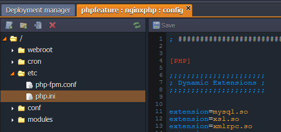

{}[Back to the list](#back){}

## CONF

* **Apache**

For the Apache application server the main configuration file is the ***httpd.conf*** located in the **conf** folder. For example, by using it, you can perform the following actions:

* set up [Multiple Domains](/multiple-domains-php/)
* enable [custom Apache modules](/add-apache-modules/)
* use [WebDav module](/apache-webdav-module/)
* perform necessary [security configurations](/apache-security-configurations/)
* configure [name-based virtual host](/name-based-apache-virtual-host/)
* enable [statistics module](/apache-statistics-module/) to view your server's statistics

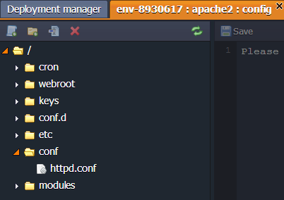

{}**Note:** In order to perform any custom configurations in the ***httpd.conf*** file, you need to remove the *#Jelastic autoconfiguration mark* string at the beginning of the file:

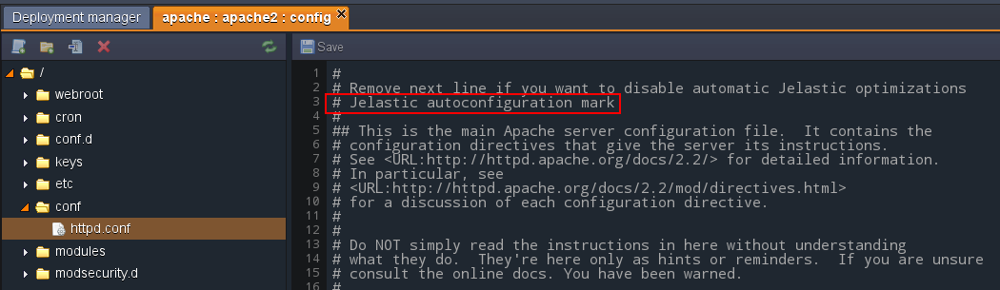{}

The number of workers for processing PHP requests is increased automatically in an Apache server depending on the cloudlet amount you stated for it.

To check this, find and remember the *MaxClients* value in ***httpd.conf*** file.

After that, change the topology of your environment by increasing or decreasing the cloudlet limit for your server.

Return to the ***httpd.conf*** file - the number of *MaxClients* has increased/decreased.

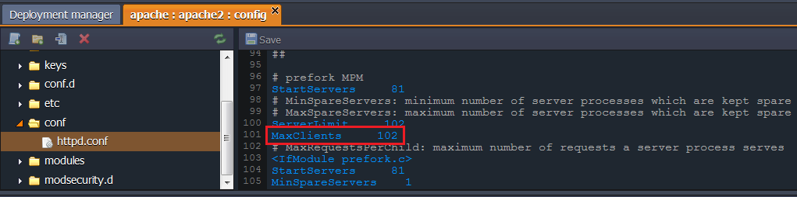

{}**Note:** This functionality will be disabled if you remove the *# Jelastic autoconfiguration mark* string at the start of the ***httpd.conf*** file{}

* **NGINX**

For performing necessary configurations for an NGINX-PHP server the ***nginx.conf*** file, located in **conf** folder, is used. Use it to set up the following configurations:

* set up [Multiple Domains](/multiple-domains-php/)
* use [WebDav module](/nginx-webdav-module/)
* perform necessary [security configurations](/nginx-security-configurations/)

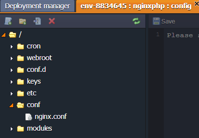

{}[Back to the list](#back){}

## CONF.D

The **conf.d** folder is used for storing and managing sub configs.

{}[Back to the list](#back){}

## WEBROOT

The **webroot** folder is used for storing the unpacked application deployed  to the environment.

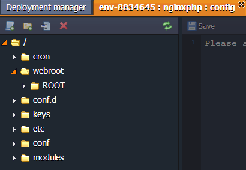

{}[Back to the list](#back){}

## CRON

App servers include a **cron** folder with the config file where cronjobs can be configured.

Detailed information on Cronjob configuration can be found in the [Setting Up a Cronjob](/cron-job/) document.

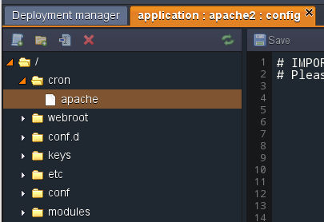

{}[Back to the list](#back){}

## KEYS

The **keys** directory is used as a location for uploading any private key which is needed for your application.

Generate the key, save it as a simple file and upload to the **key** folder. Now, you can use it for different cases by simply stating the path to your key:

*/var/lib/jelastic/keys/{key_file_name}* 

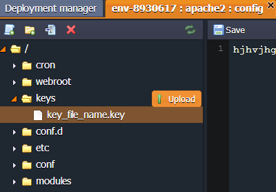

{}[Back to the list](#back){}

## MODULES

The modules folder contains the php modules available in the platform by default. You can also upload your custom php modules to this folder, in order to activate them.

For more information navigate to [PHP Modules](/php-extensions/) document.

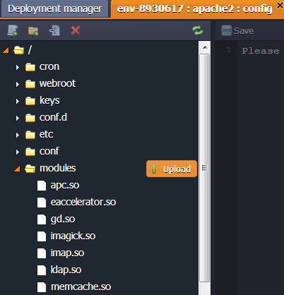

{}[Back to the list](#back){}

## What's next?

* [Apache PHP](/apache-php/)
* [NGINX PHP](/nginx-php/)
* [Multiple Domains for PHP](/multiple-domains-php/)