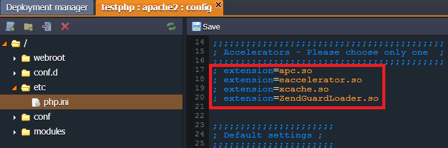

# PHP Accelerators

A **PHP accelerator** is a PHP extension designed to improve the performance of software applications written in the PHP programming language. 

The way these PHP accelerators work is by caching the compiled bytecode of your human-readable PHP. Normally, your PHP code is compiled and then executed at runtime but these tools cache the compiled code, saving the expense of compiling it and thusly generally save you a bit of CPU at the cost of some increased memory usage. 

So what PHP acceleration can do is make your PHP execute more quickly, and execute in roughly half the time. To the user it is a combination of page generation time, network latency, and page rendering time. 

In the PaaS, the most popular accelerators are used: 

* **APC**
* **Xcache**
* **eAccelerator** (works with PHP 5.3 and 5.4 only)
* **ZendGuardLoader** (works with PHP 5.3 only)

To activate the accelerator follow the instruction:

1\. Click **Config** button for the server in your environment.

2\. In the **etc** folder open ***php.ini*** file.

3\. Uncomment one of the *Accelerators*:
```php
extension=apc.so   
extension=eaccelerator.so   
extension=xcache.so   
extension=ZendGuardLoader.so
```



4\. Also here you can make all settings necessary for your module.

5\. **Save** the changes and **Restart** the node.

That's all. Now, the chosen PHP accelerator is activated.


## What's next?

* [PHP Dev Center](/php-center/)
* [PHP Modules](/php-extensions/)
* [PHP Auto Configurations](/php-auto-configuration/)
* [PHP Application Server Configuration](/php-application-server-config/)