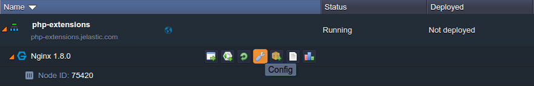
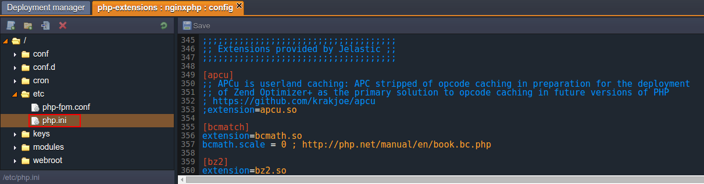
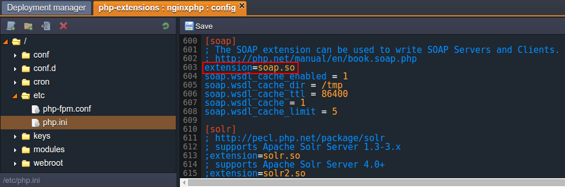
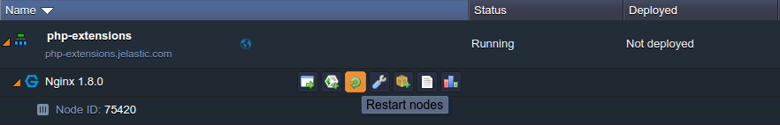
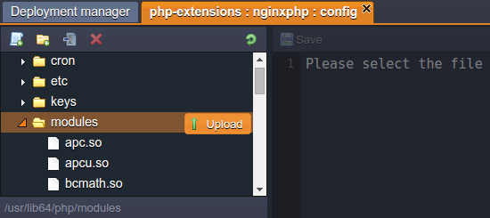
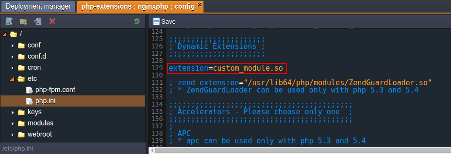

# PHP Extensions

At the platform, PHP application servers are delivered with a number of embedded modules, which allows you to **set different PHP extensions** in *httpd* (Apache-PHP) and *PHP-FPM* (NGINX-PHP) daemons. Among these extensions, the following commonly required ones are ***inbuilt***, i.e. loaded and run with PHP by default:

<table><colgroup><col width="*"><col width="*"><col width="*"></colgroup><tbody><tr><td style="text-align: center; background-color: #eceffd94;"><i>
ctype<br>
date<br>
dom<br>
ereg<br>
filter</i></td><td style="text-align: center;"><i>
hash<br>
libxml<br>
mhash<br>
pcre<br>
Reflection</i></td><td style="text-align: center;"><i>
session<br>
SLPxml<br>
sockets<br>
</i></td></tr></tbody></table>

The rest of provided extensions are ***dynamic***, i.e. they are included to the appropriate servers' builds (being stored within the dedicated *modules* server folder) and can be enabled upon the necessity:

<div><table><colgroup><col width="143"><col width="172"><col width="151"><col width="158"></colgroup><tbody><tr><td rowspan="22" style="background-color: #eceffd94;"><i>apc.so<br>
apcu.so<br>
bcmath.so<br>
bz2.so<br>
calendar.so<br>
curl.so<br>
dba.so<br>
dom.so<br>
enchant.so<br>
event.so<br>
exif.so<br>
fileinfo.so<br>
ftp.so<br>
gd.so<br>
gearman.so<br>
geoip.so<br>
gettext.so<br>
gmp.so<br>
http.so<br>
iconv.so<br>
igbinary.so<br>
imagick.so<br>
imap.so</i>
</td><td rowspan="22"><i>inotify.so<br>
intl.so<br>
json.so<br>
ldap.so<br>
mbstring.so<br>
mcrypt.so<br>
memcache.so<br>
memcached_2_1_0.so<br>
memcached_2_2_0.so<br>
mongo.so<br>
mongodb.so<br>
mysql.so<br>
mysqli.so<br>
mysqlnd_ms.so<br>
mysqlnd_qc.so<br>
mysqlnd.so<br>
ncurses.so<br>
oauth.so<br>
odbc.so<br>
opcache.so<br>
openssl.so<br>
pcntl.so<br>
pdo_dblib.so<br>
</i></td><td rowspan="22"><i>pdo_firebird.so<br>
pdo_mysql.so<br>
pdo_oci.so<br>
pdo_odbc.so<br>
pdo_pgsql.so<br>
pdo_sqlite.so<br>
pdo.so<br>
pgsql.so<br>
phar.so<br>
posix.so<br>
propro.so<br>
pspell.so<br>
raphf.so<br>
rar.so<br>
readline.so<br>
recode.so<br>
redis.so<br>
shmop.so<br>
simplexml.so<br>
snmp.so<br>
soap.so<br>
solr.so<br>
solr2.so<br>
</i></td><td rowspan="22"><i>sphinx.so<br>
sqlite3.so<br>
svn.so<br>
sysvmsg.so<br>
sysvsem.so<br>
sysvshm.so<br>
tidy.so<br>
timezonedb.so<br>
tokenizer.so<br>
uuid.so<br>
wddx.so<br>
xcache.so<br>
xdebug.so<br>
xmlreader.so<br>
xmlrpc.so<br>
xmlwriter.so<br>
xsl.so<br>
yaml.so<br>
ZendGuardLoader.so<br>
zip.so<br>
zlib.so</i></td></tr></tbody></table></div>

Below, you can figure out how to:

* [activate an extension](#activate-extension)
* [configure an extension](#configure-extension)
* [add your custom extension](#add-custom-extension)


## Activate Extension

In order to make a dynamic extension available for the used PHP module (i.e. engine), it should be enabled within the corresponding configuration file.

{}**Note:** The inbuilt extensions <u>*should not*</u> be loaded manually, as they are constantly running at all PHP servers in the platform by default.{}

Below, you can find out how this can be accomplished:

1\. Click the **Config** button for your app server.



2\. Within the opened configuration tab, move to the **etc > <i>php.ini**</i> file and scroll down to the ***Extensions provided by PaaS*** section. Here, each dynamic extension has its own sub-section, where it can be enabled and configured.



3\. Now, locate the required section (they are listed in the alphabetic order) and uncomment the ***extension={module_name}.so*** directive inside (i.e. remove semicolons at the beginning of the corresponding line) to enable it:



Also, here you can adjust the extension by means of the stated configuration parameters (or specify your own ones).

4\. After all the necessary changes are made, do not forget to **Save** them and **Restart** the node to apply the new configuration.




## Configure Extension

All the necessary PHP modules' settings are to be handled via the ***php.ini*** file. Herewith, the majority of provided dynamic extensions are specified with a set of possible configuration parameters alongside.

As an example, let's consider such for the dynamic *OPcache* extension - [PHP accelerator](/php-accelerators/), based on the opcode caching and optimization:

* ***opcache.enable=1*** - enable/disable OPcache extension
* ***opcache.memory_consumption=64*** - set the amount of memory to use
* ***opcache.interned_strings_buffer=8*** - set the amount of memory to be used for storing internal strings (e.g. classnames)
* ***opcache.max_accelerated_files=4000*** - the maximum number of files to be cached
* ***opcache.revalidate_freq=60*** - the frequency of checking file timestamps for the shared memory storage allocation to be changed
* ***opcache.fast_shutdown=1*** - enable/disable a fast shutdown sequence for accelerated code
* ***opcache.enable_cli=1*** - enable/disable OPcache for the CLI version of PHP


## Add Custom Extension

In addition to all of the modules, available at the platform out-of-box, you have the possibility to integrate your own PHP extensions to a server if needed. For that, just follow the instruction below:

1\. Compile the extension itself.

2\. Navigate to the platform dashboard and click on the **Config** button for your PHP application server.


3\. Now, using the opened manager, upload your custom extension to the **modules** folder.



4\. Move to the **etc > <i>php.ini</i>** file, find the ***Dynamic Extensions*** section and add the next command directive:

```
extension={module_name}.so
```



{}**Tip:** You can define all the necessary settings for your extension at the same section, if needed.{}

5\. **Save** the changes and **Restart** the node.


That's all! Now your custom extension is activated.


## What's next?
* [PHP Accelerators](/php-accelerators/)
* [PHP Auto Configurations](/php-auto-configuration/)
* [PHP App Server Configuration](/php-application-server-config/)
* [Apache & NGINX Modules](/apache-nginx-modules/)