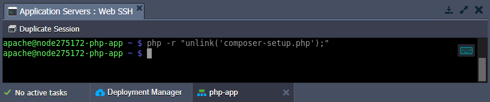

# PHP Composer for Smart Dependency Management of Your Cloud Applications

{}{}

**[Composer](https://getcomposer.org/)** is one of PHP's most popular dependency management tools inspired by the node’s [npm](https://www.npmjs.com) and ruby’s [bundler](https://bundler.io/). It will smartly manage all the required libraries and packages for your application. Running on a per-project basis, **Composer** determines which versions of which packages your project depends on and installs them in a working directory. Moreover, this tool provides the [autoload](https://getcomposer.org/doc/04-schema.md#autoload) feature to keep your packages up-to-date.


The **Composer** is integrated into all PHP application servers (*Apache*, *NGINX*, *LiteSpeed*, *LEMP*, and *LSSMP*) by default. It is installed to the **/usr/local/bin** folder, which is added to the PATH variable, making Composer operable from anywhere on the node via the *composer* shortcut (e.g. *composer about*). Additionally, if the project has a ***composer.json*** file, Composer can manage dependencies directly during the installation using the *Post-Deploy* [hook script](/deployment-hooks/). All you need to do is move to your project directory and run the *composer install* command:

```
cd $WEBROOT/{project_name}
composer install
```

## Composer Update

You are automatically provided with the latest version of Composer during the node creation. However, if a newer version of Composer is released, you can easily get it without the necessity of recreating a whole container. Follow the next steps to install the latest composer version into your PHP container:

1\. Connect to the appropriate node via SSH. For example, using the built-in [Web SSH](/web-ssh-client/).


2\. Download Composer installer with the following command:

```
php -r "copy('https://getcomposer.org/installer', 'composer-setup.php');"
```


3\. Install Composer into the current directory.

```
php composer-setup.php --install-dir=./ --filename=composer
```


{}**Tip:** If needed, you can move to the required directory before the operation or adjust the path via the *install-dir* parameter. However, you cannot install to the **/usr/local/bin/** directory with the initial Composer instance.{}

4\. Let's run this *local version* of the Composer (i.e. using relative or absolute path) to ensure that everything works as expected. For example:

```
./composer about
```


{}**Tip:** If the dependency manager works fine, we recommend removing the installer (as it's not needed anymore).

```
php -r "unlink('composer-setup.php');"
```

{}

That's all! The latest version of the Composer is successfully installed and is ready for use.


## What's next?

* [Deployment Guide](/deployment-guide/)
* [Deployment Hooks](/deployment-hooks/)
* [Configuration File Manager](/configuration-file-manager/)
* [PHP Extensions](/php-extensions/)
* [PHP Accelerators](/php-accelerators/)