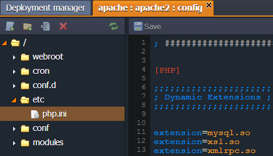
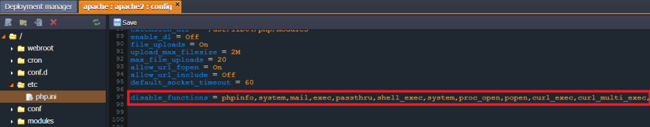

# PHP.INI Security Settings

There are several PHP functions, which are recommended to be properly configured in order to protect your server from a harm. Of course, overall protection of your system can be rather complex and require a number of specific tools, but in this tutorial we will examine how to start with some basics, which don't require additional spends. So, let's see how to perform some initial configurations to increase the security of your PHP application, hosted with the platform.

The main PHP configuration file, named **php.ini**, contains a number of default settings, which you can customize, or even add your own depending on the needs of your application. It is located in the ***etc*** directory of your Apache or NGINX-PHP application server. This file is fully editable for you as a platform customer, so let's consider which settings you can apply in order to ensure you server security.

**Note** that values described below are just recommendations. Before applying, please, make sure your application requirements will meet this configurations to not decrease its performance.

Press **Config** button for your Apache or NGINX server. In the appeared tab navigate to the **etc** directory and open **php.ini** file.

Follow the next instructions to apply the necessary configurations:

1\. Add the following string in order to disable the **<u>insecure functions</u>**:

*disable_functions = phpinfo, system, mail, exec*  
An additional security can be obtained by disabling the following functions:  
*disable_functions = exec,passthru,shell_exec,system,proc_open,popen,curl_exec,curl_multi_exec,parse_ini_file,show_source*  

2\. Scope the **<u>allowed resources**</u> amount, if it is acceptable for your application:

* Maximum script execution time (in seconds) ***max_execution_time = 30***
* Maximum time for request data parsing by each script ***max_input_time = 60***
* Maximum size of uploaded file ***upload_max_filesize = 2M***
* Maximum script memory amount (8MB) ***memory_limit = 8M*** (the default value is 128M, but it is acceptable to set the lower one if it won't decrease your application performance) 
* Maximum POST data size, acceptable for PHP ***post_max_size = 8M***

3\. The following list of **<u>functions</u>** can be **<u>restricted</u>** in the case they aren't necessary for your application:

* Disallow HTTP file uploads ***file_uploads = Off***
* Disallow displaying the PHP error messages for the end-users ***display_errors = Off***
* Limit the external access to your PHP environment ***safe_mode_allowed_env_vars = PHP\_***
* Restrict the sending back of PHP information ***expose_php = Off***
* Turn off the globals registration for input data ***register_globals = Off***
* Restrict remote files opening ***allow_url_fopen = Off***

4\. In order to get more information about the security state, **<u>enable</u>** the following **<u>functions</u>**:

* Ensure appropriateness of PHP redirecting ***cgi.force_redirect = 0***
* Enable all possible errors ***logging*** ***log_errors = On***

5\. Switch on available **<u>safe modes</u>**:

* Enable safe mode ***safe_mode = On***
* Enable SQL safe mode ***sql.safe_mode = On***

**Note:** While specifying the abovementioned settings you should consider the requirements of your application, in some cases it can be unavailable.

## What's next?
* [PHP Application Server Configuration](/php-application-server-config/)