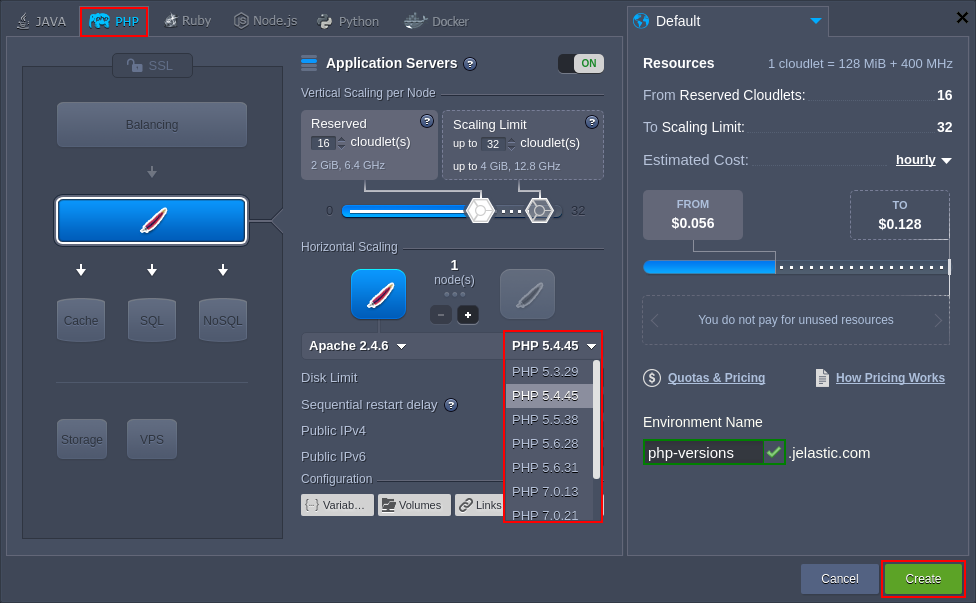
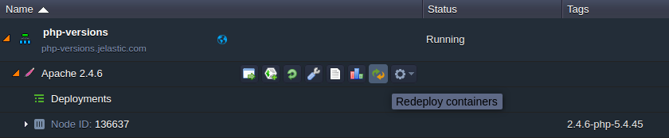
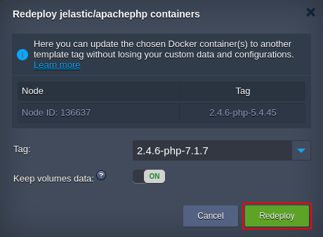

# PHP Versions

Within the confines of PHP hosting at the platform, the following PHP engine versions are supported:

* *PHP 8.0.30*
* *PHP 8.1.29*
* *PHP 8.2.23*
* *PHP 8.3.11*

{}The up-to-date list of the releases available on the platform is provided via the dedicated, regularly (weekly) updated [Software Stack Versions](/software-stacks-versions/#engines) document.{}

You can choose the version you need while environment creation and easily [switch between them](#switch) afterwards via topology wizard. The workflow is the following:

1\. Click the **New Environment** button at the top dashboard pane to open the *Environment Wizard* frame.

2\. Navigate to the ***PHP*** language tab and pick the preferred application server. Choose the desired engine version by means of the second drop-down list in the central pane.

Specify the resource limits, select the preferred [region](/environment-regions/), type your environment name (or leave the default one) and click the **Create** button.

{}**Tip:** For more information on PHP hosting specifics at the platform and the possibilities it provides, refer to the [PHP Developer's Center](/php-center/) document.{}

3\. In order to change the version of PHP for the already existing environment, click the **Redeploy containers** icon next to the appropriate layer.

4\. Select required engine version within the *Tag* list of the opened frame.

Click **Redeploy** to confirm the changes.

{}**Note:** In case of switching the engine version to PHP 7 for legacy PHP containers, you may require to manually [re-define](/php-extensions/#activate-extension) the included PHP modules, as part of them was turned into dynamic (i.e. to be activated only upon the necessity) in confines of the [PaaS 4.3](/release-notes-43/#php-modules-list-refactoringnbsp43--44) release.{}

## What's next?

* [Software Stack Versions](/software-stacks-versions/)
* [Deployment Guide](/deployment-guide/)
* [PHP App Server Configuration](/php-application-server-config/)
* [PHP Tutorials](/php-tutorials/)