# How to Install Mibew Messenger

**Mibew Messenger** (or Open Web Messenger) is a freeware and open-source application for online support in real-time. It is a kind of a call button, which is integrated into your site. A customer clicks on it and the chat with the support engineer begins. Mibew messenger doesn't have a limitation on the operators, chats or users number.

## Create Environment

{}If you don't have a PaaS account, please register it as described in the *[Getting Started](/getting-started/#sign-up-how-to-create-an-account)* document.{}

1\. Log in to the platform dashboard and click **Create environment** button in the upper left corner of the dashboard.

2\. Choose the ***PHP*** tab. Pick **Apache** as your application server and **MySQL** as a database. Name your environment or use the default name. Click the **Create** button.

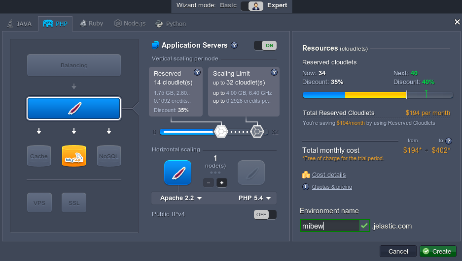

3\. Just in seconds your new environment will be created and displayed in the environment list.

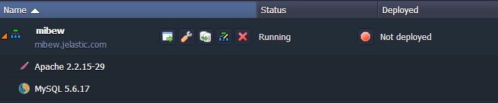

You have received two emails as well: the first one with the confirmation of successful environment creation and the second one - with MySQL authorization details.

## Configure Database

1\. Open the letter with a subject "*MySQL node successfully added*" in your Email box. Find there your **Access URL**, **Login** and **Password**.

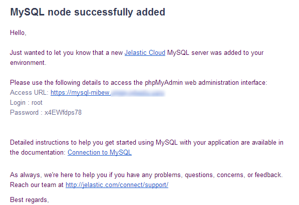

2\. Enter the **phpMyAdmin** panel by clicking on the **access URL**. Add your username and password (or copy them from the email).

3\. Go to the **Users** tab and create a new user with an option "*Create database with same name and grant all privileges*".

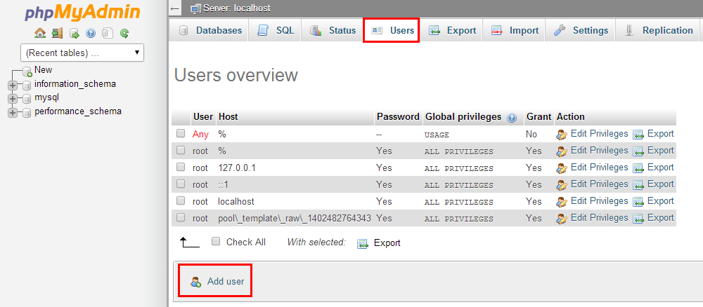

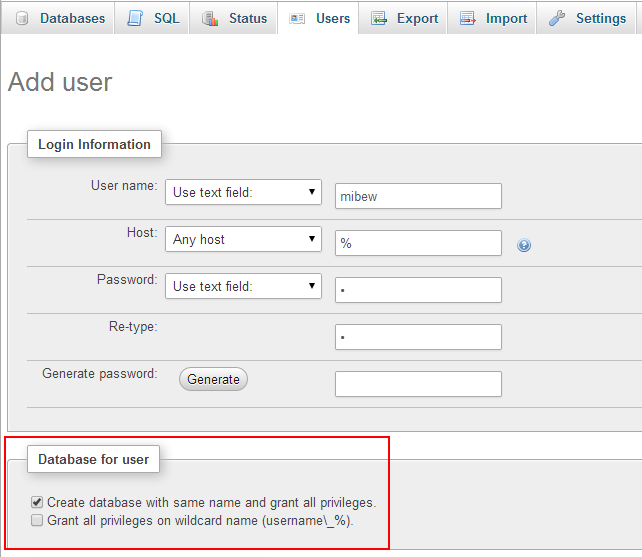

## Upload and Install Application

1\. Download the [**latest version**](https://mibew.org/download2) of the Mibew Web Messenger (zip archive) choosing a language pack from the list or the default package.

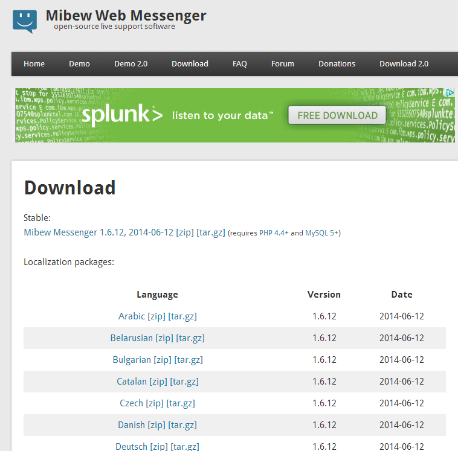

2\. Go to your platform dashboard and click **Upload** in the **Deployment Manager**. Choose your archive file and click the **Upload** button.

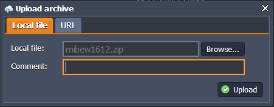

3\. Click the **Deploy to** icon next to the name of your archive file and choose your Environment. If you want to deploy several projects into one server specify the application's target context (in our case it is not necessary).

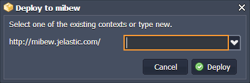

4\. Go to the **Config Manager** of Apache by clicking on the **Config** icon next to its name.

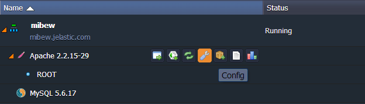

5\. Find ***config.php*** file (***/webroot/ROOT/libs/***) and edit the next lines:

* at 21 line insert: $mibewroot = ""
* at 31-34 line insert the needed data for MySQL connection (your MySQL host name, database name, user name and password you've created earlier)
* at 43 line insert your email

Save these changes.

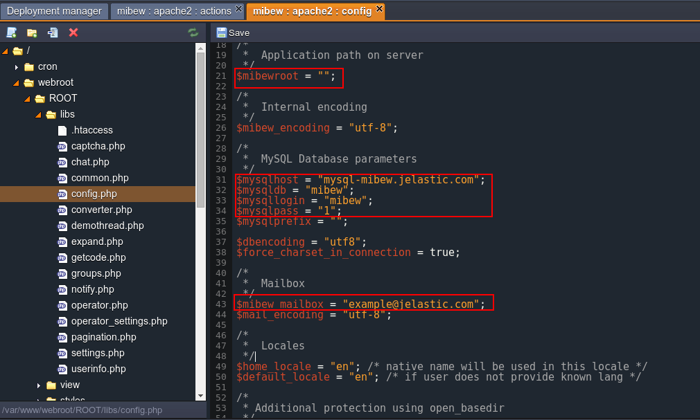

6\. Open your environment with next path:

***http://{your_environment}.{hoster.domain}/install/index.php***

If everything went well, you can see the Installation interface.

7\. Click on the **Create required tables**.

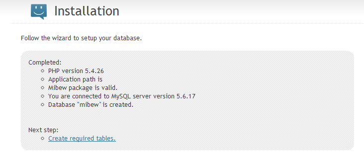

8\. Access the panel with the Login (***admin***) and an empty space in the Password field.

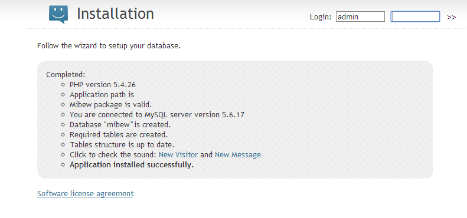

9\. Here you go! Now you have your support application deployed in the platform and can work with an Administrator panel of the **Mibew Messenger**.

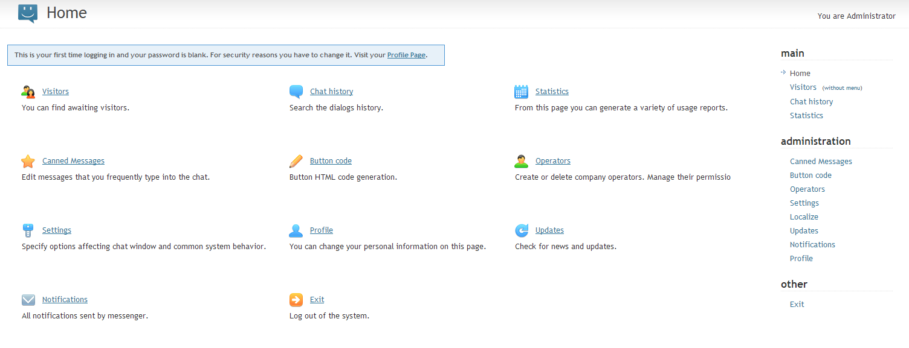

## What's next?

* [Tutorials by Category](/tutorials-by-category/)
* [PHP Tutorials](/php-tutorials/)
* [Setting Up Environment](/setting-up-environment/)