# How to Deploy phpMyFAQ

**phpMyFAQ** is a multilingual database-driven FAQ-system. It supports various databases and PHP 5.3 (or higher).

phpMyFAQ offers:

* multi-language Content Management-System (CMS) with a WYSIWYG editor and an Image Manager;
* HTML Editor;
* flexible multi-user support with user and group based permissions, templates;
* PDF support;
* Facebook and Twitter support;
* LDAP and Microsoft Active Directory support;
* Easy-to-use installation script.

It is easy to install this application into your platform. Just follow the next steps.

## Create Environment 

{}If you don't have an account, please register it as described in the [Getting Started](/getting-started/) document.{}

1\. Log in to the platform dashboard and click **Create environment** button in the upper left corner of the dashboard.

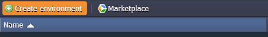

2\. Choose the ***PHP*** tab. Pick **Apache** as your application server and **MySQL** as a database. Name your environment or use the default name. State the cloudlet limit for each added node. Click the **Create** button.

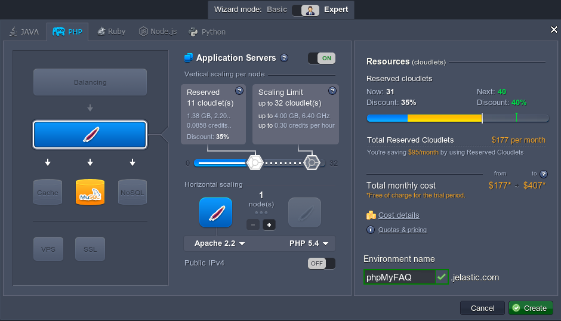

Your new environment will be created in seconds. You have received two emails as well: the first one with the confirmation of the successful creation of the environment and the second one - with MySQL authorization details. 

## Configure Database

1\. Open the letter with *MySQL node successfully added* subject in your email box. Find there your **Access URL**, **Login** and **Password**.

2\. Enter the **phpMyAdmin panel** by clicking on the **Access URL**. Add your username and password (or copy them from the email).

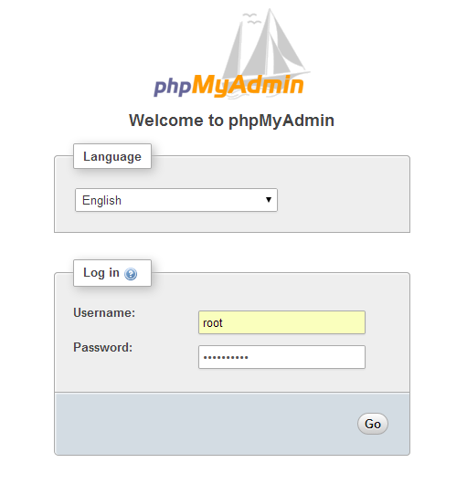

3\. Go to the **Users** tab, create a new user (e.g. *phpmy*) with an option *Create database with same name and grant all privileges* ticked.

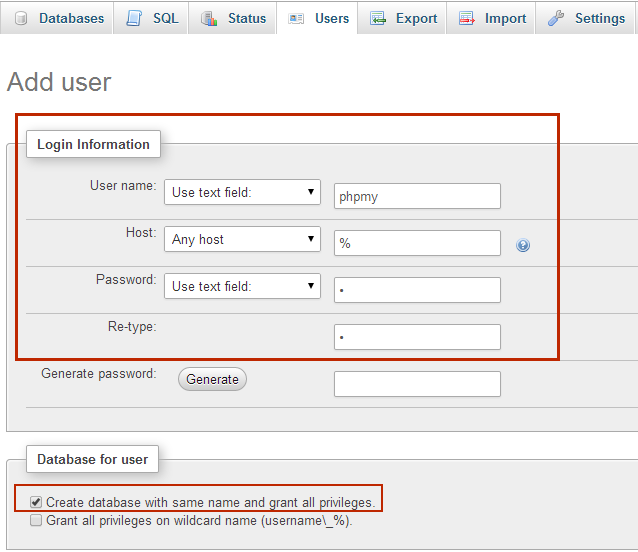

## Upload and Install Application

1\. Go to [phpMyFAQ official site](https://www.phpmyfaq.de/download) and download the latest version as **.zip** archive.

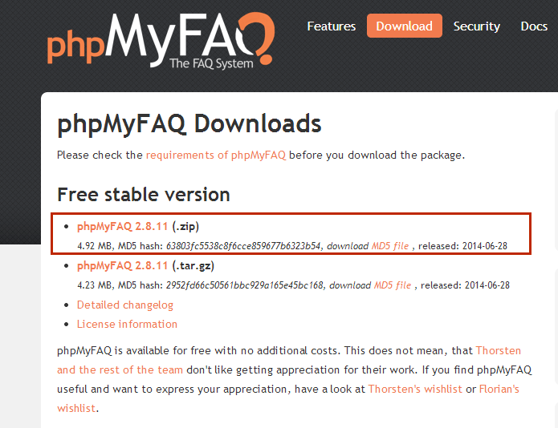

2\. Go to your platform dashboard and click **Upload** in the **Deployment Manager** window. Choose your local archive file and push the **Upload** button.

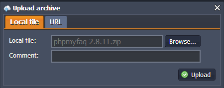

3\. Then click the **Config** button for Apache server in your environment.

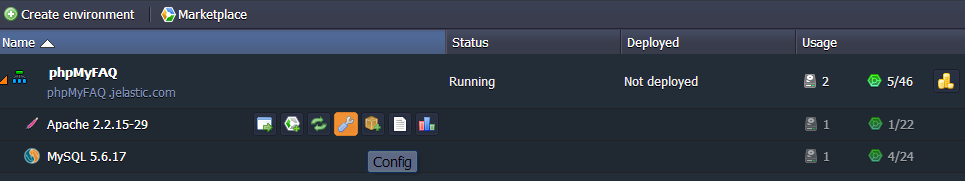

4\. You can see a config manager below. Navigate to the **ROOT** folder (***/webroot/ROOT***) and create new **attachments**, **data**, and **images** folders (without capital letters).

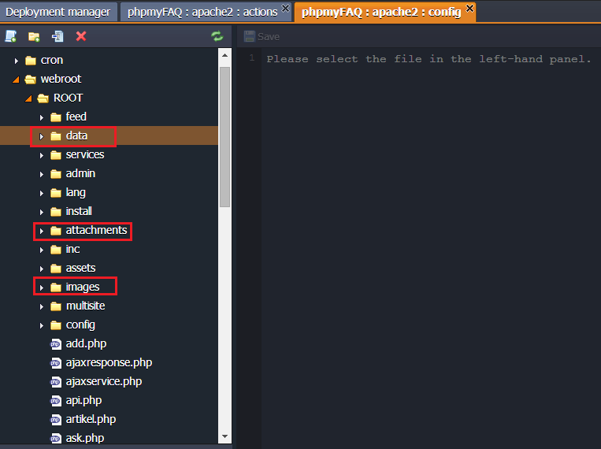

5\. Open your application by clicking the **Open in Browser** button.

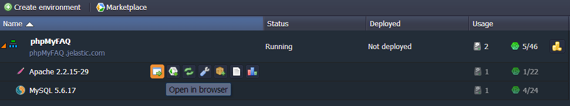

6\. You have reached a **phpMyFAQ Setup** page. Fill in all the needed fields here:

* **Database hostname** (without http://);
* **Database user** (the one you've created during database configuration);
* **Database password** (you've created during database configuration); 
* Your **email**.

And choose three more parameters for administrator: *Name*, *Login*, *Password*.

Press the **Click to install phpMyFAQ** button.

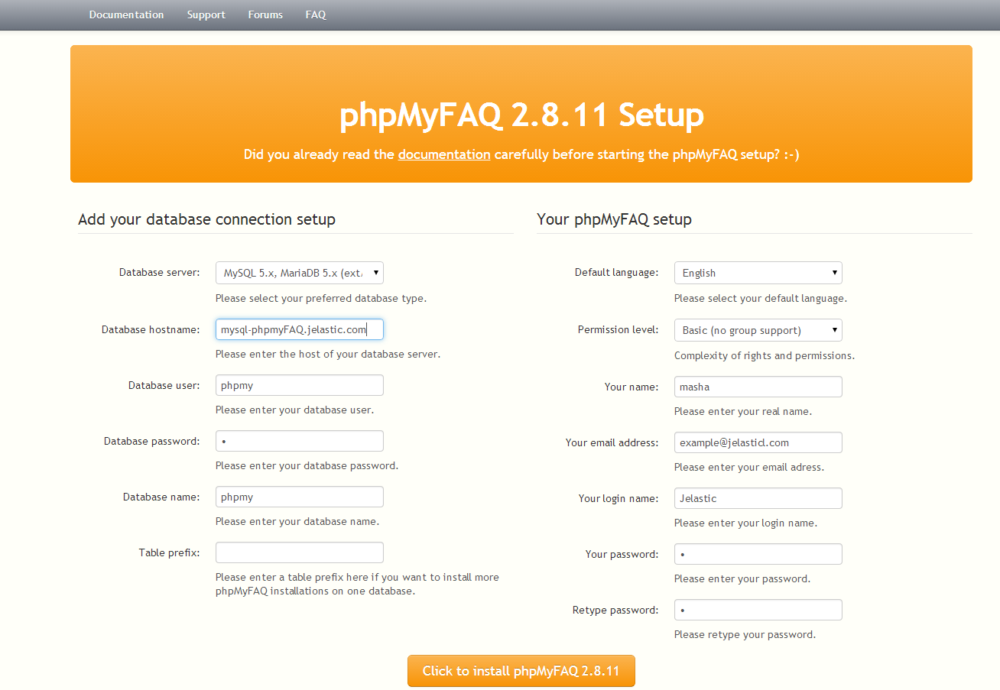

7\. You will be redirected to the Survey page. Enjoy it and click the **Click here to submit the data and finish the installation process** link.

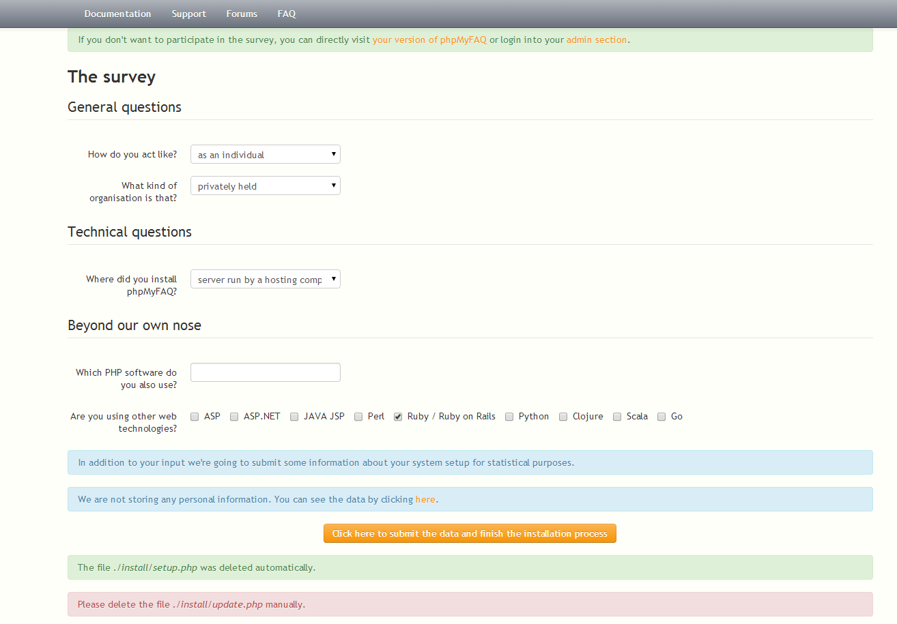

8\. Here you can see your version of phpMyFAQ and login into your admin section.

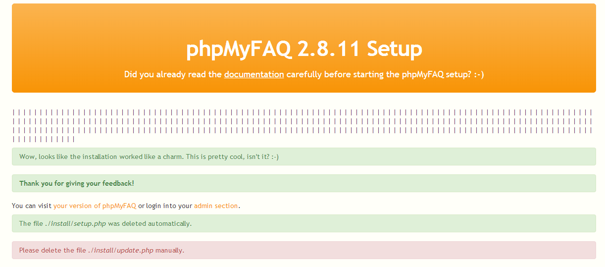

9\. Go back to your platform dashboard and open **Apache** configuration manager. Navigate to the ***/webroot/ROOT/install*** folder. Find **update.php** file there and delete it.

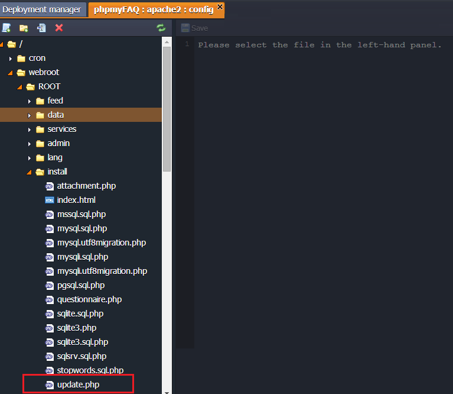

Your application is installed into your platform. Enjoy!

## What's next?

* [Tutorials by Category](/tutorials-by-category/)
* [PHP Tutorials](/php-tutorials/)
* [Setting Up Environment](/setting-up-environment/)