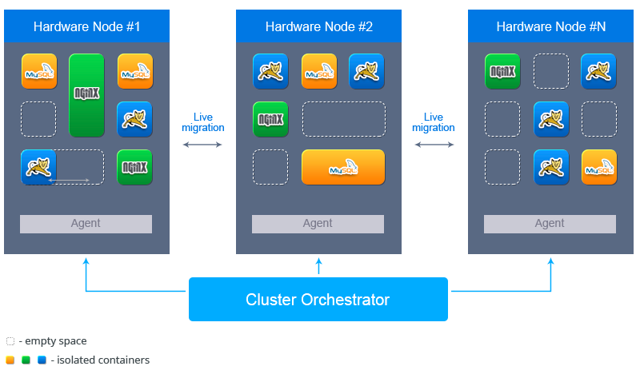

# PaaS Cluster Overview
### Basic Concepts

**Cluster**

Cluster is a group of servers and other resources that act like a single system by providing the ability to develop, debug, deploy, test, run and maintain hosted applications. PaaS Cluster includes Hardware Nodes and a Cluster Orchestrator.

**Cluster Orchestrator**

Cluster Orchestrator (Infrastructure node) is a set of internal components for managing resources, processing requests, and supporting PaaS system maintenance.

**Hardware Node**

Hardware nodes are the physical servers which store the isolated virtual machines provisioned for users' environments.

**Environment**

Environment is a collection of isolated virtual containers that provides all the facilities necessary for a particular application.

**Node (Container)**

Node or container is a virtual isolated machine provisioned for the environment and stored on the particular hardware node.

**Virtuozzo**

Virtuozzo is a system used to host a VPS (Virtual Private Server). Virtuozzo Containers can support several containers on a single physical server by using operating system-level virtualization.

## General Cluster Overview
PaaS is an isolated cluster with a group of servers and other resources that act like a single system for providing the ability to develop, debug, deploy, test, run and maintain hosted applications.

PaaS Cluster includes *Hardware Nodes* where [virtual isolated containers](http://en.wikipedia.org/wiki/Software_container) provisioned for environment are located and *Cluster Orchestrator (Infrastructure Node*) for internal components processing.

 
Follow the links to get more detailed information on each cluster component:

* [Cluster Orchestrator (Infrastructure node)](/cluster-orchestrator)
* [Hardware Node](/infrastructure-level)