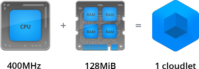
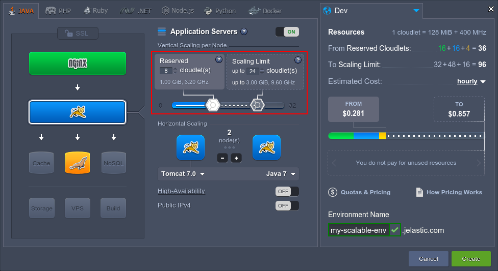
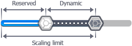
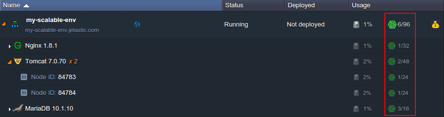

# What is a Cloudlet?

At the platform, consumed by container resources are measured in cloudlets - a special measurement unit, which includes <b>*128 MiB*</b> of **RAM** and *<b>400 MHz</b>* of <b>CPU</b> power simultaneously.

Being highly granular, it allows to accurately determine the required capacity for each server in environment, which ensures the truly fair [usage-based pricing](/pricing-model) so you do not overpay for the unused resources.
{}**Note:** that in contrast to RAM consumption (with *MiB=1024 KiB* unit), usage of [disk space and network traffic](/chargeable-resources#provider) is measured in megabytes (*1000 KB*).{}

Below, we'll consider which [types of cloudlet](#types) are used at the platform, how the [cloudlet consumption is calculated](#calculation) and where to [track your resource usage](#tracking-usage).

## Cloudlet Types
There are two types of cloudlet at the platform, available to be setup for every server in environment via the *[Vertical Scaling per Node](/automatic-vertical-scaling)* topology wizard section: ***Reserved*** and ***Dynamic***. 

Herewith, if a layer contains [multiple nodes](/multi-nodes), these limits are configured for all of them at once, i.e. are stated equal for each instance.

Here, each toddler corresponds to a particular cloudlet type:

* **Reserved Cloudlets** {}{} - these ones are reserved in advance and will be charged irrespective of your actual resource usage. In exchange, you'll get significant [automatic discounts](/automatic-discounts#1) based on their number.
* **Dynamic Cloudlets** {}{} - are added & removed automatically according to the amount of resources that are required by your application in a particular moment of time - i.e. they're assigned when load goes up and removed again as soon as it drops down. As a result, you pay based on your [actual resource usage](/pricing-model#setup-usage).

This type of cloudlet helps to cope with unexpected surges in demand without any pre-planning, special coding or overpaying for resources you won't need the majority of time. In such a way, with the Dynamic Cloudlets slider you set the container's *Scaling Limit*, defining the maximum possible number of cloudlets available to be allocated for it.

In order to gain the maximum profit, it is recommended to use *Dynamic Cloudlets* alongside with the *Reserved Cloudlets* to get all the advantages of your application's [automatic vertical scaling](/automatic-vertical-scaling) and, simultaneously, to benefit on [automatic discounts](/automatic-discounts#1).

## Cloudlet Consumption Calculation
Number of used cloudlets is calculated on hourly basis in the following way:

* **for RAM** - the *peak* value (i.e. the highest RAM consumption over the hour)
* **for CPU** - the *average* usage

The greater of these values (but <u>not</u> both of them combined) is considered as the actual environment consumption, which will be charged from your account according to the provider's tariff (check it within **[Quotas & Pricing](/resource-consumption#3)** information frame).

*For example*, if during one hour your average CPU usage is *2400 MHz* (6 cloudlets), and your highest RAM usage is *1024 MiB* (8 cloudlets), you'll be charged for 8 cloudlets only - not for the combined total of 14 units.

## Consumption Tracking

The current resource usage of your environment in general and for every layer/node it comprises in particular can be seen within the corresponding <b>Usage</b> column at dashboard:

And in order to review your servers' consumption level for a particular period of time, you can use the corresponding [Statistics](/view-app-statistics) section or check the applied account charges within your [Billing History](/consumed-resources#billing).

## Useful Links
To get to know more about the platform pricing model and how to benefit on all the advantages it provides, read the corresponding docs:

* [Usage-Based Pricing](/pricing-model)
* [Pricing FAQ](/resource-consumption)
* [Charged Resources](/chargeable-resources)
* [Automatic Vertical Scaling](/automatic-vertical-scaling)
* [Automatic Discounts](/automatic-discounts)