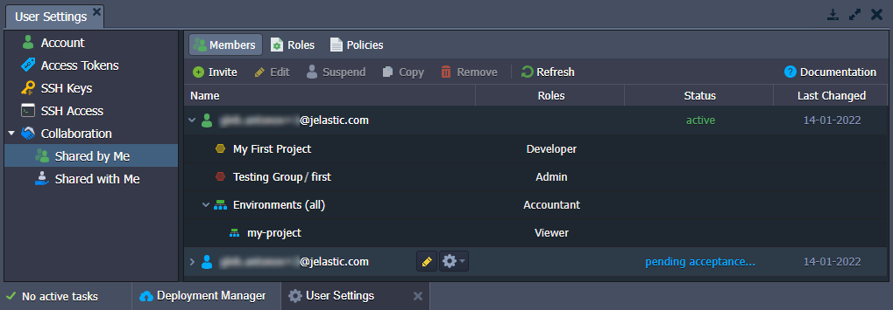

# Virtuozzo Application Platform 7.0

*This document is preliminary and subject to change.*

In this document, you will find all of the new features, enhancements and visible changes included to the **PaaS 7.0** release.

{}
{}
## Extended Account Collaboration
Reworked the *account collaboration* feature to provide better flexibility and cover more use cases
{}
{}

{}
{}
## API Changes
Listed all the changes to the public platform API in the current release
{}

{}
## Software Stack Versions
Actualized list of supported OS templates and software stack versions
{}
{}

{}
{}
## Fixes Compatible with Prior Versions
Bug fixes implemented in the current release and integrated into the previous platform versions through the appropriate patches
{}

{}
## Bug Fixes
List of fixes applied to the platform starting from the current release
{}
{}

## Extended Account Collaboration

The platform's ***account collaboration*** feature is a powerful tool that allows multiple users to work on the same project. The core idea is straightforward - you can share your environment with other accounts on the platform. Additionally, different permissions can be provided to the collaboration members to cover various use cases.

In the current 7.0 upgrade, the feature received a major rework, mainly focusing on extending its flexibility. Two focal points are **roles and policies** mechanics for advanced permission management and **integration with [environment groups](/environment-groups/)** to better organize shared components. All the features are wrapped in a new comprehensive UI:

- ***Shared by Me*** - collaboration options for the primary account, it has three tabs:
  - **Members** - manages a list of collaboration members (invite new users, suspend or remove existing ones, customize shared environments, groups, roles, etc.)
  - **Roles** - configures custom roles (a combination of policies) that create the required *range of actions*
  - **Policies** - lists actions (*specific operations*) that can be included in a role 
- ***Shared with Me*** - options for the collaboration member (accept/reject the invitation, view roles and policies, leave collaboration, etc.)

The new collaboration flow remains the same in principle but much more configurable in detail. In general, the *primary account* still sends a collaboration invite, and the user can accept it. However, instead of the two predefined collaboration roles (*admin* and *viewer*), you can manually create as many roles with different permissions as you need. Also, in addition to the ability to share separate environments, it is now possible to share environment groups, which can help organize things on the primary account in a much easier and clearer way.

You can find information on even more changes to the collaboration feature (ability to temporarily suspend collaboration, role assigning algorithm, direct environment sharing, etc.) in the dedicated documentation:

- [Collaboration Overview](/account-collaboration/)
- [Collaboration Roles & Policies](/collaboration-roles-policies/)
- [Create Collaboration](/collaboration-create/)
- [Collaboration User Experience](/collaboration-user-experience/)
- [Share Environment](/share-environment/)

{}**Note:** During the upgrade, the platform automatically generates configurations equivalent to the existing collaboration setup (if any) so that existing collaborations may continue their work as usual.{}

[More info](/account-collaboration/)

{}[Back to the top](#back){}

## API Changes

Below, you can find a list of all changes to the public API in the 7.0 platform version (compared to the preceding [6.3](/release-notes-63/#api-changes) ones):

- in the **users** namespace:
  - added a new **[collaboration](https://docs.jelastic.com/api/#!/api/users.Collaboration)** service
  - removed methods from the **[account](https://docs.jelastic.com/api/#!/api/users.Account)** service: *SetLinkedUserDisplayName*, *SetOwnerUserDisplayName*, *ConfirmLinkRequest*, *UnlinkLinkedUser*, *UnlinkOwnerUser*, *GetLinkedUsers*, *GetOwnerUsers*, *GetLinkedUsersByLogin*, *GetOwnerUsersByLogin*, *GetPayerQuotas*, *HazelcastPartitionsTest*, *LinkUsers*, *SetLinkedUserRole*, *SetLinkedUserDisplayName*, *SetOwnerUserDisplayName*, *ConfirmLinkRequest*, *UnlinkLinkedUser*, *UnlinkOwnerUser*, *GetLinkedUsers*, *GetOwnerUsers*, *SendLinkRequest*, *LinkUsersInner*
- in the **marketplace** namespace:
  - added new **[favorite](https://docs.jelastic.com/api/#!/api/marketplace.Favorite)**, **[installation](https://docs.jelastic.com/api/#!/api/marketplace.Installation)**, and **[app](https://docs.jelastic.com/api/#!/api/marketplace.App)** services
  - added the ***GetAppInfo*** and ***GetAppSettings*** methods to the **[jps](https://docs.jelastic.com/api/#!/api/marketplace.Jps)** service
  - removed the ***AttachAddon*** and ***DetachAddon*** methods from the **[jps](https://docs.jelastic.com/api/#!/api/marketplace.Jps)** service
  - added ***ReadLog*** and ***ClearLog*** methods to the [console](https://docs.jelastic.com/api/#!/api/marketplace.Console) service
- in the **environment > [control](https://docs.jelastic.com/api/#!/api/environment.Control)** service:
  - added new ***GetSSHAccessInfo***, ***GetEndpoints***, and ***Exports*** methods
  - added the ***ownerUid*** optional parameter for the ***CreateEnvironment***, ***GetTemplates***, and ***GetEnvs*** methods
  - added the ***envGroups*** optional parameter for the ***CreateEnvironment*** method
  - merged the ***envGroup*** parameter with the *envGroups* one and made mandatory for the ***AttachEnvGroup***, ***DetachEnvGroup***, and ***SetEnvGroup***  methods
  - added the ***lazy*** optional parameter for the ***GetEnvInfo*** method
- in the **environment > [group](https://docs.jelastic.com/api/#!/api/environment.Group)** service:
  - added new ***SetEnv*** and ***SetIsolationEnabled*** methods
  - added the ***ownerUid*** optional parameter for the ***AttachEnv***, ***DetachEnv***, ***CreateGroup***, ***EditGroup***, ***RemoveGroup***, and ***GetGroups*** methods
  - merged the ***envGroup*** parameter with the *envGroups* one and made mandatory for the ***AttachEnv***, and ***DetachEnv*** methods
  - added the ***targetAppid*** optional parameter for the ***GetGroups*** method
- added a new **environment > [export](https://docs.jelastic.com/api/#!/api/environment.Export)** service
- added new methods to the **environment > [trigger](https://docs.jelastic.com/api/#!/api/environment.Trigger)** service: *AddAutoScalingTrigger*, *EditAutoScalingTrigger*, *SetAutoScalingTriggerEnabled*, *GetAutoScalingTriggers*, *DeleteAutoScalingTrigger*, *AutoScalingHistory*, *AddLoadAlertTrigger*, *EditLoadAlertTrigger*, *SetLoadAlertTriggerEnabled*, *GetLoadAlertTriggers*, *DeleteLoadAlertTrigger*, *LoadAlertHistory*

[More info](https://www.virtuozzo.com/application-platform-api-docs/)

{}[Back to the top](#back){}

## Fixes Compatible with Prior Versions

Below, you can find the fixes that were implemented in the PaaS 7.0 release and also integrated into previous platform versions by means of the appropriate patches.

{}
**#**|**Compatible from**|**Description**
---|:---:|---
JE-55031|3.3|The *Eclipse Che* package installation should be restricted on accounts with insufficient quotas
JE-55647|3.3|An error occurs when creating the *Docker CE* package from the Marketplace with the "*connect to Swarm*" option
JE-57711|3.3|IPv4 is attached during the *Let's Encrypt* add-on installation when IPv6 is already present
JE-59734|3.3|Mixed content error for the *Cyclos 4 Cluster* package after enabling SSL
JE-59858|3.3|Incorrect permissions after the *Fail2Ban* add-on installation
JE-60154|3.3|An error occurs when installing the *Odoo CE 9/10* package from the Marketplace
JE-60186|3.3|Incorrect HTTPS redirect behavior after installing *Let's Encrypt* add-on with invalid custom domain
JE-60410|3.3|Errors in logs after the *Odoo CE* creation
JE-60549|3.3|The *DjangoCMS* package from the Marketplace does not work after redeploying application server nodes
JE-60725|3.3|The *New Relic* add-on does not work after redeploying the node
JE-61468|3.3|The *Odoo* package from the Marketplace does not work after restarting the environment
JE-54042|5.0.5|Errors in logs after the *WildFly Cluster* creation
JE-61190|5.0.5|An error occurs when installing the *PgAdmin4* from the JPS Collection repository
JE-47038|5.3.2|*Magento Cluster* automatic horizontal scaling should be based on the CPU triggers
JE-59122|5.3.2|An error occurs when undeploying an application on the *WildFly* node after detaching a public IP
JE-60399|5.4|The manifest ID is missing for the *Magento* package in the Marketplace
JE-55868|5.7|The *libsodium* extension is missing on nodes after the *Magento Cluster* installation
JE-59830|5.7.4|Smart memory auto-configuration is not applied to the *LLSMP* stack after decreasing the number of cloudlets
JE-59882|5.7.4|The *WAF* setting is not adjusted according to the same-named variable on the *LiteSpeed* server
JE-60943|6.0|An error occurs when creating *WordPress Cluster* with *PHP 8.1*
JE-61186|6.0|An error occurs when creating *WordPress Multiregional* with *PHP 8.1*
{}

{}[Back to the top](#back){}

## Software Stack Versions

The software stack provisioning process is independent of the platform release, which allows new software solutions to be delivered as soon as they are ready. However, due to the necessity to adapt and test new stack versions, there is a small delay between software release by its respective upstream maintainer and integration into the platform.

The most accurate and up-to-date list of the certified [software stack versions](/software-stacks-versions/) can be found on the dedicated documentation page.

[More info](/software-stacks-versions/)

{}[Back to the top](#back){}

## Bug Fixes

In the table below, you can see the list of bug fixes applied to the platform starting from PaaS 7.0 release:

{}
**#**|**Affected Versions**|**Description**
---|:---:|---
JE-15188|2.0|Unclear error message when several collaborators simultaneously remove the same context
JE-20364|3.1|An error occurs when a collaborator tries to delete a manifest of the exported environment
JE-20365|3.1|An error occurs when a collaborator tries to download a manifest of the exported environment
JE-21912|-|Email records cannot be edited or removed after sharing environments
JE-33081|5.2|An environment status is not updating when a collaboration user is selected in settings
JE-33988|-|Collaborators can create mounts from the shared environments
JE-36817|5.2|Some changes are missing when several collaborators are managing an environment simultaneously
JE-36840|5.0.5|An error occurs when a collaborator tries to add an endpoint to the shared environment
JE-37700|5.4|Collaborators can add shared environments to personal environment groups
JE-37704|5.4|Incorrect pop-up notification is displayed in the dashboard when a collaborator deploys a project via Maven
JE-39150|5.4|Collaborator with the *Viewer* access can edit */etc/exports* on the Shared Storage node
JE-44203|-|Some dashboard icons are missing for the collaborators with the *Viewer* access
JE-44981|5.5.4|New environment creation should be restricted for collaborators if the maximum number of allowed environments is reached on the target account
JE-45277|-|When several different invitations are sent, only environments from one invitation are available for the collaborator
JE-46738|5.6.9|An error occurs when a collaborator tries to add an endpoint to the shared environment
JE-47077|-|An error occurs when trying to add yourself as a collaborator
JE-47133|-|Some links to documentation are absent in the dashboard for collaborators with the *Viewer* access
JE-47563|-|Collaborators cannot create an environment with built-in SSL when the primary account has the appropriate permissions
JE-47812|-|An error occurs when a collaborator tries to delete the environment of the inactive owner
JE-48393|-|Incorrect validation in the *Branch* field when deploying from Git
JE-48868|-|When a collaborator installs complex packages, some emails are not sent to the environment owner
JE-48936|-|An error occurs when an owner tries to download or delete the manifest of the environment exported by a collaborator
JE-49291|-|Collaborators cannot create environments in regions available for the owner only
JE-50467|5.7|Collaborators cannot manage built-in SSL on the shared environments if the appropriate permission is not available (but enabled for the primary account)
JE-50596|5.7|Collaboration permissions are not updated till the dashboard reload
JE-50600|5.7|An error occurs when simultaneously sharing the environment and changing its owner to the same user
JE-50754|5.7|An error occurs when several collaborators try to delete the same domain simultaneously
JE-50755|5.7|The list of bound domains is only updated on the dashboard reload for collaborators
JE-50988|5.7|An error occurs when several collaborators simultaneously delete the same public IP
JE-50990|5.7|An error occurs when a collaborator with the *Viewer* access tries to swap domains for shared environments
JE-51933|5.7|When sharing environments shared with you, they are not displayed in the *Shared by Me* tab
JE-52136|5.7|The environment owner cannot change the permissions of the sub-collaborators
JE-52487|-|The *sshd* process is not starting on the *alpine-based* containers after the restart
JE-52595|-|An error occurs when a collaborator tries to remove the add-on installed by the owner
JE-52781|-|Active tasks are not displayed for the owner when a collaborator installs an environment with auto-clustering
JE-52784|-|The collaborators cannot see actions (in the *Tasks* manager) performed by the owner 
JE-52789|5.8.2|A hint with an email address of the action initiator is not displayed for collaborators in the *Tasks* panel upon hovering over
JE-54012|-|Collaborators cannot filter by regions of the shared environments if these regions are not available for them
JE-55002|-|The platform welcome tutorial is not displayed for the new uses registered through the collaboration invite email
JE-55004|-|Not all environment settings are displayed for the collaborators with the *Viewer* access
JE-55046|-|Incorrect behavior when trying to share environments to the account that recently left the collaboration
JE-57413|-|The environment topology wizard is not opening for the owner after recent topology changes made by the collaborator
JE-57451|-|A user is absent in the environment owner selection list if that account cannot have more environments
JE-57452|-|The notification about the inability to create an environment on the selected account should disappear when switching to a different user
JE-57910|-|The "*empty package*" error appears during the archive deployment, but the application is deployed successfully
JE-57969|-|K8s Cluster environment is stuck in the "*Applying settings*" status when adding a *Shared Storage* node via add-on
JE-58087|-|An error occurs during the "*aftercreate*" configuration of the custom Dockers based on the *Debian* and *Ubuntu* OS templates
JE-58456|5.7.6|The built-in *Web SSH* client in the dashboard is not working for the custom Dockers based on the *Alpine* OS template
JE-58527|-|Collaborators' changes to the shared environment topology are reverted if managed simultaneously with the owner
JE-58816|any|An error occurs when a collaborator tries to enable a firewall for the shared environment (but the owner does not have the required permissions)
JE-58906|-|Collaborator email address is not displayed in the *Tasks* panel upon hovering over
JE-59202|6.1|An error occurs when a user with a disabled *Docker* tab tries to add nodes from *extra services* in the wizard
JE-59207|6.0|The email address of the environment owner is not displayed in the topology wizard for collaborators with the *Viewer* access
JE-59397|-|An error occurs if *bashrc* returns the additional output
JE-59405|-|An error occurs when a collaborator tries to add a *Windows VM* node to the shared environment
JE-59450|-|An error occurs when accepting a collaboration invite while already logged in as a different account
JE-60841|-|An error occurs when trying to connect to the *alpine-based* container via SSH
JE-60852|-|The dead *unfsd* service appears after mounting a folder on the *Apache* instance in the application server layer
JE-60882|-|An error occurs when connecting to the *alpine-based* container via SSH over *IPv6*
JE-60991|-|An error occurs when trying to open the *SFTP / Direct SSH Access* tab from the node settings in the dashboard
JE-61062|-|An error occurs when a collaborator tries to clone a shared environment of the deactivated user
JE-61063|-|An error occurs when a collaborator tries to adjust auto horizontal scaling rules of the shared environment of the deactivated user
JE-61089|-|An error occurs when a collaborator tries to deploy a Java project with the *Maven* build node
{}

{}[Back to the top](#back){}