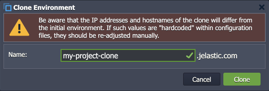

# Virtuozzo Application Platform 7.1

*This document is preliminary and subject to change.*

In this document, you will find all of the new features, enhancements and visible changes included to the **PaaS 7.1** release.

{}
{}
## Send Message API with IP Authorization
Added two new API methods that can send email notification to container owner using IP authorization (without user session)
{}
{}

{}
{}
## Info for Environment Clone Dialog
Added notification to the *Clone Environment* dialog that manual adjustment may be needed due to IP addresses and hostnames changes
{}

{}
## API Changes
Listed all the changes to the public platform API in the current release
{}

{}
## Software Stack Versions
Actualized list of supported OS templates and software stack versions
{}
{}

{}
{}
## Fixes Compatible with Prior Versions
Bug fixes implemented in the current release and integrated into the previous platform versions through the appropriate patches
{}

{}
## Bug Fixes
List of fixes applied to the platform starting from the current release
{}
{}

## Send Message API with IP Authorization

In the current 7.1 PaaS release, two new API methods were implemented for sending email notifications from the container to its owner. These methods provide automatic authentication based on the container IP address so that user session (password and login) is not required. Such implementation significantly simplifies notification of the container owner based on the events inside the node, which allows automating various scenarios that previously were difficult in realization.

Both new methods are part of the **environment > node** service:
- ***SendEvent*** - sends a predefined event using IP authorization 
  - **eventName** - the name of the required event; currently, the following values are supported:
    - *SEND\_NOTIFICATION* - sends an email notification to the node owner
    - *OOM\_KILLER* - sends a message after *OOM Killer* invocation
    - *CUSTOM\_NODE\_EVENT* - a user-defined custom event
  - **params** - JSON object with parameters for Cloud Scripting
- ***SendNotification*** - sends an email notification to the node owner using IP authorization
  - **name** - title of the message
  - **message** - body of the message

The platform already utilizes these new methods to provide proper notification about changes in containers - for example, automatic notifications due to [smart recovery after the OOM error](/auto-configuration/). Developers can benefit from the implementation by extending their custom packages with automatic notification of the container owner based on some specific condition.

[More info](https://www.virtuozzo.com/application-platform-api-docs/)

{}[Back to the top](#back){}

## Info for Environment Clone Dialog

The **[Clone Environment](/clone-environment/)** is a powerful platform feature that allows you to create an identical copy of the existing environment. For example, it can be helpful during development to create a separate instance of the project where tuning and adjustments can be safely tested without affecting existing customers. However, when utilizing the feature, users should be aware that the IP addresses and hostnames of the clone will differ from the initial environment (i.e. manual re-adjustment of these values may be required). To ensure better awareness of the fact, such information was added to the ***Clone Environment*** dialog.

[More info](/clone-environment/)

{}[Back to the top](#back){}

## API Changes

Below, you can find a list of all changes to the public API in the 7.1 platform version (compared to the preceding [7.0](/release-notes-70/#api-changes) ones).

Two new API methods were added to the **environment > node** service, implementing a simplified flow to [notify the container owner](#send-message-api-with-ip-authorization) (using IP authorization instead of user session):

- ***SendEvent*** - sends a predefined notification based on the specific event inside a container
- ***SendNotification*** - sends a custom email notification to the node owner

[More info](https://www.virtuozzo.com/application-platform-api-docs/)

{}[Back to the top](#back){}

## Fixes Compatible with Prior Versions

Below, you can find the fixes that were implemented in the PaaS 7.1 release and also integrated into previous platform versions by means of the appropriate patches.

{}
**#**|**Compatible from**|**Description**
---|:---:|---
JE-46279|any|An error occurs when installing the *Minio Cluster* package from the Marketplace
JE-57935|any|Errors and warnings during the *LiteSpeed* and *LLSMP* stacks restart are displayed incorrectly
JE-58694|any|When using the prepackaged *Jitsi* application, all users are disconnected upon any user being kicked or if the moderator leaves
JE-58696|any|When using the prepackaged *Jitsi* application, audio and video are not working in conferences with multiple users
JE-61742|any|An error occurs when installing the *IOTA Nodes* application
JE-59897|3.3|An error occurs when installing the *Liferay* prepackaged application from the Marketplace
JE-60685|3.3|The prepackaged *Odoo* application is down after the application server restart
JE-61879|3.3|An error occurs when installing the *BitNinja* add-on on the *LEMP* stack
JE-61887|3.3|Credentials are displayed in one line in the success pop-up for the *IOTA Nodes* application
JE-61951|3.3|The *BitNinja* add-on is not supported on some templates
JE-60272|5.0|An error occurs when installing the *JMeter* JPS package 
JE-61334|5.0|Incorrect credentials are sent via email for the *OpenVPN* application from the Marketplace
JE-46294|5.0.5|The *Elytron* subsystem is unavailable on the *WildFly* nodes after creation
JE-47222|5.0.5|The *HTTP/2* is not supported on some versions of the *Apache PHP* application servers
JE-48295|5.0.5|The */var/lib/jelastic/backup* directory is missing on the *MongoDB* database containers
JE-49577|5.0.5|The *yum install* command is not working on the *MongoDB* database containers
JE-49762|5.0.5|Errors in logs after restarting the *MongoDB* database containers
JE-50064|5.0.5|The *Let's Encrypt* add-on installation breaks symlinks in the *Python* application servers
JE-50130|5.0.5|The *Node.js* restart hangs if called during the add project operation
JE-50413|5.0.5|Incorrect response for the *jem service start/stop/restart/reload* commands on the VPS nodes
JE-50463|5.0.5|Incorrect template version in the *metainf.conf* file for the *NGINX PHP* servers
JE-50472|5.0.5|Incorrect path for the *backup* shortcut on the *MongoDB* nodes
JE-50633|5.0.5|Empty template version in the *metainf.conf* file for the *Percona* servers
JE-50709|5.0.5|The *JavaEngine* server based on *OpenJDK 14* is down after deploying an application
JE-50890|5.0.5|Warnings about the deprecated *ssl* directive are present in the *NGINX* load balancer logs
JE-50935|5.0.5|Incorrect access permissions to the */var/log/redis/redis.log* file on the PHP-based application servers
JE-52064|5.0.5|Incorrect regex for deleting upstreams from load balances
JE-52160|5.0.5|*GlusterFS cluster* is not operable after downgrading (redeploying to a lower version)
JE-53278|5.0.5|*Jetty* servers are not accessible after installing the *Let's Encrypt* add-on
JE-55725|5.0.5|Incorrect permissions for the */usr/java* directory on the *JavaEngine* stack with the *Dragonwell JDK*
JE-56570|5.0.5|Invalid *mbstring* module configuration options in the *php.ini* file
JE-56705|5.0.5|Incorrect error message for the unsuccessful *Storage* node restart
JE-56927|5.0.5|An error occurs when installing the *GitLab* package from the Marketplace
JE-57013|5.0.5|The */var/log/haproxy/haproxy.log* file is not rotated via logrotate on the *HAProxy* stack
JE-57468|5.0.5|An error occurs when disabling SSL on the *Varnish* stack 
JE-57764|5.0.5|An error occurs when adding new nodes to the *MySQL* cluster
JE-57994|5.0.5|The *Ruby* application is down if installing *Let's Encrypt* after removing the *FTP* add-on
JE-58326|5.0.5|An error occurs when deploying an application on the *GlassFish* stack 
JE-58733|5.0.5|The *btmp* and *wtmp* files are not rotated via logrotate on the *CentOS VPS* stack
JE-59396|5.0.5|Incorrect repository details on the *NGINX PHP* stacks
JE-59914|5.0.5|The "*cannot change locale*" error occurs when connecting to the node via the SSH gate
JE-60016|5.0.5|Custom SSL is unavailable on the *Varnish* nodes after redeploy
JE-60446|5.0.5|Password information is missing in the email for the cloned *PostgreSQL Cluster* environment
JE-60662|5.0.5|Incorrect permissions for the */etc/logrotate.d/nginx* file on the *NGINX* load balancer stack
JE-61807|5.0.5|An error occurs when deploying an application to the *Apache Ruby* stack
JE-52987|5.3.2|Some instances of the *WildFly auto-cluster* clone are broken
JE-52990|5.3.2|Removed worker instances are displayed in the *WildFly DAS* node
JE-53722|5.3.2|Auto-clustering is not properly removed when deleting all *WildFly* nodes from the topology
JE-54454|5.3.2|An error occurs when undeploying application from *WildFly Cluster* after removing the public IP address
JE-55418|5.3.2|The *WildFly* application is down when enabling auto-clustering after redeployment from the old version to the one with the feature support.
JE-57872|5.3.2|An error occurs when restarting *WildFly* nodes after adjusting the *STANDALONE_MODE_CONFIG* variable
JE-60691|5.3.2|An error occurs when installing the *WildFly Cluster* prepackaged solution from the Marketplace
JE-61605|5.3.2|An error occurs when deploying an application to the *WildFly* stack with *JDK 17*
JE-61959|5.4|An error occurs when installing the *MySQL Cluster* package from the Marketplace
JE-51972|5.5|*Payara Cluster* servers are down after restarting the environment
JE-52337|5.7|An error occurs when cloning an environment with the *WildFly auto-cluster*
JE-53610|5.7|An error occurs if removing worker nodes while logged into the *WildFly DAS* admin panel
JE-53691|5.7|After environment migration, instances are displayed as stopped or broken in the *WildFly DAS* admin panel
JE-54530|5.7|The maximum number of environments on the account should be verified when installing the *Magento Standalone* package
JE-50427|5.7.2|The *404 Not Found* error is displayed for the *LLSMP* applications deployed to the non-root context
JE-50842|5.7.2|Warnings in the *phpMyAdmin* panel for the *LLSMP* stack
JE-50924|5.7.2|Errors in the admin panel after the *LiteSpeed/LLSMP* node creation
JE-51141|5.7.2|The *phpMyAdmin* folder is not available via FTP on the *LEMP/LLSMP* nodes
JE-57337|5.7.2|The firewall is not working on the *LiteSpeed ADC* stack
JE-55672|5.7.4|The *GlusterFS Replication* add-on should not be removable after configuring *GlusterFS Cluster*
JE-57739|5.7.4|*LiteSpeed ADC* admin panel is not available via *IPv6*
JE-58575|5.7.4|The *force_kill* function works incorrectly on the *LiteSpeed ADC* stack
JE-62173|5.7.4|An error occurs when installing the *TimeZone* add-on on the *Ubuntu* and *Debian VPS* stacks
JE-52065|5.8|Two controller nodes are added to the *Extra* layer when creating *WildFly auto-cluster* via the topology wizard 
JE-52988|5.8|The dashboard should display a button to access the *WildFly DAS* admin panel on the layer level (not for a separate node)
JE-54090|5.8|An error occurs when creating the *WildFly auto-cluster*
JE-56167|5.8|An error occurs when installing the *Jenkins* instance via the topology wizard
JE-61169|5.8|Unclear UI for the *Elastic Beats* add-on installation frame
JE-61170|5.8|Errors in CS logs after the *Elastic Beats* add-on installation
JE-61177|5.8|Incorrect permissions for the */etc/heartbeat* folder after the *Elastic Beats* add-on installation
JE-61846|5.8|After the *Elastic Beats* add-on deletion, the */etc/heartbeat* folder is not entirely removed
JE-61641|7.0|An error occurs when installing the *CDN* add-on
JE-61765|7.0|If installed by a collaborator, the *Open Liberty* application is created without the *Storage* node
{}

{}[Back to the top](#back){}

## Software Stack Versions

The software stack provisioning process is independent of the platform release, which allows new software solutions to be delivered as soon as they are ready. However, due to the necessity to adapt and test new stack versions, there is a small delay between software release by its respective upstream maintainer and integration into the platform.

The most accurate and up-to-date list of the certified [software stack versions](/software-stacks-versions/) can be found on the dedicated documentation page.

[More info](/software-stacks-versions/)

{}[Back to the top](#back){}

## Bug Fixes

In the table below, you can see the list of bug fixes applied to the platform starting from PaaS 7.1.1 and 7.1.2 releases:

{}
**#**|**Affected Versions**|**Description**
---|:---:|---
JE-43124|5.5|The disk IOPS value is not calculated on the containers
JE-45740|-|The sendmail application is not available in containers
JE-50964|5.8|The redeploy operation should check for enough disk space inside the container
JE-51106|5.8|Exports records and iptables rules are not removed when unmounting a folder with the "*+*" symbol in the path
JE-52664|-|The site cannot be reached after the *FTP* add-on installation on the *GlassFish/Payara* containers
JE-55234|5.9.4|An error occurs when redeploying the *Ubuntu VPS 10.04* container 
JE-59950|-|An incorrect launcher is used for entrypoint commands in custom containers
JE-60719|6.3|An error occurs when transferring an environment to a user outside of the collaboration
JE-60795|7.0|An error occurs when transferring an environment to a user in a "*pending acceptance*" collaboration status
JE-61892|-|Invalid *pgrep* option error occurs when creating containers
JE-61942|-|An unhandled error occurs when deploying a damaged archive to the PHP environment
JE-62156|7.0|Incorrect wizard behavior when adding a template that does not correspond with the selected layer
{}

{}
**#**|**Affected Versions**|**Description**
---|:---:|---
JE-62378|7.0|The "*`*" character is not properly escaped when defined in the container variables
JE-62393|-|Permissions issue when installing JPS to the owner account as a collaboration member
{}

{}[Back to the top](#back){}