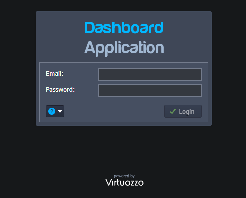
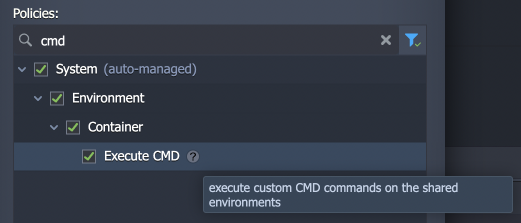
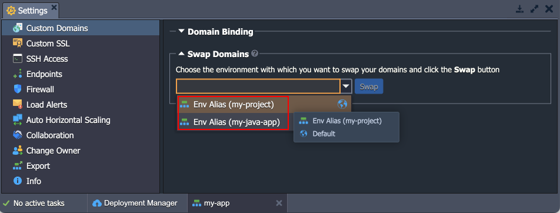

# Virtuozzo Application Platform 7.2

*This document is preliminary and subject to change.*

In this document, you will find all of the new features, enhancements and visible changes included to the **Virtuozzo PaaS 7.2** release.

{}
{}
## Platform Rebranding
Updated the PaaS name (formerly known as Jelastic) to Virtuozzo Application Platform
{}

{}
## CentOS Stream 8 OS Support
Added support for the *CentOS Stream 8* OS template
{}
{}

{}
{}
## Collaboration Policy for Custom Commands
Added a new *Execute CMD* policy to run custom CMD commands on the shared environments
{}

{}
## Environment Selection Field Adjustment
Improved options denomination for the environment selection combo-boxes in the dashboard to provide better clarity
{}

{}
## Software Stack Versions
Actualized list of supported OS templates and software stack versions
{}
{}

{}
{}
## Fixes Compatible with Prior Versions
Bug fixes implemented in the current release and integrated into the previous platform versions through the appropriate patches
{}

{}
## Bug Fixes
List of fixes applied to the platform starting from the current release
{}
{}

## Platform Rebranding

Continuing the smooth integration of the PaaS (formerly known as Jelastic) with the Virtuozzo family, the platform name was changed to **Vitruozzo Application Platform**. The appropriate changes are integrated into the platform dashboard default images, labeling, documentation references, Hello World application, etc.

{}[Back to the top](#back){}

## Collaboration Policy for Custom Commands

In order to extend the capabilities of the [account collaboration](/account-collaboration/) feature even further and ensure the possibility of providing full access to the shared account, a new **Execute CMD** policy was added. If included in the collaboration role, it allows members to execute custom CMD commands on the shared environments. This permission may be required when installing some complex JPS solutions.

{}[Back to the top](#back){}

## Environment Selection Field Adjustment

In the current Virtuozzo Application Platform 7.2 release, the dashboard’s combo-boxes for environment selection were improved. For now, the displayed items provide better clarity by showing both the [custom alias](/environment-aliases/) (if specified) and the environment name. Such implementation uniquely identifies the provided options and helps avoid possible confusion when several environments have similar aliases.

{}[Back to the top](#back){}

## CentOS Stream 8 OS Support

Virtuozzo Application Platform supports the most popular [operating system templates](/container-image-requirements/), which allows using multiple different solutions from Docker Hub as [custom containers](/container-types/#custom-docker-containers). Due to the recent CentOS Linux 8 end of life, the recommended alternative template was added to the platform – **CentOS Stream 8**. You can find a [comparison of these two versions](https://centos.org/cl-vs-cs/) in the official documentation.

{}**Note:** Do not confuse OS templates (base image for containers) support with container templates ([stacks](/software-stacks-versions/)).{}

[More info](/container-image-requirements/)

{}[Back to the top](#back){}

## Fixes Compatible with Prior Versions

Below, you can find the fixes that were implemented in the Virtuozzo Application Platform 7.2 release and also integrated into previous platform versions by means of the appropriate patches.

{}
**#**|**Compatible from**|**Description**
---|:---:|---
JE-51420|any|The project is not updated by the *Git-Push-Deploy* add-on if the VCS *auto-deploy* option is disabled
JE-59566|any|An error occurs when installing the *IOTA Node* application from the Marketplace
JE-62033|any|The *File Synchronization* add-on does not support *LiteSpeed* and *LLSMP* stacks
JE-58866|3.3|Redundant information in the error message if the *Let’s Encrypt* add-on installation fails
JE-62184|3.3|The *WAF* module for the *BitNinja* add-on does not work on the nodes without public IP
JE-62385|3.3|An error occurs when installing both *BitNinja* and *Let’s Encrypt* add-ons
JE-60123|5.0.5|Errors in the *opensearch-cluster.log* file after the *OpenSearch Cluster* package installation
JE-61060|5.0.5|An error occurs when connecting from the *Apache Python* application server to the *PostgreSQL* database
JE-61650|5.0.5|Problems with installation of some RPM packages on the old *MariaDB* versions
JE-62374|5.0.5|An error occurs when restarting *Tomcat*, *TomEE*, *WildFly*, and *Apache Python* nodes
JE-62560|5.0.5|Nodes added via the horizontal scaling are not included in the *MinIO Cluster*
JE-47553|5.3|An error occurs when establishing a connection from the *WildFly* admin panel to the database
JE-60286|5.4|The *sendmail* process is not started within the *Debian VPS* container
JE-59471|5.7|Database credentials are missing in the email when cloning an environment with the *MySQL/MariaDB auto-cluster*
JE-59918|5.7|Data mounts are absent on the new *WordPress Cluster* nodes after horizontal scaling
JE-60860|5.7|The *gd* library is missing for the *WordPress* packages based on the *LiteSpeed* application server
JE-58719|5.7.4|An error occurs when changing the permalinks option for the *WordPress Cluster* on the *LiteSpeed* server with *WAF* enabled
JE-61925|5.7.4|After the *GlusterFS cluster* redeployment, nodes added via horizontal scaling are not included in the cluster
{}

{}[Back to the top](#back){}

## Software Stack Versions

The software stack provisioning process is independent of the platform release, which allows new software solutions to be delivered as soon as they are ready. However, due to the necessity to adapt and test new stack versions, there is a small delay between software release by its respective upstream maintainer and integration into Virtuozzo Application Platform.

The most accurate and up-to-date list of the certified [software stack versions](/software-stacks-versions/) can be found on the dedicated documentation page.

[More info](/software-stacks-versions/)

{}[Back to the top](#back){}

## Bug Fixes

In the table below, you can see the list of bug fixes applied to the platform starting from Virtuozzo Application Platform 7.2 release:

{}
**#**|**Affected Versions**|**Description**
---|:---:|---
JE-55128|-|Environment transferring requests to yourself is not validated when executed via API
JE-55797|-|An error occurs when installing required packages for the custom Docker containers
JE-56611|6.0|Active shares should be unmounted after *autofs* timeout
JE-59371|6.1|*FTP* add-on does not work in the cloned environments
JE-61758|-|A warning notification is shown when starting the *openrc-jelinit* service on the *alpine-based* containers
JE-61760|-|An error occurs when installing *alpine-based* custom Docker containers
JE-62128|6.0.6|An error occurs when redeploying containers with modified configs
JE-62343|7.0.2|An error occurs when removing a custom container from the topology via the dashboard
JE-62364|-|The file manager tab in the dashboard does not automatically become operable after the layer restart operation is finished
JE-62457|7.0.2|A collaboration member with full rights cannot download from the shared environment via the dashboard’s file manager
JE-62608|-|An error occurs when starting the *openrc-jelinit* service on the *alpine-based* containers
JE-62610|7.0.2|An error occurs when exporting billing history from the dashboard
JE-62615|-|Incorrect escaping for the "*!*" symbol in the environment variable value provided via the dashboard
JE-62617|-|An error occurs when trying to install an add-on from the Marketplace on the account without any environments
JE-62636|-|Duplicated records in the configuration file after container redeployment failure
JE-62650|7.0|Default placeholders are not replaced in the collaboration emails
JE-62664|-|If billing history is downloaded for the specific environment and not the whole account, the filename should contain the appropriate environment name
JE-62726|7.1.2|An error occurs when loading variables or redeploying a container if the first variable in the configs is empty
JE-62729|-|An error occurs after the *Spring Boot Thin Jar Builder* package installation
JE-62804|-|An error occurs when a collaboration member with the '*Cost Estimation / Billing History*' policy tries to download billing history for the shared environment
{}

{}[Back to the top](#back){}