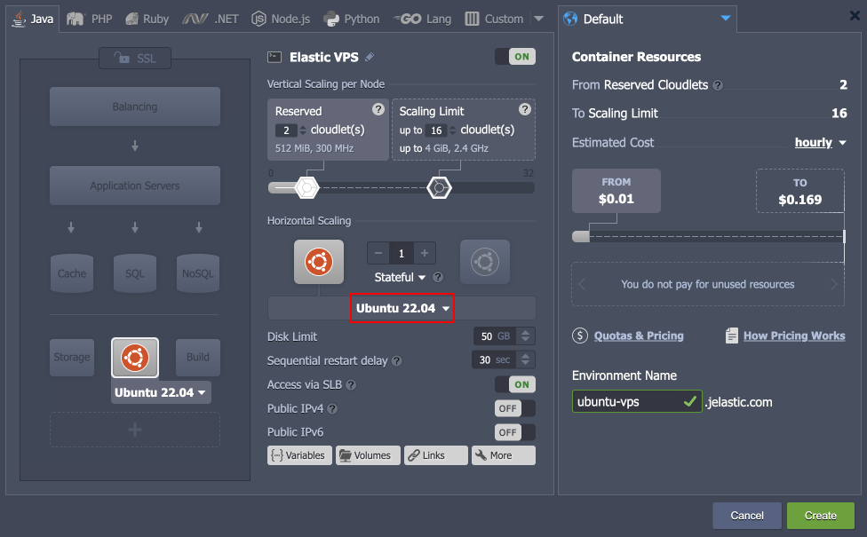

# Virtuozzo Application Platform 7.3

*This document is preliminary and subject to change.*

In this document, you will find all of the new features, enhancements and visible changes included to the **Virtuozzo PaaS 7.3** release.

{}
{}
## Dashboard Performance Optimization
Significantly improved the performance of the user dashboard when working on accounts with a lot of environments
{}

{}
## Ubuntu 22 Support
Added *Ubuntu 22.04* OS template support and integrated the *Ubuntu 22.04* VPS stack
{}

{}
## API to Move Public IPs
Implemented a new *MoveExtIP* API method that can move external IP addresses between containers and can operate with multiple IPs
{}
{}

{}
{}
## Platform Optimizations
Improved the performance, security, and usability of the platform
{}

{}
## Show Logs Button in Dashboard Notifications
Improved options denomination for the environment selection combo-boxes in the dashboard to provide better clarity
{}

{}
## API Changes
Listed all the changes to the public platform API in the current release
{}

{}
## Software Stack Versions
Actualized list of supported OS templates and software stack versions
{}
{}

{}
{}
## Fixes Compatible with Prior Versions
Bug fixes implemented in the current release and integrated into the previous platform versions through the appropriate patches
{}

{}
## Bug Fixes
List of fixes applied to the platform starting from the current release
{}
{}

## Dashboard Performance Optimization

One of the major benefits the platform is renowned for is a versatile and robust user interface ([dashboard](/dashboard-guide/)). It provides users with all the necessary tools to track and manage all hosted resources. However, when working with a large number of environments on the account (over 100), the drop in the dashboard's performance can be noted. In order to resolve the issue and improve customers' experience, several internal optimizations were applied in the 7.3 platform release to boost the operation speed when working with a lot of environments.

Among the applied changes, the most notable are:

- significantly improved the dashboard initialization time
- optimized operability in the *Firefox* browser
- optimized floating menu, search, and environment list components

{}[Back to the top](#back){}

## Platform Optimizations

Below you can find a number of optimizations implemented in the current 7.3 release to boost performance and enhance the user experience when working with the platform:

- Optimized SSL certificate requests to prevent a vast number of queries to the platform database. It results in a faster response of the hosted services in case of multiple simultaneous requests.
- Improved the security of some platform cookies with the additional "*HttpOnly*" and "*Secure*" flags.
- Changed the error code for the "*limit_conn*" problem from ***503*** to ***429***. The new code better corresponds to the generally accepted rule of code interpreting (i.e. *4xx* - client error; *5xx* - server error).

{}[Back to the top](#back){}

## Ubuntu 22 Support

The platform introduces support of the latest Long Term Support release for one of the world’s most popular Linux distributions - ***Ubuntu 22.04*** LTS (Jammy Jellyfish). The update integrates the base [operating system template](/container-image-requirements/) (for custom Docker containers) and adds the *Ubuntu 22.04* VPS stack. Moreover, the distribution support is automatically available for all platform versions since the 6.0.2 release via the appropriate patches.

[More info](/container-image-requirements/)

{}[Back to the top](#back){}

## Show Logs Button in Dashboard Notifications

In the current 7.3 platform release, the ability to display the **Show Logs** button within the '*warning*' and '*error*' [dashboard notification](https://docs.cloudscripting.com/creating-manifest/handling-custom-responses/) was implemented. Previously, such functionality was available for the '*info*' notifications only. The implementation allows custom package developers to handle errors more naturally. Namely, the log file may contain additional information on the occurred issue and even some suggested resolution steps.

{}[Back to the top](#back){}

## API to Move Public IPs

The new ***MoveExtIP*** API method allows moving external IP addresses from the source node to the target node. It complements the existing ***[SwapExtIps](/cli-ip-swap/)*** API, making the management of existing public IPs more flexible. Additionally, the new method supports nodes with multiple IPs and can manage them in a single API call.

The following parameters should be specified for the ***MoveExtIP*** method:

- **envName** - source environment name
- **session** - user session or personal access token
- **sourceNodeId** - source node ID (from the source environment)
- **targetNodeId** - target node ID
- **ips** - a comma- or semicolon-separated list of IP addresses that should be transferred (use "*\**" to move all the source node external IP addresses)

{}The UI implementation of moving public IPs will be provided in future releases.{}

[More info](https://www.virtuozzo.com/application-platform-api-docs/)

{}[Back to the top](#back){}

## API Changes

Below, you can find a list of all changes to the public API in the 7.3 platform version (compared to the preceding [7.1](/release-notes-71/#api-changes) ones):

- Implemented a new ***MoveExtIP*** API method (the **binder** service) that can [move external IP addresses](#api-to-move-public-ips) between containers and can operate with multiple IPs
- Added a new ***GetBasicEnvsInfo*** API method (the **control** service) to improve the [dashboard loading speed](#platform-optimizations)

[More info](https://www.virtuozzo.com/application-platform-api-docs/)

{}[Back to the top](#back){}

## Fixes Compatible with Prior Versions

Below, you can find the fixes that were implemented in the Virtuozzo Application Platform 7.3 release and also integrated into previous platform versions by means of the appropriate patches.

{}
**#**|**Compatible from**|**Description**
---|:---:|---
JE-60375|any|An invalid SSL certificate is issued when installing the *Docker Swarm* application with the *Portainer* option enabled
JE-62024|any|The *file-sync* add-on does not work with the *LLSMP* stack
JE-62554|any|*WildFly Cluster* nodes are not displayed in the admin panel of the controller node
JE-62881|any|An error occurs when installing *OpenSearch* for the *Magento* or *Magento Cluster* application
JE-63203|any|An error occurs when installing the *Magento* or *Magento Cluster* application from the Marketplace
JE-63204|any|An error occurs when installing the *IOTA* application from the Marketplace
JE-57124|3.3|The *Eclipse Vert.x Thin Jar Builder* application does not work after installation from the Marketplace
JE-60130|3.3|The *Rocket.Chat* application does not work after restarting the environment
JE-60291|3.3|The *PrestaShop* application does not work with the platform’s *Built-In SSL* feature
JE-60583|3.3|An error occurs when installing the *Eclipse Che* package from the Marketplace
JE-61972|3.3|An error occurs when installing the *Let’s Encrypt* add-on with a domain that has a redirect
JE-62363|3.3|Cron tasks on all nodes of the layer should be cleaned up upon the *Let’s Encrypt* add-on removal
JE-62499|3.3|*Let’s Encrypt* certificate update operation cannot be performed by the collaboration member
JE-63271|3.3|An error occurs when installing the *Drupal* application from the Marketplace
JE-62684|5.3|The *Open Liberty* application does not work in the *Kubernetes Cluster*
JE-60417|5.7|The *Galera Cluster* application does not work after restarting the environment
JE-59951|5.9.2|An error occurs when installing the *Jira* package from the Marketplace
{}

{}[Back to the top](#back){}

## Software Stack Versions

The software stack provisioning process is independent of the platform release, which allows new software solutions to be delivered as soon as they are ready. However, due to the necessity to adapt and test new stack versions, there is a small delay between software release by its respective upstream maintainer and integration into Virtuozzo Application Platform.

The most accurate and up-to-date list of the certified [software stack versions](/software-stacks-versions/) can be found on the dedicated documentation page.

[More info](/software-stacks-versions/)

{}[Back to the top](#back){}

## Bug Fixes

In the table below, you can see the list of bug fixes applied to the platform starting from Virtuozzo Application Platform 7.3 release:

{}
**#**|**Affected Versions**|**Description**
---|:---:|---
JE-33215|5.2|An error occurs when backing up the containers during the dashboard operation
JE-40710|5.2|Incorrect permissions for some authentication configuration files in containers
JE-50464|5.7.8|Directory mounts are missing after container redeployment to the *alpine-based* image
JE-51538|-|Slow response of the *GetEnvs* API method for environments with many external domains
JE-62454|7.0|Incorrect escaping for special characters in the environment variables
JE-62724|-|Password authentication should be disabled when connecting over SSH
JE-62906|-|The *autofs* service start is delayed after the container restart
JE-62934|-|An error occurs when creating nodes based on the *httpd:2.4-alpine* image
JE-62943|-|An error occurs if the manually created firewall set has the same name as any of the system ones
JE-62946|-|Insufficient permissions to attach/detach add-ons are provided via the *Containers > Add-Ons* collaboration policy
JE-62983|-|Insufficient permissions to swap IPs are provided via the *Environment > Managing > Edit Environment* collaboration policy
JE-62985|-|The platform CLI is not supported on the *Java 8* engine
JE-63031|-|Mandatory *appid* parameters are marked as optional in the API documentation
JE-63049|-|Unhandled error for the *getTemplates* API when an unknown type is specified in parameters
JE-63094|-|The *NullPointerException* error occurs when executing some API methods
JE-63487|-|The *GetStat* and *GetSumStat* API methods return excessive data
JE-63538|-|Incorrect escaping in the names of the collaboration environment groups
JE-63540|-|The list of collaboration members is not sorted
JE-63586|-|Incorrect dashboard fonts when working on the *Linux* OS
{}

{}[Back to the top](#back){}