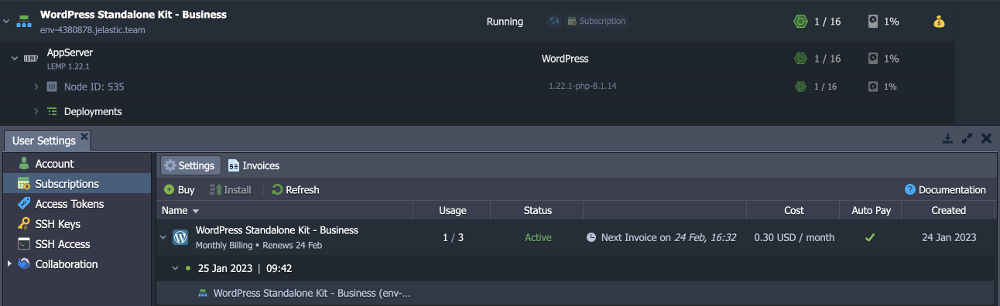

# Virtuozzo Application Platform 8.2.2

*This document is preliminary and subject to change.*

In this document, you will find all of the new features, enhancements and visible changes included to the **Virtuozzo PaaS 8.2.2** release.

{}
{}
## Subscription Based Solutions
Implemented a native support of the subscription-based solutions with a fixed pricing
{}
{}

{}
{}
## Refilling with 3DS Cards
Provided a notification that additional steps are required to complete an invoice if the selected payment method uses 3DS
{}

{}
## API Changes
Listed all the changes to the public platform API in the current release
{}

{}
## Software Stack Versions
Actualized list of supported OS templates and software stack versions
{}
{}

{}
{}
## Fixes Compatible with Prior Versions
Bug fixes implemented in the current release and integrated into the previous platform versions through the appropriate patches
{}

{}
## Bug Fixes
List of fixes applied to the platform starting from the current release
{}
{}

## Subscription Based Solutions

The 8.2.2 version of the platform implements a native ability to offer products based on the subscription model. The flow is standard to the modern subscription services implementations – a one-time fee to get a designated product for a specified period. The solution gives you a fix-priced alternative to the default [usage-based model](/pricing-model/).

{}**Note:** This feature availability depends on the particular hosting provider’s settings.{}

All the available subscriptions are available at the Marketplace under a new ***Subscription Plans*** section. Upon selecting, you’ll see several plans to choose from (e.g. offering a different quantity of resources, additional features, etc.). Click the **Buy** button for the preferred option to see the purchase dialog. You can pay monthly or annually, enable auto pay with your default payment method, and set the required number of product instances in your subscription.

All the **Subscriptions** are added to the dedicated section in the account settings. Here, you can see all the relevant information on the subscriptions (including invoices), install/remove instances, and terminate the subscription.

Due to the concept of subscriptions, some actions are restricted for the installed instances (e.g. topology adjustment or environment cloning). Read more about subscriptions in the dedicated **[Subscription-Based Product](/subscription-products/)** document.

[More info](/subscription-products/)

{}[Back to the top](#back){}

## Refilling with 3DS Cards

**3D Secure (3DS)** protocol adds an extra layer of payment authentication for additional fraud protection during an online transaction. If used, the cardholder is asked to provide proof of identity by entering a unique password, an SMS code, or a temporary PIN. 3DS can be mandatory in some regions (e.g. Europe due to the *Strong Customer Authentication* regulation) and optional in others (but still can be used to reduce fraud).

When refilling the account balance using the saved payment method with the 3DS, the platform will provide an explicit notification that the invoice was created, but the transaction should be completed through additional external authentication.

{}[Back to the top](#back){}

## API Changes

Below, you can find a list of all changes to the public API in the 8.2.2 platform version (compared to the preceding [8.0.2](/release-notes-802/#api-changes) ones):

- Added a new **[Billing > Subscriptions](https://docs.jelastic.com/api/#!/api/billing.Subscription)** service with API methods to support the [subscriptions](#subscription-based-solutions) feature

[More info](https://www.virtuozzo.com/application-platform-api-docs/)

{}[Back to the top](#back){}

## Fixes Compatible with Prior Versions

Below, you can find the fixes that were implemented in the Virtuozzo Application Platform 8.2.2 release and also integrated into previous platform versions by means of the appropriate patches.

{}
**#**|**Compatible from**|**Description**
---|:---:|---
JE-64745|any|An error occurs when installing the *Spring Boot Fat Jar Builder* application package from the platform Marketplace
JE-64955|any|An error occurs when installing some *WordPress plugins* on the *LiteSpeed* and *LLSMP* servers
JE-65165|any|The “*ERR_TOO_MANY_REDIRECTS*” error occurs when accessing the admin panel for the *WordPress Cluster* based on the *NGINX* server
JE-64833|3.3|An error occurs when installing the *osTicket* application package based on *PHP 8.2* from the platform Marketplace
JE-52335|3.3|An error occurs when deploying a stack on *Docker Swarm* from the YAML file that is not in the root directory
JE-58868|3.3|All the “*incorrect domain*” errors for the *Let’s Encrypt* add-on should have the error coded
JE-60560|3.3|Missing description for the *Let’s Encrypt* error related to network issues
JE-64794|3.3|An error occurs when installing *Eclipse Che* from the ‘*release candidate*’ image version
JE-65224|3.3|An error occurs when accessing the *Jitsi* application after installation from the platform Marketplace
JE-65452|3.3|An error occurs when installing the *Eclipse Che 7.0.0-RC-1.1* application version from the platform Marketplace
JE-65545|3.3|An error occurs when accessing the *IOTA* application after installation from the platform Marketplace
JE-49507|5.0.5|The *httpd* service fails on the *Apache* nodes if the *pid* file is missing during the container’s start/stop/restart
JE-59151|5.0.5|Cloned *LiteSpeed ADC* balancer has backends from the original environment listed in the configs
JE-60325|5.0.5|The *workerProcesses* value is not updated in the *lslbd_config.xml* file if changed via the add-on
JE-64529|5.0.5|Access to the */home/jelastic* home folder is not granted after the *FTP* add-on installation on the *Spring Boot* server
JE-65397|5.4|The *Varnish* load balancer node is not started after the redeployment
JE-60553|5.7|An error occurs when installing *Multi-Regional WordPress Cluster*
JE-61492|5.7.2|The *self-signed SSL* certificate is not generated after the *LiteSpeed ADC* balancer creation
JE-59090|5.7.4|The *lsrestart.log* file has an incorrect owner on the *LiteSpeed* and *LLSMP* servers
JE-59478|5.7.4|Incorrect values in the */etc/jelastic/metainf.conf* file on the *LLSMP* server
JE-59515|5.7.4|The *skip-networking* option is missing when resetting the *MariaDB* password on the *LEMP/LLSMP* servers
JE-60211|5.7.4|The license key registration attempts should be enumerated in *LiteSpeed WS* and *ADC* server logs
JE-60629|5.7.4|An error occurs when reloading the *LLSMP* server with the ‘*jem service reload*’ command
JE-65020|5.8|An error occurs when restoring from the *WordPress* backup after the backup storage node is changed
JE-65589|5.8|An error occurs when accessing the *Jenkins* application after redeployment from the version based on *Java 11* to *Java 17*
{}

{}[Back to the top](#back){}

## Software Stack Versions

The software stack provisioning process is independent of the platform release, which allows new software solutions to be delivered as soon as they are ready. However, due to the necessity to adapt and test new stack versions, there is a small delay between software release by its respective upstream maintainer and integration into Virtuozzo Application Platform.

The most accurate and up-to-date list of the certified [software stack versions](/software-stacks-versions/) can be found on the dedicated documentation page.

[More info](/software-stacks-versions/)

{}[Back to the top](#back){}

## Bug Fixes

In the table below, you can see the list of bug fixes applied to the platform starting from Virtuozzo Application Platform 8.2.2 release:

{}
**#**|**Affected Versions**|**Description**
---|:---:|---
JE-65170|8.2|An error occurs when mounting files from some custom Docker containers
JE-65227|-|Errors are logged during projects auto-deploy on containers with enabled *sendmail* functionality
JE-65272|-|An error occurs when executing some commands that include a file download operation
JE-65325|-|Custom Docker containers cannot be created from images that use the *OCI* manifest schema
JE-65414|-|A scroll slider appears in the environment configuration settings panel even if there is enough space to fit the content
JE-65499|-|The shared files owner is changed to *root* when resetting a password for the *FTP* add-on on the *Shared Storage* node
JE-65625|7.2|The *URL_DOCS_OOM_KILLER_TROUBLESHOOTING* placeholder is not replaced with a link in emails
{}

{}[Back to the top](#back){}