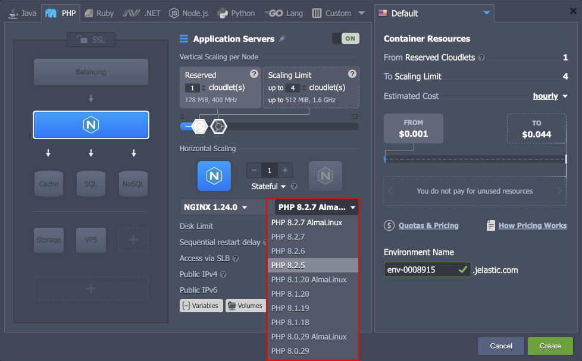
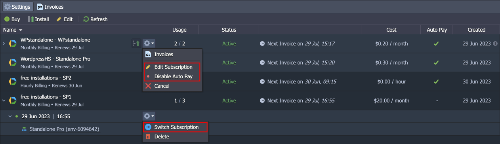
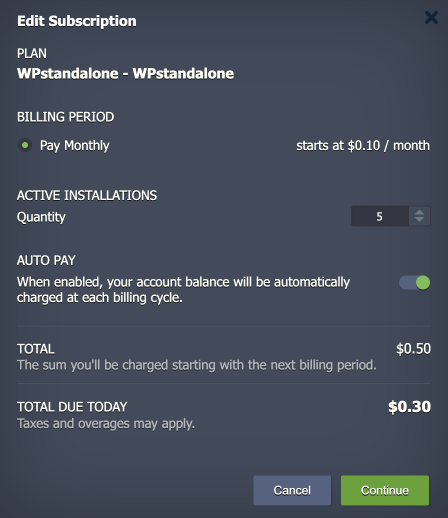
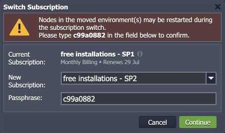
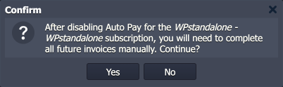

# Virtuozzo Application Platform 8.3

*This document is preliminary and subject to change.*

In this document, you will find all of the new features, enhancements and visible changes included to the **Virtuozzo PaaS 8.3** release.

{}
{}
## AlmaLinux 9 Base OS Image
Started a gradual process of transitioning certified software stacks to the *AlmaLinux 9* based images
{}

{}
## Subscription Improvements
Implemented new features for the subscription solution, including subscription update, migration, and disabling/enabling the *Auto Pay* option
{}
{}

{}
{}
## Action Initiator for Emails
Extended the collaboration email notifications with the “*action initiator*” data to help with account activity tracking
{}

{}
## API Changes
Listed all the changes to the public platform API in the current release
{}

{}
## Software Stack Versions
Actualized list of supported OS templates and software stack versions
{}
{}

{}
{}
## Fixes Compatible with Prior Versions
Bug fixes implemented in the current release and integrated into the previous platform versions through the appropriate patches
{}

{}
## Bug Fixes
List of fixes applied to the platform starting from the current release
{}
{}

## AlmaLinux 9 Base OS Image

Starting with the current 8.3 release, Virtuozzo Application Platform starts transitioning to the [software stacks](/software-stacks-versions/) based on the new ***AlmaLinux 9*** images (from the previously used *CentOS 7*). Such a change ensures support of all the up-to-date functionality, modern security standards, and compatibility with all the latest software solutions.

The transition process will be gradual and non-intrusive. It follows the next points:
- *<u>AlmaLinux 9 images are supported starting with the 8.3 platform version</u>* and won’t be available on the preceding versions.
- All the newly released stack versions will be based on AlmaLinux 9, so the whole pool of images will be seamlessly replaced with the new OS over time.
- Updates for the CentOS 7 based images will still be provided in case of critical patches and security issues.
- In the dashboard, tags based on the AlmaLinux 9 will be explicitly highlighted.
- [Redeployment](/container-redeploy/) from the CentOS 7 to the AlmaLinux 9 version of the stack can be performed without any setbacks. *<u>However, downgrading back to CentOS 7 is not supported.</u>*
- The up-to-date list of the [software stacks](/software-stacks-versions/) based on the AlmaLinux 9 image can be checked in the linked document.

Alongside the AlmaLinux 9 image implementation, some new functionality is introduced, including updated key generation (*rsa-sha2-256* and *rsa-sha2-512* signatures support), updated Guacamole ([Web SSH](/web-ssh-client/)) client, and ***[nftables](https://netfilter.org/projects/nftables/)*** netfilter (replaces *iptables*). The *nftables* solution is a new recommended choice for firewall rules management. It offers unified and consistent syntax (contrary to the *xtables* utilities), high performance through maps and concatenations, and increased security as rules get translated into bytecode. At the same time, all the dashboard UI and API calls remain the same as before so that the management process is unchanged.

Other stack-related changes include an updated list of [supported OS distributions](/container-image-requirements/), including  **CentOS Stream 9** addition and **Debian 9** deprecation.

[More info](/software-stacks-versions/)

{}[Back to the top](#back){}

## Subscription Improvements

The recently implemented **[Subscription-Based Product](/subscription-products/)** solution was further improved in the current release to ensure the best experience for the customers. All the new changes are seamlessly integrated into the dedicated dashboard’s ***Subscription*** section.

One of the most requested features is the possibility to update the number of installations for the existing subscriptions. Starting with the 8.3 platform upgrade, the appropriate functionality was fully implemented. The update window is available using the new **Edit Subscription** option. Here, user can increase and decrease *Quantity* based on their need:

- Upon upgrade, an additional invoice will be automatically generated by the platform.
- In case of a downgrade (no less than the existing number of instances), the account’s balance will be recharged according to the subscription price and remaining billing period.

Another new feature is the ability to switch subscription plan within the same product. This solution availability depends on the hosting provider. If available, you’ll see the corresponding **Switch Subscription** option for the required installation.

Lastly the ability to enable/disable **Auto Pay** option was implemented, allowing to switch between automatic (with default payment method) and manual payment for the subscriptions.

[More info](/subscription-products/)

{}[Back to the top](#back){}

## Action Initiator for Emails

Virtuozzo Application Platform provides a powerful [collaboration functionality](/account-collaboration/) that allows multiple users to work on the same account. However, with high participants number and active development, it may become difficult to track all the actions performed by individuals and create confusion on whether the account is compromised. In order to help the tracking efforts, the email notifications were extended with the “action initiator” data. Depending on the operation, it can be the email address of the collaboration member or a reference to the internal trigger (e.g., [automatic horizontal scaling](/automatic-horizontal-scaling/)).

{}[Back to the top](#back){}

## API Changes

Below, you can find a list of all changes to the public API in the 8.3 platform version (compared to the preceding [8.2.2](/release-notes-82/#api-changes) ones):

- Added new ***SetAutopay***, ***MoveProduct***, ***UpdateSubscription***, ***UpcomingInvoice***, and ***DiscardUpdateSubscription*** API methods due to [subscription](#subscription-improvements) changes.
- Added a new ***invalidateSessions*** parameter to all the password reset methods, which allows terminating all active user sessions (except the current one).

The API documentation's complete review has started in order to provide a comprehensive description of all the methods and their parameters. Currently, most of the ***billing*** and ***environment*** services have been updated. You can expect complete coverage over the course of several future releases.

[More info](https://www.virtuozzo.com/application-platform-api-docs/)

{}[Back to the top](#back){}

## Fixes Compatible with Prior Versions

Below, you can find the fixes that were implemented in the Virtuozzo Application Platform 8.3 release and also integrated into previous platform versions by means of the appropriate patches.

{}
**#**|**Compatible from**|**Description**
---|:---:|---
JE-65381|Any|The *${globals.password}* variable value is missing on the *Redis Cluster* after cloning
JE-66060|Any|*PostgreSQL* users created via *phpPgAdmin* cannot access the admin panel
JE-66252|Any|Login to *WebAdmin Console* fails for the *LiteSpeed/LLSMP* stacks after redeployment to the lower major version
JE-66503|Any|The *Multi-Regional Redis Cluster* package installation fails if the maximum allowed length is used for the provided domain name
JE-64453|3.3|An error occurs when installing the “*test*” version of the *Plesk* package from the platform Marketplace
JE-66406|3.3|The *Django* application is not working after installation from the platform Marketplace
JE-66259|5.0.5|An error occurs when installing the *Eclipse Vert.x Thin Jar Builder* package from the platform Marketplace
JE-66279|5.0.5|An error occurs when installing the *Nexus* package from the platform Marketplace
JE-66513|5.0.5|An error occurs when installing the *Open Liberty* application in the *Kubernetes cluster*
JE-66541|5.0.5|The custom *withExtIp* setting is not applied when installing the *Let’s Encrypt* add-on
JE-66590|5.0.5|An error occurs when installing the *Spring Boot Thin Jar Builder* package from the platform Marketplace
JE-66799|5.0.5|An error occurs when installing the *Oddo-Ce* package from the platform Marketplace
{}

{}[Back to the top](#back){}

## Software Stack Versions

The software stack provisioning process is independent of the platform release, which allows new software solutions to be delivered as soon as they are ready. However, due to the necessity to adapt and test new stack versions, there is a small delay between software release by its respective upstream maintainer and integration into Virtuozzo Application Platform.

The most accurate and up-to-date list of the certified [software stack versions](/software-stacks-versions/) can be found on the dedicated documentation page.

[More info](/software-stacks-versions/)

{}[Back to the top](#back){}

## Bug Fixes

In the table below, you can see the list of bug fixes applied to the platform starting from Virtuozzo Application Platform 8.3 release:

{}
**#**|**Affected Versions**|**Description**
---|:---:|---
JE-21315|3.2|Incorrect environment name in the successful migration pop-up if the name contains special characters
JE-33337|5.0.6|The upload limit warning message is absent if the uploaded file size is too large
JE-47088|-|An error occurs when logged in to the dashboard with the *Extended* token
JE-47315|-|The "*text input*" input method does not work in *Web SSH* client
JE-49993|5.7.7|Cannot reconnect to the *Web SSH* client after a container restart
JE-51930|-|The *access denied* error occurs when calling billing API methods using a token
JE-52137|5.7|Disconnected from *Web SSH* if switched to a different tab during the connection
JE-53323|-|The bind SSL/external domain actions are absent in the *Tasks* manager when working with the *Let’s Encrypt* add-on
JE-54683|-|Incorrect description for the *EditNodeGroup* method in the API documentation
JE-57190|-|Text from *Web SSH* that does not fit the screen width is copied with unnecessary line breaks
JE-59606|-|An error occurs when opening the topology wizard
JE-59773|-|The *MIME type* of the uploaded archives is identified incorrectly if its name contains spaces
JE-63283|-|The region icon tooltip is formatted incorrectly in the search menu
JE-63869|-|An error occurs when deploying a GitHub project with the "*/*" symbol in the branch name
JE-64138|-|An error occurs when uploading a file with the overwrite option via the file manager
JE-65380|8.2|An error occurs when opening the *Additionally* menu for nodes with the admin panel
JE-65402|any|Inconsistent firewall rules behavior on the *Memcached* node when working with containers with public IP
JE-65462|8.1|The search results are not displayed after long usage of the dashboard on accounts with many environments
JE-65786|-|The vertical scroll should appear for the *public keys* list if it does not fit the window
JE-65847|8.1|An error occurs when updating a project with the “*Auto resolve conflict*” option after the amended commit to the repo
JE-65875|-|The add-on installation window is not centered
JE-65917|-|Incorrect spelling in the error message
JE-65962|-|NFS storage is not stable with the *Kubernetes cluster*
JE-65988|-|Incorrect event names in the *SendEvent* API method description
JE-66072|-|An error occurs when working with *Object Browser* on the *Minio cluster*
JE-66100|-|API requests return an empty response instead of an error if the *platformUrl* parameter has a dot at the end
JE-66137|-|An incorrect host header is set during the external domain swap
JE-66300|-|The primary IP is changed when adding a second external IP address
JE-66413|-|The “*Got signal 13*” error occurs when adding a new node to the environment
JE-66421|-|An error occurs while getting the state of a custom Docker container during environment creation
JE-66458|-|The package installation error occurs when redeploying containers based on the *Debian 11* OS
JE-66758|-|The *bindSslCert* API method returns “*result: 0*” instead of the error when the incorrect *extDomains* parameter is specified
{}

{}[Back to the top](#back){}