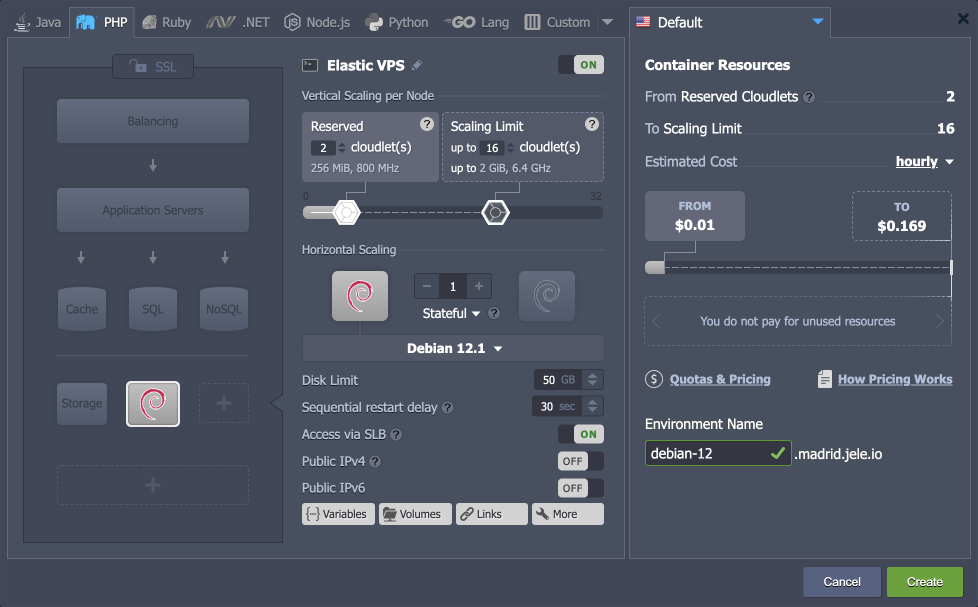
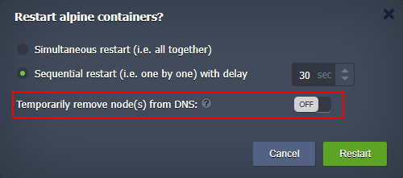

# Virtuozzo Application Platform 8.4

*This document is preliminary and subject to change.*

In this document, you will find all of the new features, enhancements and visible changes included to the **Virtuozzo PaaS 8.4** release.

{}
{}
## Ubuntu 23 Support
Implemented base OS template to support images based on the *Ubuntu 23.04* version
{}

{}
## Debian 12 Support
Implemented base OS template to support images based on the *Debian 12* version
{}

{}
## Excluding Nodes from DNS during Sequential Actions
Added an option to exclude node from DNS when managing layers with scaled nodes
{}
{}

{}
{}
## Firewall ICMP Restriction
Configured firewall rules to block potentially harmful *ICMP Timestamp* requests
{}

{}
## Environment-Associated Scripts
Implemented functionality to create persistent associations between the environments and deployed add-ons
{}

{}
## Deactivated Account Improvements
Provided an ability for the deactivated users to remove their environment
{}

{}
## API Changes
Listed all the changes to the public platform API in the current release
{}

{}
## Software Stack Versions
Actualized list of supported OS templates and software stack versions
{}
{}

{}
{}
## Fixes Compatible with Prior Versions
Bug fixes implemented in the current release and integrated into the previous platform versions through the appropriate patches
{}

{}
## Bug Fixes
List of fixes applied to the platform starting from the current release
{}
{}

## Ubuntu 23 Support

The platform introduces support for the latest version of one of the most popular Linux distributions - **Ubuntu 23.04** (Lunar Lobster). The release introduces a lot of software updates, security improvements, and bug fixes for those who need the most up-to-date patches. However, if you prefer Long Term Support, it is recommended to stick with *Ubuntu 22.04 LTS*.

The *Ubuntu 23.04* distribution support is automatically available through the appropriate [base operating system](/container-image-requirements/#supported-os-distributions) template (for custom Docker containers).

{}Also, the *Ubuntu 22.10* template was deprecated due to the version’s official end of life.{}

[More info](/container-image-requirements/)

{}[Back to the top](#back){}

## Debian 12 Support

The platform implements support for the **Debian 12** "bookworm" OS templates on all the PaaS installations (available for all platforms starting with the 8.4 release). It is the latest LTS (Long Term Support) version with an estimated support period of at least five years. The new release is focused on performance, stability, and ease of use. It provides a massive update of the default packages, creates a separate package archive for non-free firmware, extends architectures and kernel support, and introduces many other improvements, optimizations, and security fixes. For detailed information, refer to the official [Debian 12 release notes](https://www.debian.org/releases/bookworm/releasenotes).

Also, **Debian 12** was added as an out-of-box [Elastic VPS](/debian-vps/) stack in the platform dashboard.

[More info](/container-image-requirements/)

{}[Back to the top](#back){}

## Firewall ICMP Restriction

The Internet Control Message Protocol (ICMP) is used for reporting errors and performing network diagnostics. However, some ICMP request types can be considered a minor security vulnerability that allows attackers to gain information on the remote host.

In the 8.4 release, the Virtuozzo Application Platform added rules to the default firewall configurations that block **ICMP Timestamp** request messages. Such an adjustment resolves a vulnerability that can potentially be exploited to probe the network to find live hosts, gather time/date information on the target host, or generate shared traffic to trick the intrusion detection system.

{}[Back to the top](#back){}

## Excluding Nodes from DNS during Sequential Actions

Virtuozzo Application Platform provides an easy-to-use [horizontal scaling](/horizontal-scaling/) functionality for the containers, i.e. offering a quick high-availability option for users. Combined with the *sequential* configuration option that allows performing actions on nodes successively (so that at least one node remains operable), even intrusive operations like restart and redeploy can be performed without disrupting end-user experience.

However, even with the *sequential* option enabled, some connections can be lost in case of high traffic. In order to ensure application availability for all incoming requests, an additional suboption to “*Temporarily remove node(s) from DNS*” was implemented. If enabled, a node will be excluded from the DNS tables (internal and external) during the intrusive operation.

This new option is available during the following operations:

- *nodes restart on the multi-node layer*
- *nodes redeploy on the multi-node layer*

{}[Back to the top](#back){}

## Environment-Associated Scripts

In the present 8.4 release, functionality to create a more firm association between the environment and deployed add-ons was implemented. The implementation creates the necessary persistence to support such cases as:

- all collaboration members can view and manage add-ons of the [shared environment](/share-environment/)
- add-ons' management is available to the new owner after [environment transferring](/environment-transferred/)

The following add-ons are already updated to benefit from this association functionality: *Git-Push-Deploy*, *Start/Stop Scheduler*, and *Let’s Encrypt* add-ons. However, please note that the change affects the new installations only.

{}[Back to the top](#back){}

## Deactivated Account Improvements

The platform automatically deactivates an account after the trial period expires or if it runs out of funds. In ***deactivated*** [status](/account-statuses/), all the environments are forcibly stopped till the balance is replenished to a positive value.

Starting with the current 8.4 PaaS release, the ability to manually delete environments on the *deactivated account* was added. It allows cleaning up an account before re-activation and removing environments immediately (no need to wait for automatic removal upon account destruction).

Also, the account activations process was improved as well. Now, it triggers immediately after refilling the balance (to a positive value) and automatically starts all the stopped environments.

{}[Back to the top](#back){}

## API Changes

Below, you can find a list of all changes to the public API in the 8.4 platform version (compared to the preceding [8.3](/release-notes-83/#api-changes) ones):

- Extended response of the ***GetSSLCerts*** method to provide information on SSL type. The new ***sslType*** parameter has two values:
  - *CUSTOM* – for any certificates added via the dashboard or *AddSslCert* API call
  - *LETSENCRYPT* – for certificates issued for resellers or regions

The public API documentation review has been completed. All the services, methods, and parameters were provided with comprehensive descriptions to help new and existing users start using the platform’s API.

[More info](https://www.virtuozzo.com/application-platform-api-docs/)

{}[Back to the top](#back){}

## Fixes Compatible with Prior Versions

Below, you can find the fixes that were implemented in the Virtuozzo Application Platform 8.4 release and also integrated into previous platform versions by means of the appropriate patches.

{}
**#**|**Compatible from**|**Description**
---|:---:|---
JE-53135|any|Migration for the stopped database clusters should be restricted as it may result in a broken database
JE-59138|any|An error occurs when executing the "*nginx -t*" command on the NGINX balancer due to insufficient permissions
JE-62589|any|All environment nodes are restarted when redeploying the container with the *Time Zone Change* add-on
JE-63695|any|Validation for the LiteSpeed support availability should be added to the *Magento Cluster* package
JE-64958|any|An error occurs when installing the *WordPress Cluster* with the *WooCommerce* option enabled
JE-66260|any|An error occurs when installing the *LiteSpeed Cache* plugin for the *WordPress Cluster* application
JE-67000|any|An error occurs when changing the cloudlets count for the containers based on the old *LiteSpeed* tags
JE-67035|any|The "*LITEMAGE*" variable is not changed after enabling/disabling LiteMage via the LiteSpeed’s configuration add-on
JE-67226|any|Incorrect port in the admin panel URL in the email received after the *OpenSearch* application installation
JE-67236|any|Excessive load on the *Logstash* container immediately after the installation
JE-67639|any|An error occurs when restarting the *LLSMP* container
JE-67861|any|Duplicated log records for the *SSL/TLS Encrypted Connection* add-on
JE-68019|any|The "*Service Network IP*" Kubernetes add-on can cause a problem with DNS resolution or with access to other resources in the private network
JE-68103|any|Additional parameters from the */etc/sysconfig/varnish/varnish* config are not applied for some *Varnish* versions
WP-341|any|The clear cache add-on for the *Multi-Regional WordPress Standalone* package is not supported on the NGINX stack
WP-342|any|Some add-ons for the *Multi-Regional WordPress Standalone* package are missing custom icons
WP-355|any|Incorrect environment name length validation for the *Multi-Regional WordPress Standalone* package
WP-358|any|The content synchronization diagnostic log files are absent on the second node of the *Multi-Regional WordPress Standalone* package
WP-389|any|Incorrect information in the post-installation email for certain setups of the *Multi-Regional WordPress Standalone* package
WP-639|any|Incorrect region count validation for the *Multi-Regional WordPress Standalone* package
WP-654|any|An error occurs during the *Multi-Regional WordPress Standalone* package installation
JE-38695|5.0.5|The *New Relic* add-on does not work with some Java versions
JE-65454|5.0.5|The *Alfresco* application does not work after the application server layer is redeployed
JE-66387|5.0.5|Incorrect charges for the *CDN* add-on in some cases for the shared or transferred environments
JE-66396|5.0.5|*NGINX* load balancer periodically returns the "*502 application down*" error if two or more backends were added
JE-66973|5.0.5|WebSocket errors in the *odoo-server.log* log file for the *Oddo* application
JE-67040|5.0.5|An error occurs when installing the *Moodle* application
JE-67057|5.0.5|The *MINIO_SERVER_URL* variable is not defined for the *Minio* application
JE-67516|5.0.5|A file with *Let’s Encrypt* custom settings should not be sourced during the auto-update process
JE-67833|5.0.5|An error occurs when installing the *MODX* application
JE-67917|5.0.5|An error occurs when installing the *Drupal* application on top of the *8.1.23 PHP* version
JE-68063|5.0.5|The *Cyclos* application installation fails due to the slow PostgreSQL initialization
JE-67592|5.4|An error occurs during the update from the VCS repository on the *Golang* containers
JE-61990|6.0|Test SSL certificate is issued for the cloned environment with *Magento Standanon* and *Let’s Encrypt*
JE-67032|8.3|*Node.js* server is not restarted after fetching the VCS update from the remote repository
{}

{}
**#**|**Compatible from**|**Description**
---|:---:|---
JE-64557|any|An error occurs when installing the *Multi-Region WordPress* Cluster package
JE-67054|any|The *LiteMage Cache* is not enabled by default for the *Magento* packages
JE-67933|any|Backend workers are missing on the cloned *WordPress Cluster* environment
JE-69028|any|Incorrect *workerGroup* is added to the *LiteSpeed ADC* configs if there are empty lines in the *hosts_list* file
JE-69128|any|Node IPs remain unchanged after migrating the stopped *Redis Cluster* environment to a different region
WP-125|any|Email links for the WordPress packages without the *Let’s Encrypt* option should not use the HTTPS protocol if the *built-in SSL* feature is disabled for the user account
JE-57401|3.3|The *fail2ban* add-on does not work after the container redeploy
JE-65628|3.3|An error occurs when updating the *Let's Encrypt* add-on if the custom domain name matches the environment domain name
JE-63345|5.0.5|A collaboration member cannot install the *Let’s Encrypt* add-on on the shared environment
JE-66156|5.0.5|The *BitNinja* add-on is removed from the cloned environment after stopping and starting the environment
JE-67792|5.0.5|Incorrect SSL configurations for the *Odoo* package after installing the *Let’s Encrypt* add-on
JE-47914|5.1|Missing *Gzip compression* and *Local deploy* headers for the projects deployed on the *Payara* application server
JE-44740|5.3.2|The *WildFly* application server does not start if variables with spaces are set in the *variables.conf* file
JE-67711|8.3|An error is shown when exiting the *Nano* file editor
JE-40097|8.4|SSL certificate update does not work after transferring an environment with the *Let’s Encrypt* add-on to a different user
{}

{}[Back to the top](#back){}

## Software Stack Versions

The software stack provisioning process is independent of the platform release, which allows new software solutions to be delivered as soon as they are ready. However, due to the necessity to adapt and test new stack versions, there is a small delay between software release by its respective upstream maintainer and integration into Virtuozzo Application Platform.

The most accurate and up-to-date list of the certified [software stack versions](/software-stacks-versions/) can be found on the dedicated documentation page.

[More info](/software-stacks-versions/)

{}[Back to the top](#back){}

## Bug Fixes

In the table below, you can see the list of bug fixes applied to the platform starting from Virtuozzo Application Platform 8.4 release:

{}
**#**|**Affected Versions**|**Description**
---|:---:|---
JE-41735|-|An error occurs when resetting a password from the secondary *Couchbase* node
JE-48990|-|An environment suspend action is not tracked in the dashboard *Tasks* panel
JE-52391|-|The *AddDomains* API method should correctly process space after the separator in the provided domains list
JE-53154|-|Prolonged redeployment for containers with both public and private IP addresses
JE-59445|-|An error occurs when removing a mount point from the master container
JE-67003|6.1|Some operations can hung due to missing timeout configurations
JE-67115|8.1|Incorrect isolation rules for the environment after assigning to the same isolated subgroup several times
JE-67142|any|The *SwapExtIps* API method should have validation for the same node being provided in the '*srcnodeid*' and '*dstnodeid*' parameters
JE-67207|8.2.5|Incorrect CPU and disk usage statistics in the dashboard for the *Ubuntu VM*
JE-67360|8.0.2|*EdDSA* public key cannot be added due to incorrect key length validation in the dashboard UI
JE-67503|-|The *OOM* load alerts are not notified via email and are not displayed in the alert history tab
JE-67583|any|The corresponding firewall rules are not removed after deleting a mount point
JE-67772|-|An error occurs when creating a mount point with spaces in the path
JE-67809|8.3|The same one-time password for 2FA can be used for multiple logins
JE-67811|8.3.2|The dashboard is not loaded after refresh on some *Windows* machines using *Firefox* or *Edge* browsers
{}

{}[Back to the top](#back){}