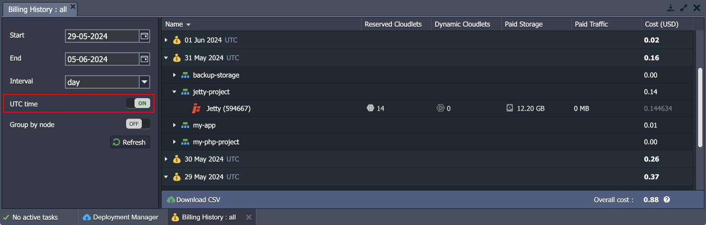
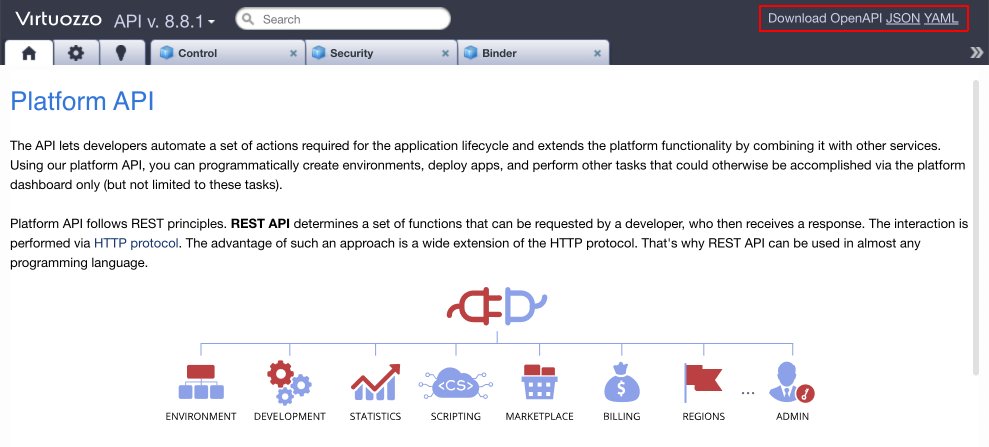

# Virtuozzo Application Platform 8.8

*This document is preliminary and subject to change.*

In this document, you will find all of the new features, enhancements and visible changes included to the **Virtuozzo PaaS 8.8** release.

{}
{}
## AlmaLinux-Based Infrastructure
Updated platform infrastructure components based on the modern *AlmaLinux 9* base OS image
{}
{}

{}
{}
## UTC/Local Time Switch for Billing History
Added the ability to switch between UTC and local time when working with the *Billing History* tab and downloadable CSV reports
{}

{}
## API Changes
Listed all the changes to the public platform API in the current release
{}

{}
## Software Stack Versions
Actualized list of supported OS templates and software stack versions
{}
{}

{}
{}
## Fixes Compatible with Prior Versions
Bug fixes implemented in the current release and integrated into the previous platform versions through the appropriate patches
{}

{}
## Bug Fixes
List of fixes applied to the platform starting from the current release
{}
{}

## AlmaLinux-Based Infrastructure

Due to the upcoming end-of-life (EOL) on 30th June 2024 for the *CentOS 7* image, the Virtuozzo Application Platform transitioned to the ***AlmaLinux 9*** base OS image for all the certified [software stacks](/release-notes-83/#almalinux-9-base-os-image). During the current 8.8 PaaS upgrade, all the infrastructure components will be automatically migrated to the new base OS. The transition ensures support for all the modern functionality, up-to-date security standards, and compatibility with all the latest software solutions. Additionally, the *iptables* functionality will be replaced with a simpler, more efficient ***[nftables](https://netfilter.org/projects/nftables/)*** netfilter alternative with unified IPv4/IPv6 handling.

{}[Back to the top](#back){}

## UTC/Local Time Switch for Billing History

In the current 8.8 platform release, the ability to toggle between *UTC* and *local time* was added to the **[Billing History](/monitoring-consumed-resources/#billing-history)** section of the dashboard. It provides users with a more flexible approach to tracking account charges. For example, you can view and download reports in your local time and switch to UTC for a more convenient comparison with invoices in UTC.

The new "***UTC time***" toggle was added to the *Billing History* tab (both for the whole account and per specific environment). Choose the preferred display time and click **Refresh** to apply. The switcher state will also affect the downloadable CSV reports.

[More info](/monitoring-consumed-resources/#billing-history)

{}[Back to the top](#back){}

## API Changes

Virtuozzo Application Platform provides a source file with all the supported API methods in the **[OpenAPI Specification](https://swagger.io/resources/open-api/)** standard. This package was thoroughly reviewed in the present 8.8 release and updated with multiple improvements, optimizations, and fixes. As usual, the new package can be downloaded in the YAML and JSON format by clicking on the appropriate link in the top-right corner of the [Virtuozzo Application Platform API](https://www.virtuozzo.com/application-platform-api-docs/) site:

[More info](https://www.virtuozzo.com/application-platform-api-docs/)

{}[Back to the top](#back){}

## Fixes Compatible with Prior Versions

Below, you can find the fixes that were implemented in the Virtuozzo Application Platform 8.8 release and also integrated into previous platform versions by means of the appropriate patches.

{}
**#**|**Compatible from**|**Description**
---|:---:|---
JE-63660|any|An error occurs when restarting the *NGINX Ruby* node for the *Redmine* application
JE-66167|any|UI warning for node scaling in the *PostgreSQL Multi-Region Cluster* application is missing
JE-70952|any|An error occurs when accessing the *Laravel* application due to a missing database file
JE-71569|any|An error occurs when installing the *Let's Encrypt* add-on for containers with IPv6 attached
JE-71784|any|An error occurs when installing the *Redmine* application
JE-71820|any|An error occurs when installing the *Fail2Ban* add-on for the *AlmaLinux-based* containers
JE-59734|3.3|The mixed content error occurs for the *Cyclos 4 Cluster* application with SSL enabled
JE-71043|5.0.5|An error occurs during project building with the *Spring Boot Fat Jar Builder* application
JE-71439|5.0.5|Logrotate is not working on some versions of the *Apache PHP* stack
JE-71611|5.0.5|An error occurs when installing the *Ghost* application
JE-71747|5.0.5|The *Let's Encrypt* add-on requires an extended logging of the cron tasks
JE-61819|8.3|An error occurs when accessing an application with whitespace in the application context folder or some file names
JE-69974|8.3|The root user for the *MariaDB* database has only localhost permissions
JE-71501|8.3|The *mysql uid:gid* should be restored after the *LLSMP* container redeployment
JE-71939|8.3|The network is broken on the standalone *LLSMP/LiteSpeed* container after uninstalling the *NewRelic* add-on
{}

{}[Back to the top](#back){}

## Software Stack Versions

The software stack provisioning process is independent of the platform release, which allows new software solutions to be delivered as soon as they are ready. However, due to the necessity to adapt and test new stack versions, there is a small delay between software release by its respective upstream maintainer and integration into Virtuozzo Application Platform.

The most accurate and up-to-date list of the certified [software stack versions](/software-stacks-versions/) can be found on the dedicated documentation page.

[More info](/software-stacks-versions/)

{}[Back to the top](#back){}

## Bug Fixes

In the table below, you can see the list of bug fixes applied to the platform starting from Virtuozzo Application Platform 8.8 release:

{}
**#**|**Affected Versions**|**Description**
---|:---:|---
JE-70054|8.0.2|An error occurs when adding an *SSH Key* with a whitespace in the key comment
JE-70744|8.4|An error occurs when accessing node files after the redeployment from the *AlmaLinux-* to the *CentOS-based* template
JE-71667|8.6|Required packages are not installed for the *Ubuntu* templates
JE-71674|8.6.2|An error occurs when executing the *AddPortRedirect* API method
JE-71694|8.6|An error occurs when creating a mount point with *Ubuntu* as an NFS server
JE-72009|8.3|OpenSSH is affected by the *CVE-2024-6387* vulnerability
JE-72025|-|*AlmaLinux* should be the default VPS option in the topology wizard
{}

{}[Back to the top](#back){}
